# Python Concurrency with asyncio by Matthew Fowler

## 1. Getting to know asyncio
## 2. asyncio basics
## 3. A first asyncio application
## 4. Concurrent web requests
## 5. Non-blocking database drivers
## 6. Handling CPU-bound work
## 7. Handling blocking work with threads
## 8. Streams
## 9. Web applications
## 10. Microservices
## 11. Synchronization
## 12. Asynchronous queues
## 13. Managing subprocesses
## 14. Advanced asyncio

---
---

# 1. Getting to know asyncio

## What is asyncio ?

In a synchronous application, code runs sequentially. The next line of code runs as soon as the previous one has finished, and only one thing is happening at once. This model works fine for many, if not most, applications. However, what if one line of code is especially slow? In that case, all other code after our slow line will be stuck waiting for that line to complete. These potentially slow lines can block the application from running any other code. Many of us have seen this before in buggy user interfaces, where we happily click around until the application freezes, leaving us with a spinner or an unresponsive user interface. This is an example of an application being blocked leading to a poor user experience.

While any operation can block an application if it takes long enough, many applications will block waiting on I/O. I/O refers to a computer’s input and output devices such as a keyboard, hard drive, and, most commonly, a network card. These operations wait for user input or retrieve the contents from a web-based API. In a synchronous application, we’ll be stuck waiting for those operations to complete before we can run anything else. This can cause performance and responsiveness issues, as we can only have one long operation running at any given time, and that operation will stop our application from doing anything else.

One solution to this issue is to introduce concurrency. In the simplest terms, concurrency means allowing more than one task being handled at the same time. In the case of concurrent I/O, examples include allowing multiple web requests to be made at the same time or allowing simultaneous connections to a web server.

There are several ways to achieve this concurrency in Python. One of the most recent additions to the Python ecosystem is the asyncio library. asyncio is short for asynchronous I/O. It is a Python library that allows us to run code using an asynchronous programming model. This lets us handle multiple I/O operations at once, while still allowing our application to remain responsive.

So what is asynchronous programming? It means that a particular long-running task can be run in the background separate from the main application. Instead of blocking all other application code waiting for that long-running task to be completed, the system is free to do other work that is not dependent on that task. Then, once the long-running task is completed, we’ll be notified that it is done so we can process the result.

In Python version 3.4, asyncio was first introduced with decorators alongside generator yield from syntax to define coroutines. A coroutine is a method that can be paused when we have a potentially long-running task and then resumed when that task is finished. In Python version 3.5, the language implemented first-class support for coroutines and asynchronous programming when the keywords async and await were explicitly added to the language. This syntax, common in other programming languages such as C# and JavaScript, allows us to make asynchronous code look like it is run synchronously. This makes asynchronous code easy to read and understand, as it looks like the sequential flow most software engineers are familiar with. asyncio is a library to execute these coroutines in an asynchronous fashion using a concurrency model known as a single-threaded event loop.

While the name of asyncio may make us think that this library is only good for I/O operations, it has functionality to handle other types of operations as well by interoperating with multithreading and multiprocessing. With this interoperability, we can use async and await syntax with threads and processes making these workflows easier to understand. This means this library not only is good for I/O based concurrency but can also be used with code that is CPU intensive. To better understand what type of workloads asyncio can help us with and which concurrency model is best for each type of concurrency, let’s explore the differences between I/O and CPU-bound operations.

## What is I/O-bound and what is CPU-bound ?

When we refer to an operation as I/O-bound or CPU-bound we are referring to the limiting factor that prevents that operation from running faster. This means that if we increased the performance of what the operation was bound on, that operation would complete in less time.

In the case of a CPU-bound operation, it would complete faster if our CPU was more powerful, for instance by increasing its clock speed from 2 GHz to 3 GHz. In the case of an I/O-bound operation, it would get faster if our I/O devices could handle more data in less time. This could be achieved by increasing our network bandwidth through our ISP or upgrading to a faster network card.

CPU-bound operations are typically computations and processing code in the Python world. An example of this is computing the digits of pi or looping over the contents of a dictionary, applying business logic. In an I/O-bound operation we spend most of our time waiting on a network or other I/O device. An example of an I/Obound operation would be making a request to a web server or reading a file from our machine’s hard drive.


I/O-bound and CPU-bound operations usually live side by side one another. We first make an I/O-bound request to download the contents of https:/ /www.example.com. Once we have the response, we perform a CPU-bound loop to format the headers of the response and turn them into a string separated by newlines. We then open a file and write the string to that file, both I/O-bound operations.

Asynchronous I/O allows us to pause execution of a particular method when we have an I/O operation; we can run other code while waiting for our initial I/O to complete in the background. This allows us to execute many I/O operations concurrently, potentially speeding up our application.

## Understanding concurrency, parallelism, and multitasking

### Concurrency

When we say two tasks are happening concurrently, we mean those tasks are happening at the same time. Take, for instance, a baker baking two different cakes. To bake these cakes, we need to preheat our oven. Preheating can take tens of minutes depending on the oven and the baking temperature, but we don’t need to wait for our oven to preheat before starting other tasks, such as mixing the flour and sugar together with eggs. We can do other work until the oven beeps, letting us know it is preheated.

We also don’t need to limit ourselves from starting work on the second cake before finishing the first. We can start one cake batter, put it in a stand mixer, and start preparing the second batter while the first batter finishes mixing. In this model, we’re switching between different tasks concurrently. This switching between tasks (doing something else while the oven heats, switching between two different cakes) is concurrent behavior.

### Parallelism

While concurrency implies that multiple tasks are in process simultaneously, it does not imply that they are running together in parallel. When we say something is running in parallel, we mean not only are there two or more tasks happening concurrently, but they are also executing at the same time. Going back to our cake baking example, imagine we have the help of a second baker. In this scenario, we can work on the first cake while the second baker works on the second. Two people making batter at once is parallel because we have two distinct tasks running concurrently (figure 1.1).


Putting this into terms of applications run by our operating system, let’s imagine it has two applications running. In a system that is only concurrent, we can switch between running these applications, running one application for a short while before letting the other one run. If we do this fast enough, it gives the appearance of two things happening at once. In a system that is parallel, two applications are running simultaneously, and we’re actively running two things concurrently.

The concepts of concurrency and parallelism are similar (figure 1.2) and slightly confusing to differentiate, but it is important to understand what makes them distinct from one another.


### The difference between concurrency and parallelism

Concurrency is about multiple tasks that can happen independently of one another. We can have concurrency on a CPU with only one core, as the operation will employ preemptive multitasking (defined in the next section) to switch between tasks. Parallelism, however, means that we must be executing two or more tasks at the same time. On a machine with one core, this is not possible. To make this possible, we need a CPU with multiple cores that can run two tasks together.

While parallelism implies concurrency, concurrency does not always imply parallelism. A multithreaded application running on a multiple-core machine is both concurrent and parallel. In this setup, we have multiple tasks running at the same time, and there are two cores independently executing the code associated with those tasks. However, with multitasking we can have multiple tasks happening concurrently, yet only one of them is executing at a given time.

### What is multitasking?

Multitasking is everywhere in today’s world. We multitask while making breakfast by taking a call or answering a text while we wait for water to boil to make tea. We even multitask while commuting to work, by reading a book while the train takes us to our stop. Two main kinds of multitasking are discussed in this section: preemptive multitasking and cooperative multitasking.

* ***PREEMPTIVE MULTITASKING***

  * In this model, we let the operating system decide how to switch between which work is currently being executed via a process called time slicing. When the operating system switches between work, we call it preempting. How this mechanism works under the hood is up to the operating system itself. It is primarily achieved through using either multiple threads or multiple processes.

* ***COOPERATIVE MULTITASKING***

  * In this model, instead of relying on the operating system to decide when to switch between which work is currently being executed, we explicitly code points in our application where we can let other tasks run. The tasks in our application operate in a model where they cooperate, explicitly saying, “I’m pausing my task for a while; go ahead and run other tasks.”

### The benefits of cooperative multitasking

asyncio uses cooperative multitasking to achieve concurrency. When our application reaches a point where it could wait a while for a result to come back, we explicitly mark this in code. This allows other code to run while we wait for the result to come back in the background. Once the task we marked has completed, we in effect “wake up” and resume executing the task. This gives us a form of concurrency because we can have multiple tasks started at the same time but, importantly, not in parallel because they aren’t executing code simultaneously.

Cooperative multitasking has benefits over preemptive multitasking. First, cooperative multitasking is less resource intensive. When an operating system needs to switch between running a thread or process, it involves a context switch. Context switches are intensive operations because the operating system must save information about the running process or thread to be able to reload it.

A second benefit is granularity. An operating system knows that a thread or task should be paused based on whichever scheduling algorithm it uses, but that might not be the best time to pause. With cooperative multitasking, we explicitly mark the areasthat are the best for pausing our tasks. This gives us some efficiency gains in that we are only switching tasks when we explicitly know it is the right time to do so. Now that we understand concurrency, parallelism, and multitasking, we’ll use these concepts to understand how to implement them in Python with threads and processes.

## Understanding processes, threads, multithreading, and multiprocessing

### Process

A process is an application run that has a memory space that other applications cannot access. An example of creating a Python process would be running a simple “hello world” application or typing python at the command line to start up the REPL (read eval print loop).

Multiple processes can run on a single machine. If we are on a machine that has a CPU with multiple cores, we can execute multiple processes at the same time. If we are on a CPU with only one core, we can still have multiple applications running simultaneously, through time slicing. When an operating system uses time slicing, it will switch between which process is running automatically after some amount of time. The algorithms that determine when this switching occurs are different, depending on the operating system.

### Thread

 Threads can be thought of as lighter-weight processes. In addition, they are the smallest construct that can be managed by an operating system. They do not have their own memory as does a process; instead, they share the memory of the process that created them. Threads are associated with the process that created them. A process will always have at least one thread associated with it, usually known as the main thread. A process can also create other threads, which are more commonly known as worker or background threads. These threads can perform other work concurrently alongside the main thread. Threads, much like processes, can run alongside one another on a multi-core CPU, and the operating system can also switch between them via time slicing. When we run a normal Python application, we create a process as well as a main thread that will be responsible for running our Python application.

```Python3
import os
import threading

print("Python process running with process id: {0}".format(os.getpid()))

total_threads = threading.active_count()
thread_name = threading.current_thread().name

print("Python is currently running {0} thread(s)".format(total_threads))
print("The current thread is {0}".format(thread_name))
```


In figure 1.3, we sketch out the process for listing 1.2. We create a simple application to show us the basics of the main thread. We first grab the process ID (a unique identifier for a process) and print it to prove that we indeed have a dedicated process running. We then get the active count of threads running as well as the current thread’s name to show that we are running one thread—the main thread. While the process ID will be different each time this code is run, running listing 1.2 will give output similar to the following:

```
Python process running with process id: 98230
Python currently running 1 thread(s)
The current thread is MainThread
```

Processes can also create other threads that share the memory of the main process. These threads can do other work concurrently for us via what is known as multithreading.

```Python3
import threading


def hello_from_thread():
  print("Hello from thread {0}".format(threading.current_thread()))


hello_thread = threading.Thread(target=hello_from_thread)
hello_thread.start()

total_threads = threading.active_count()
thread_name = threading.current_thread().name

print("Python is currently running {0} thread(s)".format(total_threads))
print("The current thread is {0}".format(thread_name))

hello_thread.join()
```


In figure 1.4, we sketch out the process and threads for listing 1.3. We create a method to print out the name of the current thread and then create a thread to run that method. We then call the start method of the thread to start running it. Finally, we call the join method. join will cause the program to pause until the thread we started completed. If we run the previous code, we’ll see output similar to the following:

```
Hello from thread <Thread(Thread-1, started 123145541312512)>!
Python is currently running 2 thread(s)
The current thread is MainThread
```

Note that when running this you may see the hello from thread and python is currently running 2 thread(s) messages print on the same line. This is a race condition; we’ll explore a bit about this in the next section and in chapters 6 and 7.

Multithreaded applications are a common way to achieve concurrency in many programming languages. There are a few challenges in utilizing concurrency with threads in Python, however. Multithreading is only useful for I/O-bound work because we are limited by the global interpreter lock, which is discussed in section 1.5.

Multithreading is not the only way we can achieve concurrency; we can also create multiple processes to do work concurrently for us. This is known as multiprocessing. In multiprocessing, a parent process creates one or more child processes that it manages. It can then distribute work to the child processes.

Python gives us the multiprocessing module to handle this. The API is similar to that of the threading module. We first create a process with a target function. Then, we call its start method to execute it and finally its join method to wait for it to complete running.

```Python3
import multiprocessing
import os


def hello_from_process():
  print("Hello from child process {0}".format(os.getpid()))


if __name__ == '__main__':
  hello_process = multiprocessing.Process(target=hello_from_process)
  hello_process.start()

  print("Hello from parent process {0}".format(os.getpid()))

  hello_process.join()
```


In figure 1.5, we sketch out the process and threads for listing 1.4. We create one child process that prints its process ID, and we also print out the parent process ID to prove that we are running different processes. Multiprocessing is typically best when we have CPU-intensive work.

Multithreading and multiprocessing may seem like magic bullets to enable concurrency with Python. However, the power of these concurrency models is hindered by an implementation detail of Python—the global interpreter lock.

## Understanding the global interpreter lock

The global interpreter lock, abbreviated GIL and pronounced gill, is a controversial topic in the Python community. Briefly, the GIL prevents one Python process from executing more than one Python bytecode instruction at any given time. This means that even if we have multiple threads on a machine with multiple cores, a Python process can have only one thread running Python code at a time. In a world where we have CPUs with multiple cores, this can pose a significant challenge for Python developers looking to take advantage of multithreading to improve the performance of their application.

Multiprocessing can run multiple bytecode instructions concurrently because each Python process has its own GIL.

So why does the GIL exist? The answer lies in how memory is managed in CPython. In CPython, memory is managed primarily by a process known as reference counting. Reference counting works by keeping track of who currently needs access to a particular Python object, such as an integer, dictionary, or list. A reference count is an integer keeping track of how many places reference that particular object. When someone no longer needs that referenced object, the reference count is decremented, and when someone else needs it, it is incremented. When the reference count reaches zero, no one is referencing the object, and it can be deleted from memory.

CPython is the reference implementation of Python. By reference implementation we mean it is the standard implementation of the language and is used as the reference for proper behavior of the language. There are other implementations of Python such as Jython, which is designed to run on the Java Virtual Machine, and IronPython, which is designed for the .NET framework.

The conflict with threads arises in that the implementation in CPython is not thread safe. When we say CPython is not thread safe, we mean that if two or more threads modify a shared variable, that variable may end in an unexpected state. This unexpected state depends on the order in which the threads access the variable, commonly known as a race condition. Race conditions can arise when two threads need to reference a Python object at the same time.

As shown in figure 1.6, if two threads increment the reference count at one time, we could face a situation where one thread causes the reference count to be zero when the object is still in use by the other thread. The likely result of this would be an application crash when we try to read the potentially deleted memory.

To demonstrate the effect of the GIL on multithreaded programming, let’s examine the CPU-intensive task of computing the nth number in the Fibonacci sequence. We’ll use a fairly slow implementation of the algorithm to demonstrate a time-intensive operation. A proper solution would utilize memoization or mathematical techniques to improve performance.


```Python3
import time


def print_fib(number: int) -> None:
  def fib(n: int) -> int:
    if n == 1:
      return 0
    elif n == 2:
      return 1
    else:
      return fib(n - 1) + fib(n - 2)

  print("fib {0} is {1}".format(number, fib(number)))


def fibs_no_threading():
  print_fib(40)
  print_fib(41)


start = time.perf_counter()
fibs_no_threading()
end = time.perf_counter()

print("Completed in {0:.4f} seconds".format(end - start))
```

This implementation uses recursion and is overall a relatively slow algorithm, requiring exponential O(2^N) time to complete. If we are in a situation where we need to print two Fibonacci numbers, it is easy enough to synchronously call them and time the result, as we have done in the preceding listing.

Depending on the speed of the CPU we run on, we will see different timings, but running the code in listing 1.5 will yield output similar to the following:

```
fib(40) is 63245986
fib(41) is 102334155
Completed in 65.1516 seconds.
```

This is a fairly long computation, but our function calls to print_fibs are independent from one another. This means that they can be put in multiple threads that our CPU can, in theory, run concurrently on multiple cores, thus, speeding up our application.

```Python3
import threading
import time


def print_fib(number: int) -> None:
  def fib(n: int) -> int:
    if n == 1:
      return 0
    elif n == 2:
      return 1
    else:
      return fib(n - 1) + fib(n - 2)

  print("fib {0} is {1}".format(number, fib(number)))


def fibs_with_threads():
  thread_1 = threading.Thread(target=print_fib, args=(40, ))
  thread_2 = threading.Thread(target=print_fib, args=(41,))

  thread_1.start()
  thread_2.start()

  thread_1.join()
  thread_2.join()


start_threads = time.perf_counter()
fibs_with_threads()
end_threads = time.perf_counter()
print("Completed in {0:.4f} seconds".format(end_threads - start_threads))
```

In the preceding listing, we create two threads, one to compute fib(40) and one to compute fib(41) and start them concurrently by calling start() on each thread. Then we make a call to join(), which will cause our main program to wait until the threads finish. Given that we start our computation of fib(40) and fib(41) simultaneously and run them concurrently, you would think we could see a reasonable speedup; however, we will see an output like the following even on a multi-core machine.

```
fib(40) is 63245986
fib(41) is 102334155
Threads took 66.1059 seconds.
```

Our threaded version took almost the same amount of time. In fact, it was even a little slower! This is almost entirely due to the GIL and the overhead of creating and managing threads. While it is true the threads run concurrently, only one of them is allowed to run Python code at a time due to the lock. This leaves the other thread in a waiting state until the first one completes, which completely negates the value of multiple threads.

### Is the GIL ever released?

Based on the previous example, you may be wondering if concurrency in Python can ever happen with threads, given that the GIL prevents running two lines of Python concurrently. The GIL, however, is not held forever such that we can’t use multiple threads to our advantage.

The global interpreter lock is released when I/O operations happen. This lets us employ threads to do concurrent work when it comes to I/O, but not for CPU-bound Python code itself (there are some notable exceptions that release the GIL for CPUbound work in certain circumstances, and we’ll look at these in a later chapter). To illustrate this, let’s use an example of reading the status code of a web page.

```Python3
import time
import requests


def read_example() -> None:
  response = requests.get('http://www.example.com')
  print(response.status_code)


sync_start = time.perf_counter()

read_example()
read_example()

sync_end = time.perf_counter()


print("Running synchronously took {0:.4f} seconds".format(sync_end - sync_start))
```

In the preceding listing, we retrieve the contents of example.com and print the status code twice. Depending on our network connection speed and our location, we’ll see output similar to the following when running this code:

```
200
200
Running synchronously took 0.2306 seconds.
```

Now that we have a baseline for what a synchronous version looks like, we can write a multithreaded version to compare to. In our multithreaded version, in an attempt to run them concurrently, we’ll create one thread for each request to example.com.

```Python3
import time
import threading
import requests


def read_example() -> None:
  response = requests.get("https://www.example.com")
  print(response.status_code)


thread_1 = threading.Thread(target=read_example)
thread_2 = threading.Thread(target=read_example)

thread_start = time.perf_counter()

thread_1.start()
thread_2.start()

print('All threads running!')

thread_1.join()
thread_2.join()

thread_end = time.perf_counter()

print("Running with threads took {0:.4f} seconds".format(thread_end - thread_start))
```

When we execute the preceding listing, we will see output like the following, depending  again on our network connection and location:

```
All threads running!
200
200
Running with threads took 0.0977 seconds.
```

This is roughly two times faster than our original version that did not use threads, since we’ve run the two requests at roughly the same time! Of course, depending on your internet connection and machine specs, you will see different results, but the numbers should be directionally similar.

So how is it that we can release the GIL for I/O but not for CPU-bound operations? The answer lies in the system calls that are made in the background. In the case of I/O, the low-level system calls are outside of the Python runtime. This allows the GIL to be released because it is not interacting with Python objects directly. In this case, the GIL is only reacquired when the data received is translated back into a Python object. Then, at the operating-system level, the I/O operations execute concurrently. This model gives us concurrency but not parallelism. In other languages, such as Java or C++, we would get true parallelism on multi-core machines because we don’t have the GIL and can execute simultaneously. However, in Python, because of the GIL, the best we can do is concurrency of our I/O operations, and only one piece of Python code is executing at a given time.

### asyncio and the GIL

asyncio exploits the fact that I/O operations release the GIL to give us concurrency, even with only one thread. When we utilize asyncio we create objects called coroutines. A coroutine can be thought of as executing a lightweight thread. Much like we can have multiple threads running at the same time, each with their own concurrent I/O operation, we can have many coroutines running alongside one another. While we are waiting for our I/O-bound coroutines to finish, we can still execute other Python code, thus, giving us concurrency. It is important to note that asyncio does not circumvent the GIL, and we are still subject to it. If we have a CPU-bound task, we still need to use multiple processes to execute it concurrently (which can be done with asyncio itself); otherwise, we will cause performance issues in our application. Now that we know it is possible to achieve concurrency for I/O with only a single thread, let’s dive into the specifics of how this works with non-blocking sockets.

## How single-threaded concurrency works

In the previous section, we introduced multiple threads as a mechanism for achieving concurrency for I/O operations. However, we don’t need multiple threads to achieve this kind of concurrency. We can do it all within the confines of one process and one thread. We do this by exploiting the fact that, at the system level, I/O operations can be completed concurrently. To better understand this, we’ll need to dive into how sockets work and, in particular, how non-blocking sockets work.

### What is a socket?

A socket is a low-level abstraction for sending and receiving data over a network. It is the basis for how data is transferred to and from servers. Sockets support two main operations: sending bytes and receiving bytes. We write bytes to a socket, which will then get sent to a remote address, typically some type of server. Once we’ve sent those bytes, we wait for the server to write its response back to our socket. Once these bytes have been sent back to our socket, we can then read the result.

Sockets are a low-level concept and are fairly easy to understand if you think of them as mailboxes. You can put a letter in your mailbox that your letter carrier then picks up and delivers to the recipient’s mailbox. The recipient opens their mailbox and your letter. Depending on the contents, the recipient may send you a letter back. In this analogy, you may think of the letter as the data or bytes we want to send. Consider that the act of putting a letter into the mailbox is writing the bytes to a socket, and opening the mailbox to read the letter is reading bytes from a socket. The letter carrier can be thought of as the transfer mechanism over the internet, routing the data to the correct address.

In the case of getting the contents from example.com as we saw earlier, we open a socket that connects to example.com’s server. We then write a request to get the contents to that socket and wait for the server to reply with the result: in this case, the HTML of the web page. We can visualize the flow of bytes to and from the server in figure 1.7.


Sockets are blocking by default. Simply put, this means that when we are waiting for a server to reply with data, we halt our application or block it until we get data to read. Thus, our application stops running any other tasks until we get data from the server, an error happens, or there is a timeout.

At the operating system level, we don’t need to do this blocking. Sockets can operate in non-blocking mode. In non-blocking mode, when we write bytes to a socket, we can just fire and forget the write or read, and our application can go on to perform other tasks. Later, we can have the operating system tell us that we received bytes and deal with it at that time. This lets the application do any number of things while we wait for bytes to come back to us. Instead of blocking and waiting for data to come to us, we become more reactive, letting the operating system inform us when there is data for us to act on.

In the background, this is performed by a few different event notification systems, depending on which operating system we’re running. asyncio is abstracted enough that it switches between the different notification systems, depending on which one our operating system supports. The following are the event notification systems used by specific operating systems:

* kqueue—FreeBSD and MacOS
* epoll—Linux
* IOCP (I/O completion port)—Windows

These systems keep track of our non-blocking sockets and notify us when they are ready for us to do something with them. This notification system is the basis of how asyncio can achieve concurrency. In asyncio’s model of concurrency, we have only one thread executing Python at any given time. When we hit an I/O operation, we hand it over to our operating system’s event notification system to keep track of it for us. Once we have done this handoff, our Python thread is free to keep running other Python code or add more non-blocking sockets for the OS to keep track of for us. When our I/O operation finishes, we “wake up” the task that was waiting for the result and then proceed to run any other Python code that came after that I/O operation. We can visualize this flow in figure 1.8 with a few separate operations that each rely on a socket.


But how do we keep track of which tasks are waiting for I/O as opposed to ones that can just run because they are regular Python code? The answer lies in a construct called an event loop.

## How an event loop works

An event loop is at the heart of every asyncio application. Event loops are a fairly common design pattern in many systems and have existed for quite some time. If you’ve ever used JavaScript in a browser to make an asynchronous web request, you’ve created a task on an event loop. Windows GUI applications use what are called message loops behind the scenes as a primary mechanism for handling events such as keyboard input, while still allowing the UI to draw.

The most basic event loop is extremely simple. We create a queue that holds a list of events or messages. We then loop forever, processing messages one at a time as they come into the queue. In Python, a basic event loop might look something like this:

```Python3
from collections import deque
messages = deque()

while True:
    if messages:
      message = messages.pop()
      process_message(message)
```

In asyncio, the event loop keeps a queue of tasks instead of messages. Tasks are wrappers around a coroutine. A coroutine can pause execution when it hits an I/O-bound operation and will let the event loop run other tasks that are not waiting for I/O operations to complete.

When we create an event loop, we create an empty queue of tasks. We can then add tasks into the queue to be run. Each iteration of the event loop checks for tasks that need to be run and will run them one at a time until a task hits an I/O operation. At that time the task will be “paused,” and we instruct our operating system to watch any sockets for I/O to complete. We then look for the next task to be run. On every iteration of the event loop, we’ll check to see if any of our I/O has completed; if it has, we’ll “wake up” any tasks that were paused and let them finish running. We can visualize this as follows in figure 1.9: the main thread submits tasks to the event loop, which can then run them.

To illustrate this, let’s imagine we have three tasks that each make an asynchronous web request. Imagine these tasks have a bit of code to do setup, which is CPU-bound, then they make a web request, and they follow with some CPU-bound postprocessing code. Now, let’s submit these tasks to the event loop simultaneously. In pseudocode, we would write something like this:

```Python3
def make_request():
    cpu_bound_setup()
    io_bound_web_request()
    cpu_bound_postprocess()

task_one = make_request()
task_two = make_request()
task_three = make_request()
```


All three tasks start with CPU-bound work and we are single-threaded, so only the first task starts executing code, and the other two are left waiting to run. Once the CPU-bound setup work is finished in Task 1, it hits an I/O-bound operation and will pause itself to say, “I’m waiting for I/O; any other tasks waiting to run can run.”

Once this happens, Task 2 can begin executing. Task 2 starts its CPU-bound code and then pauses, waiting for I/O. At this time both Task 1 and Task 2 are waiting concurrently for their network request to complete. Since Tasks 1 and 2 are both paused waiting for I/O, we start running Task 3.

Now imagine once Task 3 pauses to wait for its I/O to complete, the web request for Task 1 has finished. We’re now alerted by our operating system’s event notification system that this I/O has finished. We can now resume executing Task 1 while both Task 2 and Task 3 are waiting for their I/O to finish.

In figure 1.10, we show the execution flow of the pseudocode we just described. If we look at any vertical slice of this diagram, we can see that only one CPU-bound piece of work is running at any given time; however, we have up to two I/O-bound operations happening concurrently. This overlapping of waiting for I/O per each task is where the real time savings of asyncio comes in.

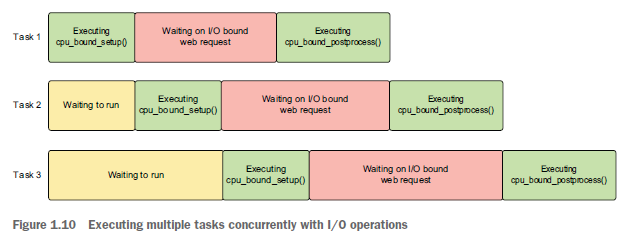

# 2. asyncio basics

## Introduction Coroutines

Think of a coroutine like a regular Python function but with the superpower that it can pause its execution when it encounters an operation that could take a while to complete. When that long-running operation is complete, we can “wake up” our paused coroutine and finish executing any other code in that coroutine. While a paused coroutine is waiting for the operation it paused for to finish, we can run other code. This running of other code while waiting is what gives our application concurrency. We can also run several time-consuming operations concurrently, which can give our applications big performance improvements.

To both create and pause a coroutine, we’ll need to learn to use Python’s ```async``` and ```await``` keywords. The async keyword will let us define a coroutine; the await keyword will let us pause our coroutine when we have a long-running operation.

## Creating coroutines with the ```async``` keyword

Creating a coroutine is straightforward and not much different from creating a normal Python function. The only difference is that, instead of using the def keyword, we use async def. The async keyword marks a function as a coroutine instead of a normal Python function.

```Python3
async def my_coroutine() -> None:
    print('Hello world!')
```

The coroutine in the preceding listing does nothing yet other than print “Hello world!” It’s also worth noting that this coroutine does not perform any long-running operations; it just prints our message and returns. This means that, when we put the coroutine on the event loop, it will execute immediately because we don’t have any blocking I/O, and nothing is pausing execution yet.

This syntax is simple, but we’re creating something very different from a plain Python function. To illustrate this, let’s create a function that adds one to an integer as well as a coroutine that does the same and compare the results of calling each. We’ll also use the type convenience function to look at the type returned by calling a coroutine as compared to calling our normal function.

```Python3
async def coroutine_add_one(number: int) -> int:
  return number + 1


def add_one(number: int) -> int:
  return number + 1


function_result = add_one(1)
coroutine_result = coroutine_add_one(1)

print("Function result is {0} and the type is {1}".format(function_result, type(function_result)))
print("Function result is {0} and the type is {1}".format(coroutine_result, type(coroutine_result)))
```

When we run this code, we’ll see output like the following:

```
Method result is 2 and the type is <class 'int'>
Coroutine result is <coroutine object coroutine_add_one at 0x1071d6040> and
the type is <class 'coroutine'>
```

Notice how when we call our normal add_one function it executes immediately and returns what we would expect, another integer. However, when we call coroutine_ add_one we don’t get our code in the coroutine executed at all. We get a coroutine object instead.

This is an important point, as coroutines aren’t executed when we call them directly. Instead, we create a coroutine object that can be run later. To run a coroutine, we need to explicitly run it on an event loop. So how can we create an event loop and run our coroutine?

In versions of Python older than 3.7, we had to create an event loop if one did not already exist. However, the asyncio library has added several functions that abstract the event loop management. There is a convenience function, asyncio.run, we can use to run our coroutine. This is illustrated in the following listing.

```Python3
import asyncio


async def coroutine_add_one(number: int) -> int:
  return number + 1


result = asyncio.run(coroutine_add_one(1))

print(result)
```

Running listing 2.3 will print “2,” as we would expect for returning the next integer. We’ve properly put our coroutine on the event loop, and we have executed it!

asyncio.run is doing a few important things in this scenario. First, it creates a brand-new event. Once it successfully does so, it takes whichever coroutine we pass into it and runs it until it completes, returning the result. This function will also do some cleanup of anything that might be left running after the main coroutine finishes. Once everything has finished, it shuts down and closes the event loop.

Possibly the most important thing about asyncio.run is that it is intended to be the main entry point into the asyncio application we have created. It only executes one coroutine, and that coroutine should launch all other aspects of our application. As we progress further, we will use this function as the entry point into nearly all our applications. The coroutine that asyncio.run executes will create and run other coroutines that will allow us to utilize the concurrent nature of asyncio.

## Pausing execution with the ```await``` keyword

The example we saw in listing 2.3 did not need to be a coroutine, as it executed only non-blocking Python code. The real benefit of asyncio is being able to pause execution to let the event loop run other tasks during a long-running operation. To pause execution, we use the await keyword. The await keyword is usually followed by a call to a coroutine (more specifically, an object known as an awaitable, which is not always a coroutine; we’ll learn more about awaitables later in the chapter).

Using the await keyword will cause the coroutine following it to be run, unlike calling a coroutine directly, which produces a coroutine object. The await expression will also pause the coroutine where it is contained in until the coroutine we awaited finishes and returns a result. When the coroutine we awaited finishes, we’ll have access to the result it returned, and the containing coroutine will “wake up” to handle the result.

We can use the await keyword by putting it in front of a coroutine call. Expanding on our earlier program, we can write a program where we call the add_one function inside of a “main” async function and get the result.

```Python3
import asyncio


async def add_one(number: int) -> int:
  return number + 1


async def main() -> None:
  one_plus_one = await add_one(1)
  two_plus_one = await add_one(2)
  print(one_plus_one)
  print(two_plus_one)


asyncio.run(main())
```

In listing 2.4, we pause execution twice. We first await the call to add_one(1). Once we have the result, the main function will be “unpaused,” and we will assign the return value from add_one(1) to the variable one_plus_one, which in this case will be two. We then do the same for add_one(2) and then print the results. We can visualize the execution flow of our application, as shown in figure 2.1. Each block of the figure represents what is happening at any given moment for one or more lines of code.

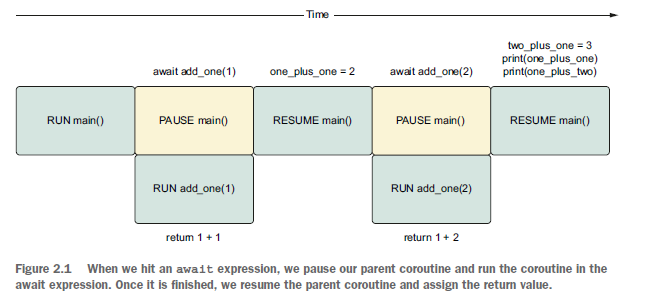

As it stands now, this code does not operate differently from normal, sequential code. We are, in effect, mimicking a normal call stack. Next, let’s look at a simple example of how to run other code by introducing a dummy sleep operation while we’re waiting.

## Introducing long-running coroutines with sleep

Our previous examples did not use any slow operations and were used to help us learn the basic syntax of coroutines. To fully see the benefits and show how we can run multiple events simultaneously, we’ll need to introduce some long-running operations. Instead of making web API or database queries right away, which are nondeterministic as to how much time they will take, we’ll simulate long-running operations by specifying how long we want to wait. We’ll do this with the asyncio.sleep function.

We can use asyncio.sleep to make a coroutine “sleep” for a given number of seconds. This will pause our coroutine for the time we give it, simulating what would happen if we had a long-running call to a database or web API.

```asyncio.sleep``` is itself a coroutine, so we must use it with the await keyword. If we call it just by itself, we’ll get a coroutine object. Since asyncio.sleep is a coroutine, this means that when a coroutine awaits it, other code will be able to run.

Let’s examine a simple example, shown in the following listing, that sleeps for 1 second and then prints a 'Hello World!' message.

```Python3
import asyncio


async def hello_world_message() -> str:
  await asyncio.sleep(1)
  return 'Hello World!'


async def main() -> None:
  message = await hello_world_message()
  print(message)


asyncio.run(main())
```

When we run this application, our program will wait 1 second before printing our 'Hello World!' message. Since hello_world_message is a coroutine and we pause it for 1 second with asyncio.sleep, we now have 1 second where we could be running other code concurrently.

We’ll be using sleep a lot in the next few examples, so let’s invest the time to create a reusable coroutine that sleeps for us and prints out some useful information. We’ll call this coroutine delay. This is shown in the following listing.

```Python3
import asyncio

async def delay(delay_seconds: int) -> int:
  print("Sleeping for {0} second(s)".format(delay_seconds))
  await asyncio.sleep(delay_seconds)
  print("Finished sleeping for {0} second(s)".format(delay_seconds))
  return delay_seconds
```

delay will take in an integer of the duration in seconds that we’d like the function to sleep and will return that integer to the caller once it has finished sleeping. We’ll also print when sleep begins and ends. This will help us see what other code, if any, is running concurrently while our coroutines are paused.

### Running two coroutines

```Python3
import asyncio
from util import delay


async def add_one(number: int) -> int:
  return number + 1


async def hello_word_message() -> str:
  await delay(1)
  return 'Hello World!'


async def main() -> None:
  message = await hello_word_message()
  one_plus_one = await add_one(1)
  print(one_plus_one)
  print(message)


asyncio.run(main())
```

When we run this, 1 second passes before the results of both function calls are printed. What we really want is the value of add_one(1) to be printed immediately while hello_world_message()runs concurrently. So why isn’t this happening with this code? The answer is that await pauses our current coroutine and won’t execute any other code inside that coroutine until the await expression gives us a value. Since it will take 1 second for our hello_world_message function to give us a value, the main coroutine will be paused for 1 second. Our code behaves as if it were sequential in this case. This behavior is illustrated in figure 2.2.

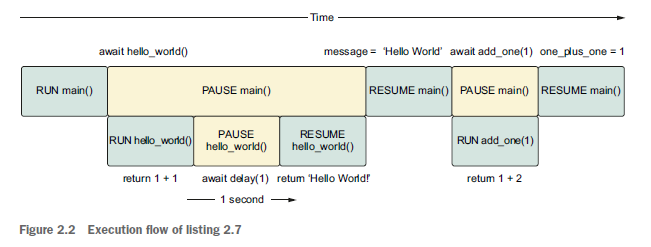

Both main and hello_world paused while we wait for delay(1) to finish. After it has finished, main resumes and can execute add_one.

We’d like to move away from this sequential model and run add_one concurrently with hello_world. To achieve this, we’ll need to introduce a concept called tasks.

## Running concurrently with tasks

Earlier we saw that, when we call a coroutine directly, we don’t put it on the event loop to run. Instead, we get a coroutine object that we then need to either use the await keyword on it or pass it in to asyncio.run to run and get a value. With only these tools we can write async code, but we can’t run anything concurrently. To run coroutines concurrently, we’ll need to introduce tasks.

Tasks are wrappers around a coroutine that schedule a coroutine to run on the event loop as soon as possible. This scheduling and execution happen in a non-blocking fashion, meaning that, once we create a task, we can execute other code instantly while the task is running. This contrasts with using the await keyword that acts in a blocking manner, meaning that we pause the entire coroutine until the result of the await expression comes back.

The fact that we can create tasks and schedule them to run instantly on the event loop means that we can execute multiple tasks at roughly the same time. When these tasks wrap a long-running operation, any waiting they do will happen concurrently. To illustrate this, let’s create two tasks and try to run them at the same time.

## The basics of creating tasks

Creating a task is achieved by using the asyncio.create_task function. When we call this function, we give it a coroutine to run, and it returns a task object instantly. Once we have a task object, we can put it in an await expression that will extract the return value once it is complete.

```Python3
import asyncio
from util import delay


async def main():
  sleep_for_three = asyncio.create_task(delay(3))
  print(type(sleep_for_three))
  result = await sleep_for_three
  print(result)


async def test_main():
  print("hello world")
  sleep_for_three = await delay(3)
  print(type(sleep_for_three))

asyncio.run(test_main())
```

In the preceding listing, we create a task that requires 3 seconds to complete. We also print out the type of the task, in this case, <class '_asyncio.Task'>, to show that it is different from a coroutine.

One other thing to note here is that our print statement is executed immediately after we run the task. If we had simply used await on the delay coroutine we would have waited 3 seconds before outputting the message.

Once we’ve printed our message, we apply an await expression to the task sleep_ for_three. This will suspend our main coroutine until we have a result from our task.

It is important to know that we should usually use an await keyword on our tasks at some point in our application. In listing 2.8, if we did not use await, our task would be scheduled to run, but it would almost immediately be stopped and “cleaned up” when asyncio.run shut down the event loop. Using await on our tasks in our application also has implications for how exceptions are handled, which we’ll look at in chapter 3. Now that we’ve seen how to create a task and allow other code to run concurrently, we can learn how to run multiple long-running operations at the same time.

## Running multiple tasks concurrently

Given that tasks are created instantly and are scheduled to run as soon as possible, this allows us to run many long-running tasks concurrently. We can do this by sequentially starting multiple tasks with our long-running coroutine.

```Python3
import asyncio
from util import delay


async def main():
  sleep_for_three = asyncio.create_task(delay(3))
  sleep_again = asyncio.create_task(delay(3))
  sleep_once_more = asyncio.create_task(delay(3))

  await sleep_for_three
  await sleep_again
  await sleep_once_more


asyncio.run(main())
```

In the preceding listing we start three tasks, each taking 3 seconds to complete. Each call to create_task returns instantly, so we reach the await sleep_for_three statement right away. Previously, we mentioned that tasks are scheduled to run “as soon as possible.” Generally, this means the first time we hit an await statement after creating a task, any tasks that are pending will run as await triggers an iteration of the event loop.

Since we’ve hit await sleep_for_three, all three tasks start running and will carry out any sleep operations concurrently. This means that the program in listing 2.9 will complete in about 3 seconds. We can visualize the concurrency as shown in figure 2.3, noting that all three tasks are running their sleep coroutines at the same time.

Note that in figure 2.3 the code in the tasks labeled RUN delay(3) (in this case, some print statements) does not run concurrently with other tasks; only the sleep coroutines run concurrently. If we were to run these delay operations sequentially, we’d have an application runtime of just over 9 seconds. By doing this concurrently, we’ve decreased the total runtime of this application three-fold!

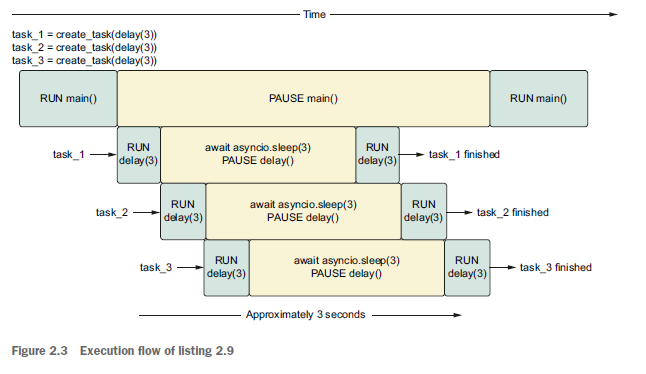

This benefit compounds as we add more tasks; if we had launched 10 of these tasks, we would still take roughly 3 seconds, giving us a 10-fold speedup.

Executing these long-running operations concurrently is where asyncio really shines and delivers drastic improvements in our application’s performance, but the benefits don’t stop there. In listing 2.9, our application was actively doing nothing, while it was waiting for 3 seconds for our delay coroutines to complete. While our code is waiting, we can execute other code. As an example, let’s say we wanted to print out a status message every second while we were running some long tasks.

```Python3
import asyncio
from util import delay


async def hello_every_second() -> None:
  for _ in range(9):
    await asyncio.sleep(1)
    print("I'm running other code while I'm waiting!")


async def main() -> None:
  first_delay = asyncio.create_task(delay(3))
  second_delay = asyncio.create_task(delay(3))

  await hello_every_second()
  await first_delay
  await second_delay


asyncio.run(main())
```

In the preceding listing, we create two tasks, each of which take 3 seconds to complete. While these tasks are waiting, our application is idle, which gives us the opportunity to run other code. In this instance, we run a coroutine hello_every_second, which prints a message every second 2 times. While our two tasks are running, we’ll see messages being output, giving us the following:

```
sleeping for 3 second(s)
sleeping for 3 second(s)
I'm running other code while I'm waiting!
I'm running other code while I'm waiting!
finished sleeping for 3 second(s)
finished sleeping for 3 second(s)
```

We can imagine the execution flow as shown in figure 2.4.

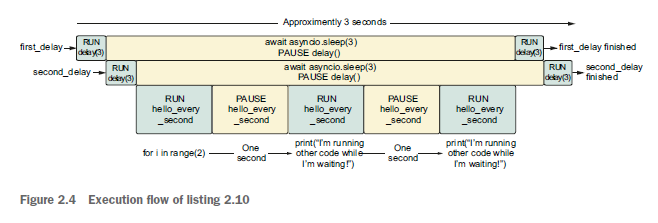

First, we start two tasks that sleep for 3 seconds; then, while our two tasks are idle, we start to see I’m running other code while I’m waiting! being printed every second. This means that even when we’re running time-intensive operations, our application can still be performing other tasks.

One potential issue with tasks is that they can take an indefinite amount of time to complete. We could find ourselves wanting to stop a task if it takes too long to finish. Tasks support this use case by allowing cancellation.

## Canceling tasks and setting timeouts

Network connections can be unreliable. A user’s connection may drop because of a network slowdown, or a web server may crash and leave existing requests in limbo. When making one of these requests, we need to be especially careful that we don’t wait indefinitely. Doing so could lead to our application hanging, waiting forever for a result that may never come. It could also lead to a poor user experience; if we allow a user to make a request that takes too long, they are unlikely to wait forever for a response. Additionally, we may want to allow our users a choice if a task continues torun. A user may proactively decide things are taking too long, or they may want to stop a task they made in error.

In our previous examples, if our tasks took forever, we would be stuck waiting for the await statement to finish with no feedback. We also had no way to stop things if we wanted to. asyncio supports both these situations by allowing tasks to be canceled as well as allowing them to specify a timeout.

## Canceling tasks

Canceling a task is straightforward. Each task object has a method named cancel, which we can call whenever we’d like to stop a task. Canceling a task will cause that task to raise a CancelledError when we await it, which we can then handle as needed.

To illustrate this, let’s say we launch a long-running task that we don’t want to run for longer than 5 seconds. If the task is not completed within 5 seconds, we’d like to stop that task, reporting back to the user that it took too long and we’re stopping it. We also want a status update printed every second, to provide up-to-date information to our user, so they aren’t left without information for several seconds.

```Python3
import asyncio
from asyncio import CancelledError
from util import delay


async def main():
  long_task = asyncio.create_task(delay(10))

  seconds_elapsed = 0

  while not long_task.done():
    print("Task not finished, checking again in a second.")
    await asyncio.sleep(1)
    seconds_elapsed += 1
    if seconds_elapsed == 5:
      long_task.cancel()

  try:
    await long_task
  except CancelledError:
    print('Our task was cancelled')


asyncio.run(main())
```

In the preceding listing, we create a task that will take 10 seconds to run. We then create a while loop to check if that task is done. The done method on the task returns True if a task is finished and False otherwise. Every second, we check to see if the task has finished, keeping track of how many seconds we’ve checked so far. If our task has taken5 seconds, we cancel the task. Then, we will go on to await long_task, and we’ll see Our task was cancelled printed out, indicating we’ve caught a CancelledError.

Something important to note about cancellation is that a CancelledError can only be thrown from an await statement. This means that if we call cancel on a task when it is executing plain Python code, that code will run until completion until we hit the next await statement (if one exists) and a CancelledError can be raised. Calling cancel won’t magically stop the task in its tracks; it will only stop the task if you’re currently at an await point or its next await point.

## Setting a timeout and canceling with a ```wait_for```

Checking every second or at some other time interval, and then canceling a task, as we did in the previous example, isn’t the easiest way to handle a timeout. Ideally, we’d have a helper function that would allow us to specify this timeout and handle cancellation for us.

asyncio provides this functionality through a function called asyncio.wait_for. This function takes in a coroutine or task object, and a timeout specified in seconds. It then returns a coroutine that we can await. If the task takes more time to complete than the timeout we gave it, a TimeoutException will be raised. Once we have reached the timeout threshold, the task will automatically be canceled.

To illustrate how wait_for works, we’ll look at a case where we have a task that will take 2 seconds to complete, but we’ll only allow it 1 second to finish. When we get a TimeoutError raised, we’ll catch the exception and check to see if the task was canceled.

```Python3
import asyncio
from util import delay


async def main():
  delay_task = asyncio.create_task(delay(2))

  try:
    result = await asyncio.wait_for(delay_task, timeout=1)
    print(result)
  except asyncio.exceptions.TimeoutError:
    print("Got a timeout!")
    print('Was the task cancelled ? {0}'.format(delay_task.cancelled()))


asyncio.run(main())
```

When we run the preceding listing, our application will take roughly 1 second to complete. After 1 second our wait_for statement will raise a TimeoutError, which we then handle. We’ll then see that our original delay task was canceled, giving the following output:

```
sleeping for 2 second(s)
Got a timeout!
Was the task cancelled? True
```

Canceling tasks automatically if they take longer than expected is normally a good idea. Otherwise, we may have a coroutine waiting indefinitely, taking up resources that may never be released. However, in certain circumstances we may want to keep our coroutine running. For example, we may want to inform a user that something is taking longer than expected after a certain amount of time but not cancel the task when the timeout is exceeded.

To do this we can wrap our task with the asyncio.shield function. This function will prevent cancellation of the coroutine we pass in, giving it a “shield,” which cancellation requests then ignore.

```Python3
import asyncio
from util import delay


async def main():
  task = asyncio.create_task(delay(10))

  try:
    result = await asyncio.wait_for(asyncio.shield(task), 5)
    print(result)
  except asyncio.exceptions.TimeoutError:
    print('Task took longer than five seconds, it will finish soon!')
    result = await task
    print(result)


asyncio.run(main())
``` 

In the preceding listing, we first create a task to wrap our coroutine. This differs from our first cancellation example because we’ll need to access the task in the except block. If we had passed in a coroutine, wait_for would have wrapped it in a task, but we wouldn’t be able to reference it, as it is internal to the function.

Then, inside of a try block, we call wait_for and wrap the task in shield, which will prevent the task from being canceled. Inside our exception block, we print a useful message to the user, letting them know that the task is still running and then we await the task we initially created. This will let it finish in its entirety, and the program’s output will be as follows:

```
sleeping for 10 second(s)
Task took longer than five seconds!
finished sleeping for 10 second(s)
finished <function delay at 0x10e8cf820> in 10 second(s)
```

Cancellation and shielding are somewhat tricky subjects with several cases that are noteworthy. We introduce the basics below, but as we get into more complicated cases, we’ll explore how cancellation works in greater depth.

## Tasks, coroutines, futures, and awaitables

Coroutines and tasks can both be used in await expressions. So what is the common thread between them? To understand, we’ll need to know about both a future as well as an awaitable. You normally won’t need to use futures, but understanding them is a key to understanding the inner workings of asyncio. As some APIs return futures, we will reference them in the rest of the book.

## Introducing futures

A future is a Python object that contains a single value that you expect to get at some point in the future but may not yet have. Usually, when you create a future, it does not have any value it wraps around because it doesn’t yet exist. In this state, it is considered incomplete, unresolved, or simply not done. Then, once you get a result, you can set the value of the future. This will complete the future; at that time, we can consider it finished and extract the result from the future. To understand the basics of futures, let’s try creating one, setting its value and extracting that value back out.

```Python3
from asyncio import Future

my_future = Future()

print('Is my_future done? {0}'.format(my_future.done()))

my_future.set_result(42)

print('Is my_future done? {0}'.format(my_future.done()))
print('What is the result of my_future? {0}'.format(my_future.result()))
```

We can create a future by calling its constructor. At this time, the future will have no result set on it, so calling its done method will return False. We then set the value of the future with its set_result method, which will mark the future as done. Alternatively, if we had an exception we wanted to set on the future, we could call set_exception.

***We don’t call the result method before the result is set because the result method will throw an invalid state exception if we do so.***

Futures can also be used in await expressions. If we await a future, we’re saying “pause until the future has a value set that I can work with, and once I have a value, wake up and let me process it.”

To understand this, let’s consider an example of making a web request that returns a future. Making a request that returns a future should complete instantly, but as the request will take some time, the future will not yet be defined. Then, later, once the request has finished, the result will be set, then we can access it. If you have used JavaScript in the past, this concept is analogous to promises. In the Java world, these are known as completable futures.

```Python3
from asyncio import Future
import asyncio


def make_request() -> Future:
  future = Future()
  asyncio.create_task(set_future_value(future))
  return future


async def set_future_value(future: asyncio.Future) -> None:
  await asyncio.sleep(1)
  future.set_result(42)


async def main():
  future = make_request()
  print('Is the future done? {0}'.format(future.done()))
  value = await future
  print('Is the future done? {0}'.format(future.done()))
  print(value)


asyncio.run(main())
```

In the preceding listing, we define a function make_request. In that function we create a future and create a task that will asynchronously set the result of the future after 1 second. Then, in the main function, we call make_request. When we call this, we’ll instantly get a future with no result; it is, therefore, undone. Then, we await the future. Awaiting this future will pause main for 1 second while we wait for the value of the future to be set. Once this completes, value will be 42 and the future is done.

In the world of asyncio, you should rarely need to deal with futures. That said, you will run into some asyncio APIs which return futures, and you may need to work with callback-based code, which can require futures. You may also need to read or debug some asyncio API code yourself. The implementation of these asyncio APIs heavily rely on futures, so it is ideal to have a basic understanding of how they work.

## The relationship between futures, tasks, and coroutines

There is a strong relationship between tasks and futures. In fact, task directly inherits from future. A future can be thought as representing a value that we won’t have for a while. A task can be thought as a combination of both a coroutine and a future. When we create a task, we are creating an empty future and running the coroutine. Then, when the coroutine has completed with either an exception or a result, we set the result or exception of the future.

Given the relationship between futures and tasks, is there a similar relationship between tasks and coroutines? After all, all these types can be used in await expressions.

The common thread between these is the Awaitable abstract base class. This class defines one abstract double underscore method __await__. We won’t go into the specifics about how to create our own awaitables, but anything that implements the __await__ method can be used in an await expression. Coroutines inherit directly from Awaitable, as do futures. Tasks then extend futures, which gives us the inheritance diagram shown in figure 2.5.

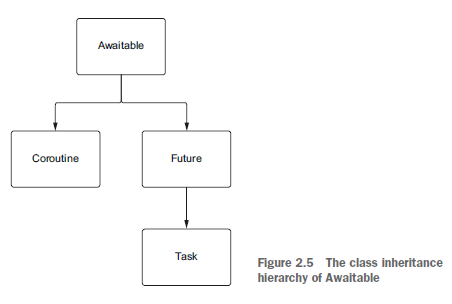

Going forward, we’ll start to refer to objects that can be used in await expressions as awaitables. You’ll frequently see the term awaitable referenced in the asyncio documentation, as many API methods don’t care if you pass in coroutines, tasks, or futures.

Now that we understand the basics of coroutines, tasks, and futures, how do we assess their performance? So far, we’ve only theorized about how long they take. To make things more rigorous, let’s add some functionality to measure execution time.

## Measuring coroutine executing time with decorators

So far, we’ve talked about roughly how long our applications take to run without timing them. To really understand and profile things we’ll need to introduce some code to keep track of this for us.

As a first try we could wrap every await statement and keep track of the start and end time of the coroutine:

```Python3
import asyncio
import time

async def main():
  start = time.time()
  await asyncio.sleep(1)
  end = time.time()
  print(f'Sleeping took {end - start} seconds')
  
asyncio.run(main())
```

However, this will get messy quickly when we have multiple await statements and tasks to keep track of. A better approach is to come up with a reusable way to keep track of how long any coroutine takes to finish. We can do this by creating a decorator that will run an await statement for us (listing 2.16). We’ll call this decorator async_timed.

```Python3
import functools
import time
from typing import Callable, Any


def async_timed():
  def wrapper(func: Callable) -> Callable:
    @functools.wraps(func)
    async def wrapped(*args, **kwargs) -> Any:
      print('starting {0} with args {1} {2}'.format(func, args, kwargs))
      start = time.time()

      try:
        return await func(*args, **kwargs)
      finally:
        end = time.time()
        total = end - start
        print('finished {0} in {1:.4f} second(s)'.format(func, total))

    return wrapped

  return wrapper
```

In this decorator, we create a new coroutine called wrapped. This is a wrapper around our original coroutine that takes its arguments, *args and **kwargs, calls an await statement, and then returns the result. We surround that await statement with one message when we start running the function and another message when we end running the function, keeping track of the start and end time in much the same way that we did in our earlier start-time and end-time example. Now, as shown in listing 2.17, we can put this annotation on any coroutine, and any time we run it, we’ll see how long it took to run.

```Python3
import asyncio
from util import async_timed


@async_timed()
async def delay(delay_seconds: int) -> int:
  print('sleeping for {0} second(s)'.format(delay_seconds))
  await asyncio.sleep(delay_seconds)
  print('finished sleeping for {0} second(s)'.format(delay_seconds))
  return delay_seconds


@async_timed()
async def main():
  task_one = asyncio.create_task(delay(2))
  task_two = asyncio.create_task(delay(2))

  await task_one
  await task_two


asyncio.run(main())
```

When we run the preceding listing, we’ll see console output similar to the following:

```
starting <function main at 0x109111ee0> with args () {}
starting <function delay at 0x1090dc700> with args (2,) {}
starting <function delay at 0x1090dc700> with args (3,) {}
finished <function delay at 0x1090dc700> in 2.0032 second(s)
finished <function delay at 0x1090dc700> in 3.0003 second(s)
finished <function main at 0x109111ee0> in 3.0004 second(s)
```

We can see that our two delay calls were both started and finished in roughly 2 and 3 seconds, respectively, for a total of 5 seconds. Notice, however, that our main coroutine only took 3 seconds to complete because we were waiting concurrently.

## The pitfalls of coroutines and tasks

When seeing the performance improvements we can obtain from running some of our longer tasks concurrently, we can be tempted to start to use coroutines and tasks everywhere in our applications. While it depends on the application you’re writing, simply marking functions async and wrapping them in tasks may not help application performance. In certain cases, this may degrade performance of your applications.

Two main errors occur when trying to turn your applications asynchronous. The first is attempting to run CPU-bound code in tasks or coroutines without using multiprocessing; the second is using blocking I/O-bound APIs without using multithreading.

## Running CPU-bound code

We may have functions that perform computationally expensive calculations, such as looping over a large dictionary or doing a mathematical computation. Where we have several of these functions with the potential to run concurrently, we may get the idea to run them in separate tasks. In concept, this is a good idea, but remember that asyncio has a single-threaded concurrency model. This means we are still subject to the limitations of a single thread and the global interpreter lock.

To prove this to ourselves, let’s try to run some CPU-bound functions concurrently.

```Python3
import asyncio
from util import async_timed, delay


@async_timed()
async def cpu_bound_work() -> int:
  counter = 0

  for _ in range(100000000):
    counter += 1

  return counter


@async_timed()
async def main():
  task_one = asyncio.create_task(cpu_bound_work())
  task_two = asyncio.create_task(cpu_bound_work())

  await task_one
  await task_two


asyncio.run(main())
```

When we run the preceding listing, we’ll see that, despite creating two tasks, our code still executes sequentially. First, we run Task 1, then we run Task 2, meaning our total runtime will be the sum of the two calls to cpu_bound_work:

```
starting <function main at 0x10a8f6c10> with args () {}
starting <function cpu_bound_work at 0x10a8c0430> with args () {}
finished <function cpu_bound_work at 0x10a8c0430> in 4.6750 second(s)
starting <function cpu_bound_work at 0x10a8c0430> with args () {}
finished <function cpu_bound_work at 0x10a8c0430> in 4.6680 second(s)
finished <function main at 0x10a8f6c10> in 9.3434 second(s)
```

Looking at the output above, we may be tempted to think that there are no drawbacks to making all our code use async and await. After all, it ends up taking the same amount of time as if we had run things sequentially. However, by doing this we can run into situations where our application’s performance can degrade. This is especially true when we have other coroutines or tasks that have await expressions. Consider creating two CPU-bound tasks alongside a long-running task, such as our delay coroutine.

```Python3
import asyncio
from util import async_timed, delay


@async_timed()
async def cpu_bound_work() -> int:
  counter = 0

  for _ in range(100000000):
    counter += 1

  return counter


@async_timed()
async def main():
  task_one = asyncio.create_task(cpu_bound_work())
  task_two = asyncio.create_task(cpu_bound_work())
  delay_task = asyncio.create_task(delay(4))

  await task_one
  await task_two
  await delay_task


asyncio.run(main())
```

Running the preceding listing, we might expect to take the same amount of time as in listing 2.18. After all, won’t delay_task run concurrently alongside the CPU-bound work? In this instance it won’t because we create the two CPU-bound tasks first, which, in effect, blocks the event loop from running anything else. This means the runtime of our application will be the sum of time it took for our two cpu_bound_work tasks to finish plus the 4 seconds that our delay task took.

If we need to perform CPU-bound work and still want to use async / await syntax, we can do so. To do this we’ll still need to use multiprocessing, and we need to tell asyncio to run our tasks in a process pool. We’ll learn how to do this in chapter 6.

## Running blocking APIs

We may also be tempted to use our existing libraries for I/O-bound operations by wrapping them in coroutines. However, this will generate the same issues that we saw with CPU-bound operations. These APIs block the main thread. Therefore, when we run a blocking API call inside a coroutine, we’re blocking the event loop thread itself, meaning that we stop any other coroutines or tasks from executing. Examples of blocking API calls include libraries such as requests, or time.sleep. Generally, any function that performs I/O that is not a coroutine or performs time-consuming CPU operations can be considered blocking.

As an example, let’s try getting the status code of www.example.com three times concurrently, using the requests library. When we run this, since we’re running concurrently we’ll be expecting this application to finish in about the length of time necessary to get the status code once.

```Python3
import asyncio
import requests
from util import async_timed


@async_timed()
async def get_example_status() -> int:
  return requests.get('http://www.example.com').status_code


@async_timed()
async def main():
  task_1 = asyncio.create_task(get_example_status())
  task_2 = asyncio.create_task(get_example_status())
  task_3 = asyncio.create_task(get_example_status())

  await task_1
  await task_2
  await task_3


asyncio.run(main())
```

When running the preceding listing, we’ll see output similar to the following. Note how the total runtime of the main coroutine is roughly the sum of time for all the tasks to get the status we ran, meaning that we did not have any concurrency advantage:

```
starting <function main at 0x1102e6820> with args () {}
starting <function get_example_status at 0x1102e6700> with args () {}
finished <function get_example_status at 0x1102e6700> in 0.0839 second(s)
starting <function get_example_status at 0x1102e6700> with args () {}
finished <function get_example_status at 0x1102e6700> in 0.0441 second(s)
starting <function get_example_status at 0x1102e6700> with args () {}
finished <function get_example_status at 0x1102e6700> in 0.0419 second(s)
finished <function main at 0x1102e6820> in 0.1702 second(s)
```

This is again because the requests library is blocking, meaning it will block whichever thread it is run on. Since asyncio only has one thread, the requests library blocks the event loop from doing anything concurrently.

As a rule, most APIs you employ now are blocking and won’t work out of the box with asyncio. You need to use a library that supports coroutines and utilizes nonblocking sockets. This means that if the library you are using does not return coroutines and you aren’t using await in your own coroutines, you’re likely making a blocking call.

In the above example we can use a library such as aiohttp, which uses non-blocking sockets and returns coroutines to get proper concurrency. We’ll introduce this library later in chapter 4.

If you need to use the requests library, you can still use async syntax, but you’ll need to explicitly tell asyncio to use multithreading with a thread pool executor. We’ll see how to do this in chapter 7.

We’ve now seen a few things to look for when using asyncio and have built a few simple applications. So far, we have not created or configured the event loop ourselves but relied on convenience methods to do it for us. Next, we’ll learn to create the event loop, which will allow us to access lower-level asyncio functionality and event loop configuration properties.

## Accessing and manually managing the event loop

Until now, we have used the convenient asyncio.run to run our application and create the event loop for us behind the scenes. Given the ease of use, this is the preferred method to create the event loop. However, there may be cases in which we don’t want the functionality that asyncio.run provides. As an example, we may want to execute custom logic to stop tasks that differ from what asyncio.run does, such as letting any remaining tasks finish instead of stopping them.

In addition, we may want to access methods available on the event loop itself. These methods are typically lower level and, as such, should be used sparingly. However, if you want to perform tasks, such as working directly with sockets or scheduling a task to run at a specific time in the future, you’ll need to access the event loop. While we won’t, and shouldn’t, be managing the event loop extensively, this will be necessary from time to time.

## Creating an event loop manually

We can create an event loop by using the asyncio.new_event_loop method. This will return an event loop instance. With this, we have access to all the low-level methods that the event loop has to offer. With the event loop we have access to a method named run_until_complete, which takes a coroutine and runs it until it finishes. Once we are done with our event loop, we need to close it to free any resources it was using. This should normally be in a finally block so that any exceptions thrown don’t stop us from closing the loop. Using these concepts, we can create a loop and run an asyncio application.

```Python3
import asyncio


async def main():
  await asyncio.sleep(1)


loop = asyncio.new_event_loop()

try:
  loop.run_until_complete(main())
finally:
  loop.close()
```

The code in this listing is similar to what happens when we call asyncio.run with the difference being that this does not perform canceling any remaining tasks. If we want any special cleanup logic, we would do so in our finally clause.

## Accessing the event loop

From time to time, we may need to access the currently running event loop. asyncio exposes the asyncio.get_running_loop function that allows us to get the current event loop. As an example, let’s look at call_soon, which will schedule a function to run on the next iteration of the event loop.

```Python3
import asyncio
from util import delay


def call_later():
  print("I'm being called in the future!")


async def main():
  loop = asyncio.get_running_loop()
  loop.call_soon(call_later)
  await delay(1)


asyncio.run(main())
```

In the preceding listing, our main coroutine gets the event loop with asyncio.get _running_loop and tells it to run call_later, which takes a function and will run it on the next iteration of the event loop. In addition, there is an asyncio.get_event _loop function that lets you access the event loop.

This function can potentially create a new event loop if it is called when one is not already running, leading to strange behavior. It is recommended to use get_ running_loop, as this will throw an exception if an event loop isn’t running, avoiding any surprises.

While we shouldn’t use the event loop frequently in our applications, there are times when we will need to configure settings on the event loop or use low-level functions. We’ll see an example of configuring the event loop in the next section on debug mode.

## Using debug mode

In previous sections, we mentioned how coroutines should always be awaited at some point in the application. We also saw the drawbacks of running CPU-bound and other blocking code inside coroutines and tasks. It can, however, be hard to tell if a coroutine is taking too much time on CPU, or if we accidently forgot an await somewhere in our application. Luckily, asyncio gives us a debug mode to help us diagnose these situations.

When we run in debug mode, we’ll see a few helpful log messages when a coroutine or task takes more than 100 milliseconds to run. In addition, if we don’t await a coroutine, an exception is thrown, so we can see where to properly add an await. There are a few different ways to run in debug mode.

### Using ```asyncio.run```

The asyncio.run function we have been using to run coroutines exposes a debug parameter. By default, this is set to False, but we can set this to True to enable debug mode:

```Python3
asyncio.run(coroutine(), debug=True)
```

### Using command-line arguments

Debug mode can be enabled by passing a command-line argument when we start our Python application. To do this we apply -X dev:

```bash
$ python3 -X dev program.py
```

### Using environment-variablesWe can also use environment variables to enable debug mode by setting the PYTHONASYNCIODEBUG variable to 1:

```bash
$ PYTHONASYINCIODEBUG=1 python3 program.py
```

In versions of Python older than 3.9, there is a bug within debug mode. When using asyncio.run, only the boolean debug parameter will work. Command-line arguments and environment variables will only work when manually managing the event loop.

In debug mode, we’ll see informative messages logged when a coroutine takes too long. Let’s test this out by trying to run CPU-bound code in a task to see if we get a warning, as shown in the following listing.

```Python3
import asyncio
from util import async_timed


@async_timed()
async def cpu_bound_work() -> int:
  counter = 0
  for _ in range(100000000):
    counter += 1

  return counter


async def main() -> None:
  task_one = asyncio.create_task(cpu_bound_work())
  await task_one


asyncio.run(main(), debug=True)
```

When running this, we’ll see a helpful message that task_one was taking too long, therefore blocking the event loop from running any other tasks:

```
Executing <Task finished name='Task-2' coro=<cpu_bound_work() done, defined
at listing_2_9.py:5> result=100000000 created at tasks.py:382> took 4.829
seconds
```

This can be helpful for debugging issues where we may inadvertently be making a call that is blocking. The default settings will log a warning if a coroutine takes longer than 100 milliseconds, but this may be longer or shorter than we’d like. To change this value, we can set the slow callback duration by accessing the event loop as we do in listing 2.24 and setting slow_callback_duration. This is a floating-point value representing the seconds we want the slow callback duration to be.

```Python3
import asyncio


async def main():
  loop = asyncio.get_event_loop()
  loop.slow_callback_duration = .250


asyncio.run(main(), debug=True)
```

The preceding listing will set the slow callback duration to 250 milliseconds, meaning we’ll get a message printed out if any coroutine takes longer than 250 milliseconds of CPU time to run

# 3. A first asyncio application

## An echo server on the asyncio event loop

Working with select is a bit too low-level for most applications. We may want to have code run in the background while we’re waiting for socket data to come in, or we may want to have background tasks run on a schedule. If we were to do this with only selectors, we’d likely build our own event loop, while asyncio has a nicely implemented one ready to use. In addition, coroutines and tasks provide abstractions on top of selectors, which make our code easier to implement and maintain, as we don’t need to think about selectors at all.

Now that we have a deeper understanding on how the asyncio event loop works, let’s take the echo server that we built in the last section and build it again using coroutines and tasks. We’ll still use lower-level sockets to accomplish this, but we’ll use asyncio-based APIs that return coroutines to manage them. We’ll also add some more functionality to our echo server to demonstrate a few key concepts to illustrate how asyncio works.

## Event loop coroutines for sockets

Given that sockets are a relatively low-level concept, the methods for dealing with them are on asyncio’s event loop itself. There are three main coroutines we’ll want to work with: sock_accept, sock_recv and sock_sendall. These are analogous to the socket methods that we used earlier, except that they take in a socket as an argument and return coroutines that we can await until we have data to act on.

Let’s start with sock_accept. This coroutine is analogous to the socket.accept method that we saw in our first implementation. This method will return a tuple (a data structure that stores an ordered sequence of values) of a socket connection and a client address. We pass it in the socket we’re interested in, and we can then await the coroutine it returns. Once that coroutine completes, we’ll have our connection and address. This socket must be non-blocking and should already be bound to a port:

```Python3
connection, address = await loop.sock_accept(socket)
```

sock_recv and sock_sendall are called similarly to sock_accept. They take in a socket, and we can then await for a result. sock_recv will await until a socket has bytes we can process. sock_sendall takes in both a socket and data we want to send and will wait until all data we want to send to a socket has been sent and will return None on success:

```Python3
data = await loop.sock_recv(socket)
success = await loop.sock_sendall(socket, data)
```

With these building blocks, we’ll be able to translate our previous approaches into one using coroutines and tasks.

## Designing an asyncio echo server

In chapter 2, we introduced coroutines and tasks. So when should we use just a coroutine, and when should we wrap a coroutine in a task for our echo server? Let’s examine how we want our application to behave to make this determination.

We’ll start with how we want to listen for connections in our application. When we are listening for connections, we will only be able to process one connection at a time as socket.accept will only give us one client connection. Behind the scenes, incoming connections will be stored in a queue known as the backlog if we get multiple connections at the same time, but here, we won’t get into how this works.

Since we don’t need to process multiple connections concurrently, a single coroutine that loops forever makes sense. This will allow other code to run concurrently while we’re paused waiting for a connection. We’ll define a coroutine called listen_ for_connections that will loop forever and listen for any incoming connections:

```Python3
async def listen_for_connections(server_socket: socket, loop: AbstractEventLoop):
    while True:
        connection, address = await loop.sock_accept(server_socket)
        connection.setblocking(False)
        print(f"Got a connection from {address}")
```

Now that we have a coroutine for listening to connections, how about reading and writing data to the clients who have connected? Should that be a coroutine, or a coroutine we wrap in a task? In this case, we will have multiple connections, each of which could send data to us at any time. We don’t want to wait for data from one connection to block another, so we need to read and write data from multiple clients concurrently. Because we need to handle multiple connections at the same time, creating a task for each connection to read and write data makes sense. On every connection we get, we’ll create a task to both read data from and write data to that connection.

We’ll create a coroutine named echo that is responsible for handling data from a connection. This coroutine will loop forever listening for data from our client. Once it receives data it will then send it back to the client.

Then, in listen_for_connections we’ll create a new task that wraps our echo coroutine for each connection that we get. With these two coroutines defined, we now have all we need to build an asyncio echo server.

```Python3
import asyncio
import socket
from asyncio import AbstractEventLoop


async def echo(connection: socket, loop: AbstractEventLoop) -> None:
    # Loop forever waiting for data from a client connection
    while data := await loop.sock_recv(connection, 1024):
        # Once we have data, send it back to ALL clients.
        await loop.sock_sendall(connection, data)


async def listen_for_connection(server_socket: socket, loop: AbstractEventLoop) -> None:
    while True:
        connection, address = await loop.sock_accept(server_socket)
        connection.setblocking(False)
        print(f'Got a connection from {address}')

        # Whenever we get a connection, create an echo task to listen for client data.
        asyncio.create_task(echo(connection, loop))


async def main():
    server_socket = socket.socket(socket.AF_INET, socket.SOCK_STREAM)
    server_socket.setsockopt(socket.SOL_SOCKET, socket.SO_REUSEADDR, 1)

    server_address = ('127.0.0.1', 8000)
    server_socket.setblocking(False)
    server_socket.bind(server_address)
    server_socket.listen()

    # Start the coroutine to listen for connections
    await listen_for_connection(server_socket, asyncio.get_event_loop())


asyncio.run(main())
```

The architecture for the preceding listing looks like figure 3.5. We have one coroutine, listen_for_connection, listening for connections. Once a client connects, our coroutine spawns an echo task for each client which then listens for data and writes it back out to the client.

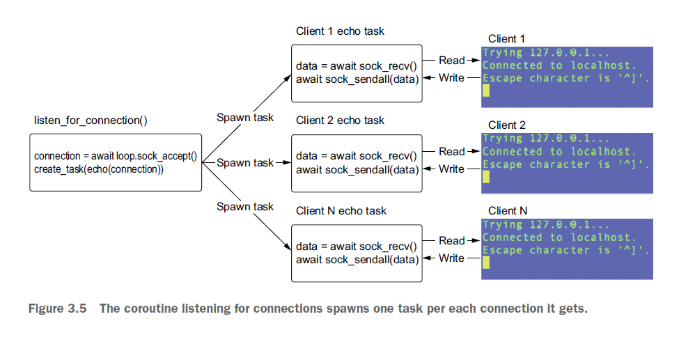

When we run this application, we’ll be able to connect multiple clients concurrently and send data to them concurrently. Under the hood, this is all using selectors as we saw before, so our CPU utilization remains low.

We’ve now built a fully functioning echo server entirely using asyncio! So is our implementation error free? It turns out that the way we have designed this echo server does have an issue when our echo task fails that we’ll need to handle

# 4. Concurrent web requests

## Asynchronous context managers

In any programming language, dealing with resources that must be opened and then closed, such as files, is common. When dealing with these resources, we need to be careful about any exceptions that may be thrown. This is because if we open a resource and an exception is thrown, we may never execute any code to clean up, leaving us in a status with leaking resources. Dealing with this in Python is straightforward using a ```finally``` block. Though this example is not exactly Pythonic, we can always close a file even if an exception was thrown:

```Python3
file = open('example.txt')

try:
    lines = file.readlines()
finally:
    file.close()
```

This solves the issue of a file handle being left open if there was an exception during file.readlines. The drawback is that we must remember to wrap everything in a try finally, and we also need to remember the methods to call to properly close our resource. This isn’t too hard to do for files, as we just need to remember to close them, but we’d still like something more reusable, especially since our cleanup may be more complicated than just calling one method. Python has a language feature to deal with this known as a context manager. Using this, we can abstract the shutdown logic along with the try/finally block:

```Python3
with open(‘example.txt’) as file:
    lines = file.readlines()
```

This Pythonic way to manage files is a lot cleaner. If an exception is thrown in the with block, our file will automatically be closed. This works for synchronous resources, but what if we want to asynchronously use a resource with this syntax? In this case, the context manager syntax won’t work, as it is designed to work only with synchronous Python code and not coroutines and tasks. Python introduced a new language feature to support this use case, called asynchronous context managers. The syntax is almost the same as for synchronous context managers with the difference being that we say async with instead of just with.

Asynchronous context managers are classes that implement two special coroutine methods, __aenter__, which asynchronously acquires a resource and __aexit__, which closes that resource. The __aexit__ coroutine takes several arguments that deal with any exceptions that occur, which we won’t review in this chapter.

To fully understand async context managers, let’s implement a simple one using the sockets we introduced in chapter 3. We can consider a client socket connection a resource we’d like to manage. When a client connects, we acquire a client connection. Once we are done with it, we clean up and close the connection. In chapter 3, we wrapped everything in a try/finally block, but we could have implemented an asynchronous context manager to do so instead.

```Python3

import asyncio
import socket
from types import TracebackType
from typing import Optional, Type


class ConnectedSocket:
  def __init__(self, server_socket):
    self._connection = None
    self._server_socket = server_socket

  async def __aenter__(self):
    print('Entering context manager, waiting for connection')
    loop = asyncio.get_event_loop()
    connection, address = await loop.sock_accept(self._server_socket)
    self._connection = connection
    print('Accepted a connection')
    return self._connection

  async def __aexit__(self,
                      exc_type: Optional[Type[BaseException]],
                      exc_val: Optional[BaseException],
                      exc_tb: Optional[TracebackType]) -> None:
    print('Exiting context manager')
    self._connection.close()
    print('Closed connection')


async def main():
  loop = asyncio.get_event_loop()

  server_socket = socket.socket()
  server_socket.setsockopt(socket.SOL_SOCKET, socket.SO_REUSEADDR, 1)
  server_address = ('127.0.0.1', 8000)
  server_socket.setblocking(False)
  server_socket.bind(server_address)
  server_socket.listen()

  async with ConnectedSocket(server_socket) as connection:
    data = await loop.sock_recv(connection, 1024)
    print(data)


asyncio.run(main())
```

In the preceding listing, we created a ConnectedSocket async context manager. This class takes in a server socket, and in our __aenter__ coroutine we wait for a client to connect. Once a client connects, we return that client’s connection. This lets us access that connection in the as portion of our async with statement. Then, inside our async with block, we use that connection to wait for the client to send us data. Once this block finishes execution, the __aexit__ coroutine runs and closes the connection. Assuming a client connects with Telnet and sends some test data, we should see output like the following when running this program:

```
Entering context manager, waiting for connection
Accepted a connection
b'test\r\n'
Exiting context manager
Closed connection
```

## Making a web request with aiohttp

aiohttp, and web requests in general, employ the concept of a session. Think of a session as opening a new browser window. Within a new browser window, you’ll make connections to any number of web pages, which may send you cookies that your browser saves for you. With a session, you’ll keep many connections open, which can then be recycled. This is known as connection pooling. Connection pooling is an important concept that aids the performance of our aiohttp-based applications. Since creating connections is resource intensive, creating a reusable pool of them cuts down on resource allocation costs. A session will also internally save any cookies that we receive, although this functionality can be turned off if desired.

Typically, we want to take advantage of connection pooling, so most aiohttpbased applications run one session for the entire application. This session object is then passed to methods where needed. A session object has methods on it for making any number of web requests, such as GET, PUT, and POST. We can create a session by using async with syntax and the aiohttp.ClientSession asynchronous context manager.

```Python3
import asyncio
import aiohttp

from aiohttp import ClientSession


async def fetch_status(session: ClientSession, url: str) -> int:
  async with session.get(url) as result:
    return result.status


async def main():
  async with aiohttp.ClientSession() as session:
    url = 'https://www.example.com'
    status = await fetch_status(session, url)
    print(f'Status for {url} was {status}')


asyncio.set_event_loop_policy(asyncio.WindowsSelectorEventLoopPolicy())
asyncio.run(main())
```

When we run this, we should see that the output Status for http:/ / www .example .com was 200. In the preceding listing, we first created a client session in an async with block with aiohttp.ClientSession(). Once we have a client session, we’re free to make any web request desired. In this case, we define a convenience method fetch_status_code that will take in a session and a URL and return the status code for the given URL. In this function, we have another async with block and use the session to run a GET HTTP request against the URL. This will give us a result, which we can then process within the with block. In this case, we just grab the status code and return.

Note that a ClientSession will create a default maximum of 100 connections by default, providing an implicit upper limit to the number of concurrent requests we can make. To change this limit, we can create an instance of an aiohttp TCPConnector specifying the maximum number of connections and passing that to the Client- Session. To learn more about this, review the aiohttp documentation at https:// docs.aiohttp.org/en/stable/client_advanced.html#connectors.

## Setting timeouts with aiohttp

Earlier we saw how we could specify a timeout for an awaitable by using asyncio.wait_ for. This will also work for setting timeouts for an aiohttp request, but a cleaner way to set timeouts is to use the functionality that aiohttp provides out of the box.

By default, aiohttp has a timeout of five minutes, which means that no single operation should take longer than that. This is a long timeout, and many application developers may wish to set this lower. We can specify a timeout at either the session level, which will apply that timeout for every operation, or at the request level, which provides more granular control.

We can specify timeouts using the aiohttp-specific ClientTimeout data structure. This structure not only allows us to specify a total timeout in seconds for an entire request but also allows us to set timeouts on establishing a connection or reading data. Let’s examine how to use this by specifying a timeout for our session and one for an individual request.

```Python3
import asyncio
import aiohttp
from aiohttp import ClientSession


async def fetch_status(session: ClientSession, url: str) -> int:
  ten_millis = aiohttp.ClientTimeout(total=.01)

  async with session.get(url, timeout=ten_millis) as result:
    print(result.status)
    return result.status


async def main():
  session_timeout = aiohttp.ClientTimeout(total=1, connect=.1)

  async with aiohttp.ClientSession(timeout=session_timeout) as session:
    await fetch_status(session, 'https://www.example.com')


asyncio.set_event_loop_policy(asyncio.WindowsSelectorEventLoopPolicy())
asyncio.run(main())
```

In the preceding listing, we set two timeouts. The first timeout is at the client-session level. Here we set a total timeout of 1 second and explicitly set a connection timeout of 100 milliseconds. Then, in fetch_status we override this for our get request to set a total timeout of 10 miliseconds. In this instance, if our request to example.com takes more than 10 milliseconds, an asyncio.TimeoutError will be raised when we await fetch_status. In this example, 10 milliseconds should be enough time for the request to example.com to complete, so we’re not likely to see an exception. If you’d like to check out this exception, change the URL to a page that takes a bit longer than 10 milliseconds to download.

## Running tasks concurrently, revisited

In the first few chapters of this book, we learned how to create multiple tasks to run coroutines concurrently. To do this, we used asyncio.create_task and then awaited the task as below:

```Python3
import asyncio

async def main() -> None:
    task_one = asyncio.create_task(delay(1))
    task_two = asyncio.create_task(delay(2))
    
await task_one
await task_two
```

This works for simple cases like the previous one in which we have one or two coroutines we want to launch concurrently. However, in a world where we may make hundreds, thousands, or even more web requests concurrently, this style would become verbose and messy.

We may be tempted to utilize a for loop or a list comprehension to make this a little smoother, as demonstrated in the following listing. However, this approach can cause issues if not written correctly.

```Python3
import asyncio
from util import async_timed, delay


@async_timed()
async def main() -> None:
    delay_times = [3, 3, 3]
    [await asyncio.create_task(delay(seconds)) for seconds in delay_times]

asyncio.run(main())
```

Given that we ideally want the delay tasks to run concurrently, we’d expect the main method to complete in about 3 seconds. However, in this case 9 seconds elapse to run, since everything is done sequentially:

```
starting <function main at 0x10f14a550> with args () {}
starting <function delay at 0x10f7684c0> with args (3,) {}
sleeping for 3 second(s)
finished sleeping for 3 second(s)
finished <function delay at 0x10f7684c0> in 3.0008 second(s)
starting <function delay at 0x10f7684c0> with args (3,) {}
sleeping for 3 second(s)
finished sleeping for 3 second(s)
finished <function delay at 0x10f7684c0> in 3.0009 second(s)
starting <function delay at 0x10f7684c0> with args (3,) {}
sleeping for 3 second(s)
finished sleeping for 3 second(s)
finished <function delay at 0x10f7684c0> in 3.0020 second(s)
finished <function main at 0x10f14a550> in 9.0044 second(s)
```

The problem here is subtle. It occurs because we use await as soon as we create the task. This means that we pause the list comprehension and the main coroutine for every delay task we create until that delay task completes. In this case, we will have only one task running at any given time, instead of running multiple tasks concurrently. The fix is easy, although a bit verbose. We can create the tasks in one list comprehension and await in a second. This lets everything run concurrently.

```Python3
import asyncio
from util import async_timed, delay


@async_timed()
async def main() -> None:
    delay_times = [3, 3, 3]
    print("hello 1")
    tasks = [asyncio.create_task(delay(seconds)) for seconds in delay_times]
    print("hello 2")
    [await task for task in tasks]
    print("hello 3")


asyncio.run(main())
```

This code creates a number of tasks all at once in the tasks list. Once we have created all the tasks, we await their completion in a separate list comprehension. This works because create_task returns instantly, and we don’t do any awaiting until all the tasks have been created. This ensures that it only requires at most the maximum pause in delay_times, giving a runtime of about 3 seconds:

```
starting <function main at 0x10d4e1550> with args () {}
starting <function delay at 0x10daff4c0> with args (3,) {}
sleeping for 3 second(s)
starting <function delay at 0x10daff4c0> with args (3,) {}
sleeping for 3 second(s)
starting <function delay at 0x10daff4c0> with args (3,) {}
sleeping for 3 second(s)
finished sleeping for 3 second(s)
finished <function delay at 0x10daff4c0> in 3.0029 second(s)
finished sleeping for 3 second(s)
finished <function delay at 0x10daff4c0> in 3.0029 second(s)
finished sleeping for 3 second(s)
finished <function delay at 0x10daff4c0> in 3.0029 second(s)
finished <function main at 0x10d4e1550> in 3.0031 second(s)
```

While this does what we want, drawbacks remain. The first is that this consists of multiple lines of code, where we must explicitly remember to separate out our task creation from our awaits. The second is that it is inflexible, and if one of our coroutines finishes long before the others, we’ll be trapped in the second list comprehension waiting for all other coroutines to finish. While this may be acceptable in certain circumstances, we may want to be more responsive, processing our results as soon as they arrive. The third, and potentially biggest issue, is exception handling. If one of our coroutines has an exception, it will be thrown when we await the failed task. This means that we won’t be able to process any tasks that completed successfully because that one exception will halt our execution.

asyncio has convenience functions to deal with all these situations and more. These functions are recommended when running multiple tasks concurrently. In the following sections, we’ll look at some of them, and examine how to use them in the context of making multiple web requests concurrently.

## Running requests concurrently with gather

A widely used asyncio API functions for running awaitables concurrently is asyncio .gather. This function takes in a sequence of awaitables and lets us run them concurrently, all in one line of code. If any of the awaitables we pass in is a coroutine, gather will automatically wrap it in a task to ensure that it runs concurrently. This means that we don’t have to wrap everything with asyncio.create_task separately as we used above.

asyncio.gather returns an awaitable. When we use it in an await expression, it will pause until all awaitables that we passed into it are complete. Once everything we passed in finishes, asyncio.gather will return a list of the completed results.

We can use this function to run as many web requests as we’d like concurrently. To illustrate this, let’s see an example where we make 1,000 requests at the same time and grab the status code of each response. We’ll decorate our main coroutine with @async_ timed so we know how long things are taking.

```Python3
import asyncio
import aiohttp

from aiohttp import ClientSession
from util import async_timed


async def fetch_status(session: ClientSession, url: str) -> int:
  ten_millis = aiohttp.ClientTimeout(total=1)

  async with session.get(url, timeout=ten_millis) as result:
    print(result.status)
    return result.status


@async_timed()
async def main():
  async with aiohttp.ClientSession() as session:
    urls = ['https://www.example.com' for _ in range(100)]

    # Generate a list of coroutines for each request we want to make.
    requests = [fetch_status(session, url) for url in urls]

    # Wait for all requests to complete.
    status_codes = await asyncio.gather(*requests)

    print(status_codes)


asyncio.set_event_loop_policy(asyncio.WindowsSelectorEventLoopPolicy())
asyncio.run(main())
```

In the preceding listing, we first generate a list of URLs we’d like to retrieve the status code from; for simplicity, we’ll request example.com repeatedly. We then take that list of URLs and call fetch_status_code to generate a list of coroutines that we then pass into gather. This will wrap each coroutine in a task and start running them concurrently. When we execute this code, we’ll see 1,000 messages printed to standard out, saying that the fetch_status_code coroutines started sequentially, indicating that 1,000 requests started concurrently. As results come in, we’ll see messages like finished <function fetch_status_code at 0x10f3fe3a0> in 0.5453 second(s) arrive. Once we retrieve the contents of all the URLs we’ve requested, we’ll see the status codes start to print out. This process is quick, depending on the internet connection and speed of the machine, and this script can finish in as little as 500–600 milliseconds.

So how does this compare with doing things synchronously? It’s easy to adapt the main function so that it blocks on each request by using an await when we call fetch_status_code. This will pause the main coroutine for each URL, effectively making things synchronous:

```Python3
@async_timed()
async def main():
    async with aiohttp.ClientSession() as session:
        urls = ['https:/ / example .com' for _ in range(1000)]
        status_codes = [await fetch_status_code(session, url) for url in
        urls]
        print(status_codes)
```

If we run this, notice that things will take much longer. We’ll also notice that, instead of getting 1,000 starting function fetch_status_code messages followed by 1,000 finished function fetch_status_code messages, something like the following displays for each request:

```
starting <function fetch_status_code at 0x10d95b310>
finished <function fetch_status_code at 0x10d95b310> in 0.01884 second(s)
```

This indicates that requests occur one after another, waiting for each call to fetch_ status_code to finish before moving on to the next request. So how much slower is this than using our async version? While this depends on your internet connection and the machine you run this on, running sequentially can take around 18 seconds to complete. Comparing this with our asynchronous version, which took around 600 milliseconds, the latter runs an impressive 33 times faster.

It is worth noting that the results for each awaitable we pass in may not complete in a deterministic order. For example, if we pass coroutines a and b to gather in that order, b may complete before a. A nice feature of gather is that, regardless of when our awaitables complete, we are guaranteed the results will be returned in the order we passed them in. Let’s demonstrate this by looking at the scenario we just described with our delay function.

```Python3
import asyncio
from util import delay, async_timed


@async_timed()
async def main():
  results = await asyncio.gather(delay(3), delay(1))
  print(results)


asyncio.set_event_loop_policy(asyncio.WindowsSelectorEventLoopPolicy())
asyncio.run(main())
```

In the preceding listing, we pass two coroutines to gather. The first takes 3 seconds to complete and the second takes 1 second. We may expect the result of this to be [1, 3], since our 1-second coroutine finishes before our 3-second coroutine, but the result is actually [3, 1]—the order we passed things in. The gather function keeps result ordering deterministic despite the inherent nondeterminism behind the scenes. In the background, gather uses a special kind of future implementation to do this. For the curious reader, reviewing the source code of gather can be an instructive way to understand how many asyncio APIs are built using futures.

## Handling exceptions with gather

Of course, when we make a web request, we might not always get a value back; we might get an exception. Since networks can be unreliable, different failure cases are possible. For example, we could pass in an address that is invalid or has become invalid because the site has been taken down. The server we connect to could also close or refuse our connection.

```asyncio.gather``` gives us an optional parameter, return_exceptions, which allows us to specify how we want to deal with exceptions from our awaitables. return_exceptions is a Boolean value; therefore, it has two behaviors that we can choose from:

* ```return_exceptions=False``` —This is the default value for gather. In this case, if any of our coroutines throws an exception, our gather call will also throw that exception when we await it. However, even though one of our coroutines failed, our other coroutines are not canceled and will continue to run as long as we handle the exception, or the exception does not result in the event loop stopping and canceling the tasks.
* ```return_exceptions=True``` —In this case, gather will return any exceptions as part of the result list it returns when we await it. The call to gather will not throw any exceptions itself, and we’ll be able handle all exceptions as we wish.

To illustrate how these options work, let’s change our URL list to contain an invalid web address. This will cause aiohttp to raise an exception when we attempt to make the request. We’ll then pass that into gather and see how each of these return_ exceptions behaves:

```Python3
@async_timed()
async def main():
    async with aiohttp.ClientSession() as session:
        urls = ['https:/ / example .com', 'python:/ / example .com']
        tasks = [fetch_status_code(session, url) for url in urls]
        status_codes = await asyncio.gather(*tasks)
        print(status_codes)
```

If we change our URL list to the above, the request for 'python:/ / example .com' will fail because that URL is not valid. Our fetch_status_code coroutine will throw an AssertionError because of this, meaning that python:/ / does not translate into a port. This exception will get thrown when we await our gather coroutine. If we run this and look at the output, we’ll see that our exception was thrown, but we’ll also see that our other request continued to run (we’ve removed the verbose traceback for brevity):

```
starting <function main at 0x107f4a4c0> with args () {}
starting <function fetch_status_code at 0x107f4a3a0>
starting <function fetch_status_code at 0x107f4a3a0>
finished <function fetch_status_code at 0x107f4a3a0> in 0.0004 second(s)
finished <function main at 0x107f4a4c0> in 0.0203 second(s)
finished <function fetch_status_code at 0x107f4a3a0> in 0.0198 second(s)
Traceback (most recent call last):
    File "gather_exception.py", line 22, in <module>
      asyncio.run(main())
AssertionError

Process finished with exit code 1
```

asyncio.gather won’t cancel any other tasks that are running if there is a failure. That may be acceptable for many use cases but is one of the drawbacks of gather. We’ll see how to cancel tasks we run concurrently later in this chapter.

Another potential issue with the above code is that if more than one exception happens, we’ll only see the first one that occurred when we await the gather. We can fix this by using return_exceptions=True, which will return all exceptions we encounter when running our coroutines. We can then filter out any exceptions and handle them as needed. Let’s examine our previous example with invalid URLs to understand how this works:

```Python3
@async_timed()
async def main():
    async with aiohttp.ClientSession() as session:
        urls = ['https:/ / example .com', 'python:/ / example .com']
        
        tasks = [fetch_status_code(session, url) for url in urls]
        results = await asyncio.gather(*tasks, return_exceptions=True)
        exceptions = [res for res in results if isinstance(res, Exception)]
        successful_results = [res for res in results if not isinstance(res,
        Exception)]
        
        print(f'All results: {results}')
        print(f'Finished successfully: {successful_results}')
        print(f'Threw exceptions: {exceptions}')
```

When running this, notice that no exceptions are thrown, and we get all the exceptions alongside our successful results in the list that gather returns. We then filter out anything that is an instance of an exception to retrieve the list of successful responses, resulting in the following output:

```
All results: [200, AssertionError()]
Finished successfully: [200]
Threw exceptions: [AssertionError()]
```

This solves the issue of not being able to see all the exceptions that our coroutines throw. It is also nice that now we don’t need to explicitly handle any exceptions with a try catch block, since we no longer throw an exception when we await. It is still a little clunky that we must filter out exceptions from successful results, but the API is not perfect.

```gather``` has a few drawbacks. The first, which was already mentioned, is that it isn’t easy to cancel our tasks if one throws an exception. Imagine a case in which we’re making requests to the same server, and if one request fails, all others will as well, such as reaching a rate limit. In this case, we may want to cancel requests to free up resources, which isn’t very easy to do because our coroutines are wrapped in tasks in the background.

The second is that we must wait for all our coroutines to finish before we can process our results. If we want to deal with results as soon as they complete, this poses a problem. For example, if we have one request needing 100 milliseconds, but another that lasts 20 seconds, we’ll be stuck waiting for 20 seconds before we can process the request that completed in only 100 milliseconds.

asyncio provides APIs that allow us to solve for both issues. Let’s start by looking at the problem of handling results as soon as they come in.

## Processing requests as they complete

While asyncio.gather will work for many cases, it has the drawback that it waits for all awaitables to finish before allowing access to any results. This is a problem if we’d like to process results as soon as they come in. It can also be a problem if we have a fewawaitables that could complete quickly and a few which could take some time, since gather waits for everything to finish. This can cause our application to become unresponsive; imagine a user makes 100 requests and two of them are slow, but the rest complete quickly. It would be great if once requests start to finish, we could output some information to our users.

To handle this case, asyncio exposes an API function named as_completed. This method takes a list of awaitables and returns an iterator of futures. We can then iterate over these futures, awaiting each one. When the await expression completes, we will retrieve the result of the coroutine that finished first out of all our awaitables. This means that we’ll be able to process results as soon as they are available, but there is now no deterministic ordering of results, since we have no guarantees as to which requests will complete first.

To show how this works, let’s simulate a case where one request completes quickly, and another needs more time. We’ll add a delay parameter to our fetch_status function and call asyncio.sleep to simulate a long request, as follows:

```Python3
async def fetch_status(session: ClientSession,
                      url: str,
                      delay: int = 0) -> int:
    await asyncio.sleep(delay)
    async with session.get(url) as result:
        return result.status
```

We’ll then use a for loop to iterate over the iterator returned from as_completed.

```Python3
import asyncio
import aiohttp
from aiohttp import ClientSession
from util import async_timed


async def fetch_status(session: ClientSession, url: str) -> int:
  ten_millis = aiohttp.ClientTimeout(total=1)

  async with session.get(url, timeout=ten_millis) as result:
    print(result.status)
    return result.status


@async_timed()
async def main():
  async with aiohttp.ClientSession() as session:
    url = 'https://www.example.com'

    fetchers = [
      fetch_status(session, url),
      fetch_status(session, url),
      fetch_status(session, url),
    ]

    for finished_task in asyncio.as_completed(fetchers):
      print(await finished_task)


asyncio.set_event_loop_policy(asyncio.WindowsSelectorEventLoopPolicy())
asyncio.run(main())
```

In the preceding listing, we create three coroutines—two that require about 1 second to complete and one that will take 10 seconds. We then pass these into as_completed

Under the hood, each coroutine is wrapped in a task and starts running concurrently. The routine instantly returned an iterator that starts to loop over. When we enter the for loop, we hit await finished_task. Here we pause execution and wait for our first result to come in. In this case, our first result comes in after 1 second, and we print the status code. Then we reach the await result again, and since our requests ran concurrently, we should see the second result almost instantly. Finally, our 10-second request will complete, and our loop will finish. Executing this will give us output as follows:

```
starting <function fetch_status at 0x10dbed4c0>
starting <function fetch_status at 0x10dbed4c0>
starting <function fetch_status at 0x10dbed4c0>
finished <function fetch_status at 0x10dbed4c0> in 1.1269 second(s)
200
finished <function fetch_status at 0x10dbed4c0> in 1.1294 second(s)
200
finished <function fetch_status at 0x10dbed4c0> in 10.0345 second(s)
200
finished <function main at 0x10dbed5e0> in 10.0353 second(s)
```

In total, iterating over result_iterator still takes about 10 seconds, as it would have if we used asynio.gather; however, we’re able to execute code to print the result of our first request as soon as it finishes. This gives us extra time to process the result of our first successfully finished coroutine while others are still waiting to finish, making our application more responsive when our tasks complete.

This function also offers better control over exception handling. When a task throws an exception, we’ll be able to process it when it happens, as the exception is thrown when we await the future.

## Timeouts with as_completed

Any web-based request runs the risk of taking a long time. A server could be under a heavy resource load, or we could have a poor network connection. Earlier, we saw how to add timeouts for a particular request, but what if we wanted to have a timeout for a group of requests? The as_completed function supports this use case by supplying an optional timeout parameter, which lets us specify a timeout in seconds. This will keep track of how long the as_completed call has taken; if it takes longer than the timeout, each awaitable in the iterator will throw a TimeoutException when we await it.

To illustrate this, let’s take our previous example and create two requests that take 10 seconds to complete and one request that takes 1 second. Then, we’ll set a timeout of 2 seconds on as_completed. Once we’re done with the loop, we’ll print out all the tasks we have that are currently running.

```Python3
import asyncio
import aiohttp
from aiohttp import ClientSession
from util import async_timed


async def fetch_status(session: ClientSession, url: str) -> int:
  ten_millis = aiohttp.ClientTimeout(total=1)

  async with session.get(url, timeout=ten_millis) as result:
    print(result.status)
    return result.status


@async_timed()
async def main():
  async with aiohttp.ClientSession() as session:
    url = 'https://www.example.com'

    fetchers = [
      fetch_status(session, url),
      fetch_status(session, url),
      fetch_status(session, url),
    ]

    for done_task in asyncio.as_completed(fetchers):
      try:
        result = await done_task
        print(result)
      except asyncio.TimeoutError:
        print('We got a timeout error!')

    for task in asyncio.tasks.all_tasks():
      print(task)


asyncio.set_event_loop_policy(asyncio.WindowsSelectorEventLoopPolicy())
asyncio.run(main())
```

When we run this, we’ll notice the result from our first fetch, and after 2 seconds, we’ll see two timeout errors. We’ll also see that two fetches are still running, giving output similar to the following:

```
starting <function main at 0x109c7c430> with args () {}
200
We got a timeout error!
We got a timeout error!
finished <function main at 0x109c7c430> in 2.0055 second(s)
<Task pending name='Task-2' coro=<fetch_status_code()>>
<Task pending name='Task-1' coro=<main>>
<Task pending name='Task-4' coro=<fetch_status_code()>>
```

as_completed works well for getting results as fast as possible but has drawbacks. The first is that while we get results as they come in, there isn’t any way to easily see which coroutine or task we’re awaiting as the order is completely nondeterministic. If we don’t care about order, this may be fine, but if we need to associate the results to the requests somehow, we’re left with a challenge.

The second is that with timeouts, while we will correctly throw an exception and move on, any tasks created will still be running in the background. Since it’s hard to figure out which tasks are still running if we want to cancel them, we have another challenge. If these are problems we need to deal with, then we’ll need some finergrained knowledge of which awaitables are finished, and which are not. To handle this situation, asyncio provides another API function called wait.

## Finer-grained control with wait

One of the drawbacks of both gather and as_completed is that there is no easy way to cancel tasks that were already running when we saw an exception. This might be okay in many situations, but imagine a use case in which we make several coroutine calls and if the first one fails, the rest will as well. An example of this would be passing in an invalid parameter to a web request or reaching an API rate limit. This has the potential to cause performance issues because we’ll consume more resources by having more tasks than we need. Another drawback we noted with as_completed is that, as the iteration order is nondeterministic, it is challenging to keep track of exactly which task had completed.

wait in asyncio is similar to gather wait that offers more specific control to handle these situations. This method has several options to choose from depending on when we want our results. In addition, this method returns two sets: a set of tasks that are finished with either a result or an exception, and a set of tasks that are still running. This function also allows us to specify a timeout that behaves differently from how other API methods operate; it does not throw exceptions. When needed, this function can solve some of the issues we noted with the other asyncio API functions we’ve used so far.

The basic signature of wait is a list of awaitable objects, followed by an optional timeout and an optional return_when string. This string has a few predefined values that we’ll examine: ALL_COMPLETED, FIRST_EXCEPTION and FIRST_COMPLETED. It defaults to ALL_COMPLETED. While as of this writing, wait takes a list of awaitables, it will change in future versions of Python to only accept task objects. We’ll see why at the end of this section, but for these code samples, as this is best practice, we’ll wrap all coroutines in tasks.

## Waiting for all tasks to complete

This option is the default behavior if return_when is not specified, and it is the closest in behavior to asyncio.gather, though it has a few differences. As implied, using this option will wait for all tasks to finish before returning. Let’s adapt this to our example of making multiple web requests concurrently to learn how this function works.

```Python3
import asyncio
import aiohttp
from aiohttp import ClientSession
from util import async_timed


async def fetch_status(session: ClientSession, url: str) -> int:
  ten_millis = aiohttp.ClientTimeout(total=1)

  async with session.get(url, timeout=ten_millis) as result:
    print(result.status)
    return result.status


@async_timed()
async def main():
  async with aiohttp.ClientSession() as session:
    url = 'https://www.example.com'

    fetchers = [
      asyncio.create_task(fetch_status(session, url)),
      asyncio.create_task(fetch_status(session, url))
    ]

    done, pending = await asyncio.wait(fetchers)

    print(f'Done task count: {len(done)}')
    print(f'Pending task count: {len(pending)}')

    for done_task in done:
      result = await done_task
      print(result)


asyncio.set_event_loop_policy(asyncio.WindowsSelectorEventLoopPolicy())
asyncio.run(main())
```

In the preceding listing, we run two web requests concurrently by passing a list of coroutines to wait. When we await wait it will return two sets once all requests finish: one set of all tasks that are complete and one set of the tasks that are still running. The done set contains all tasks that finished either successfully or with exceptions. The pending set contains all tasks that have not finished yet. In this instance, since we are using the ALL_COMPLETED option the pending set will always be zero, since asyncio.wait won’t return until everything is completed. This will give us the following output:

```
starting <function main at 0x10124b160> with args () {}
Done task count: 2
Pending task count: 0
200
200
finished <function main at 0x10124b160> in 0.4642 second(s)
```

If one of our requests throws an exception, it won’t be thrown at the asyncio.wait call in the same way that asyncio.gather did. In this instance, we’ll get both the done and pending sets as before, but we won’t see an exception until we await the task in done that failed.

With this paradigm, we have a few options on how to handle exceptions. We can use await and let the exception throw, we can use await and wrap it in a try except block to handle the exception, or we can use the task.result() and task.exception() methods. We can safely call these methods since our tasks in the done set are guaranteed to be completed tasks; if they were not calling these methods, it would then produce an exception.

Let’s say that we don’t want to throw an exception and have our application crash. Instead, we’d like to print the task’s result if we have it and log an error if there was an exception. In this case, using the methods on the Task object is an appropriate solution. Let’s see how to use these two Task methods to handle exceptions.

```Python3
import asyncio
import aiohttp
import logging
from util import async_timed
from aiohttp import ClientSession


async def fetch_status(session: ClientSession, url: str) -> int:
  ten_millis = aiohttp.ClientTimeout(total=1)

  async with session.get(url, timeout=ten_millis) as result:
    print(result.status)
    return result.status


@async_timed()
async def main():
  async with aiohttp.ClientSession() as session:
    good_request = fetch_status(session, 'https://www.example.com')
    bad_request = fetch_status(session, 'python://bad')

    fetchers = [
      asyncio.create_task(good_request),
      asyncio.create_task(bad_request)
    ]

    done, pending = await asyncio.wait(fetchers)

    print(f'Done task count: {len(done)}')
    print(f'Pending task count: {len(pending)}')

    for done_task in done:
      if done_task.exception() is None:
        print(done_task.result())
      else:
        logging.error("Request got an exception", exc_info=done_task.exception())
```

Using done_task.exception() will check to see if we have an exception. If we don’t, then we can proceed to get the result from done_task with the result method. It would also be safe to do result = await done_task here, although it might throw an exception, which may not be what we want. If the exception is not None, then we know that the awaitable had an exception, and we can handle that as desired. Here we just print out the exception’s stack trace. Running this will yield output similar to the following (we’ve removed the verbose traceback for brevity):

```
starting <function main at 0x10401f1f0> with args () {}
Done task count: 2
Pending task count: 0
200
finished <function main at 0x10401f1f0> in 0.12386679649353027 second(s)
ERROR:root:Request got an exception
Traceback (most recent call last):
AssertionError
```

## Watching for exceptions

The drawbacks of ALL_COMPLETED are like the drawbacks we saw with gather. We could have any number of exceptions while we wait for other coroutines to complete, which we won’t see until all tasks complete. This could be an issue if, because of one exception, we’d like to cancel other running requests. We may also want toimmediately handle any errors to ensure responsiveness and continue waiting for other coroutines to complete.

To support these use cases, wait supports the FIRST_EXCEPTION option. When we use this option, we’ll get two different behaviors, depending on whether any of our tasks throw exceptions.

> No exceptions from any awaitables: If we have no exceptions from any of our tasks, then this option is equivalent to ALL_COMPLETED. We’ll wait for all tasks to finish and then the done set will contain all finished tasks and the pending set will be empty.
> One or more exception from a task: If any task throws an exception, wait will immediately return once that exception is thrown. The done set will have any coroutines that finished successfully alongside any coroutines with exceptions. The done set is, at minimum, guaranteed to have one failed task in this case but may have successfully completed tasks. The pending set may be empty, but it may also have tasks that are still running. We can then use this pending set to manage the currently running tasks as we desire.

To illustrate how wait behaves in these scenarios, look at what happens when we have a couple of long-running web requests we’d like to cancel when one coroutine fails immediately with an exception.

```Python3
import aiohttp
import asyncio
import logging

from aiohttp import ClientSession
from util import async_timed


async def fetch_status(session: ClientSession, url: str) -> int:
  ten_millis = aiohttp.ClientTimeout(total=1)

  async with session.get(url, timeout=ten_millis) as result:
    print(result.status)
    return result.status


@async_timed()
async def main():
  async with aiohttp.ClientSession() as session:
    fetchers = [
      asyncio.create_task(fetch_status(session, 'python://bad.com')),
      asyncio.create_task(fetch_status(session, 'https://www.example.com')),
      asyncio.create_task(fetch_status(session, 'https://www.example.com')),
    ]

    done, pending = await asyncio.wait(fetchers, return_when=asyncio.FIRST_EXCEPTION)

    print(f'Done task count: {len(done)}')
    print(f'Pending task count: {len(pending)}')

    for done_task in done:
      if done_task.exception() is None:
        print(done_task.result())
      else:
        logging.error("Request got an exception", exc_info=done_task.exception())

    for pending_task in pending:
      pending_task.cancel()


asyncio.set_event_loop_policy(asyncio.WindowsSelectorEventLoopPolicy())
asyncio.run(main())
```

In the preceding listing, we make one bad request and two good ones; each lasts 3 seconds. When we await our wait statement, we return almost immediately since our bad request errors out right away. Then we loop through the done tasks. In this instance, we’ll have only one in the done set since our first request ended immediately with an exception. For this, we’ll execute the branch that prints the exception.

The pending set will have two elements, as we have two requests that take roughly 3 seconds each to run and our first request failed almost instantly. Since we want to stop these from running, we can call the cancel method on them. This will give us the following output:

```
starting <function main at 0x105cfd280> with args () {}
Done task count: 1
Pending task count: 2
finished <function main at 0x105cfd280> in 0.0044 second(s)
ERROR:root:Request got an exception
```

***NOTE:*** Our application took almost no time to run, as we quickly reacted to the fact that one of our requests threw an exception; the power of using this option is we achieve fail fast behavior, quickly reacting to any issues that arise.

## Processing results as they complete

Both ALL_COMPLETED and FIRST_EXCEPTION have the drawback that, in the case where coroutines are successful and don’t throw an exception, we must wait for all coroutines to complete. Depending on the use case, this may be acceptable, but if we’re in a situation where we want to respond to a coroutine as soon as it completes successfully, we are out of luck.

In the instance in which we want to react to a result as soon as it completes, we could use as_completed; however, the issue with as_completed is there is no easy way to see which tasks are remaining and which tasks have completed. We get them only one at a time through an iterator.

The good news is that the return_when parameter accepts a FIRST_COMPLETED option. This option will make the wait coroutine return as soon as it has at least one result. This can either be a coroutine that failed or one that ran successfully. We can then either cancel the other running coroutines or adjust which ones to keep running, depending on our use case. Let’s use this option to make a few web requests and process whichever one finishes first.

```Python3
import asyncio
import aiohttp
from util import async_timed

from aiohttp import ClientSession


async def fetch_status(session: ClientSession, url: str) -> int:
  ten_millis = aiohttp.ClientTimeout(total=1)

  async with session.get(url, timeout=ten_millis) as result:
    print(result.status)
    return result.status


@async_timed()
async def main():
  async with aiohttp.ClientSession() as session:
    url = 'https://www.example.com'

    fetchers = [
      asyncio.create_task(fetch_status(session, url)),
      asyncio.create_task(fetch_status(session, url)),
      asyncio.create_task(fetch_status(session, url))
    ]

    done, pending = await asyncio.wait(fetchers, return_when=asyncio.FIRST_COMPLETED)

    print(f'Done task count: {len(done)}')
    print(f'Pending task count: {len(pending)}')

    for done_task in done:
      print(await done_task)


asyncio.set_event_loop_policy(asyncio.WindowsSelectorEventLoopPolicy())
asyncio.run(main())
```

In the preceding listing, we start three requests concurrently. Our wait coroutine will return as soon as any of these requests completes. This means that done will have one complete request, and pending will contain anything still running, giving us the following output:

```
starting <function main at 0x10222f1f0> with args () {}
Done task count: 1
Pending task count: 2
200
finished <function main at 0x10222f1f0> in 0.1138 second(s)
```

These requests can complete at nearly the same time, so we could also see output that says two or three tasks are done. Try running this listing a few times to see how the result varies.

This approach lets us respond right away when our first task completes. What if we want to process the rest of the results as they come in like as_completed? The above example can be adopted easily to loop on the pending tasks until they are empty. This will give us behavior similar to as_completed, with the benefit that at each step we know exactly which tasks have finished and which are still running.

```Python3
import asyncio
import aiohttp
from aiohttp import ClientSession
from util import async_timed


async def fetch_status(session: ClientSession, url: str) -> int:
  ten_millis = aiohttp.ClientTimeout(total=1)

  async with session.get(url, timeout=ten_millis) as result:
    print(result.status)
    return result.status


@async_timed()
async def main():
  async with aiohttp.ClientSession() as session:
    url = 'https://www.example.com'

    pending = [
      asyncio.create_task(fetch_status(session, url)),
      asyncio.create_task(fetch_status(session, url)),
      asyncio.create_task(fetch_status(session, url))
    ]

    while pending:
      done, pending = await asyncio.wait(pending, return_when=asyncio.FIRST_COMPLETED)

      print(f'Done task count: {len(done)}')
      print(f'Pending task count: {len(pending)}')

      for done_task in done:
        print(await done_task)


asyncio.set_event_loop_policy(asyncio.WindowsSelectorEventLoopPolicy())
asyncio.run(main())
```

In the preceding listing, we create a set named pending that we initialize to the coroutines we want to run. We loop while we have items in the pending set and call wait with that set on each iteration. Once we have a result from wait, we update the done and pending sets and then print out any done tasks. This will give us behavior similar to as_completed with the difference being we have better insight into which tasks are done and which tasks are still running. Running this, we’ll see the following output:

```
starting <function main at 0x10d1671f0> with args () {}
Done task count: 1
Pending task count: 2
200
Done task count: 1
Pending task count: 1
200
Done task count: 1
Pending task count: 0
200
finished <function main at 0x10d1671f0> in 0.1153 second(s)
```

Since the request function may complete quickly, such that all requests complete at the same time, it’s not impossible that we see output similar to this as well:

```
starting <function main at 0x1100f11f0> with args () {}
Done task count: 3
Pending task count: 0
200
200
200
finished <function main at 0x1100f11f0> in 0.1304 second(s)
```

## Handling timeouts

In addition to allowing us finer-grained control on how we wait for coroutines to complete, wait also allows us to set timeouts to specify how long we want for all awaitables to complete. To enable this, we can set the timeout parameter with the maximum number of seconds desired. If we’ve exceeded this timeout, wait will return both the done and pending task set. There are a couple of differences in how timeouts behave in wait as compared to what we have seen thus far with wait_for and as_completed.

> ***Coroutines are not canceled***
> When we used wait_for, if our coroutine timed out it would automatically request cancellation for us. This is not the case with wait; it behaves closer to what we saw with gather and as_completed. In the case we want to cancel coroutines due to a timeout, we must explicitly loop over the tasks and cancel them.

> ***Timeout errors are not raised***
> wait does not rely on exceptions in the event of timeouts as do wait_for and as_ completed. Instead, if the timeout occurs the wait returns all tasks done and all tasks that are still pending up to that point when the timeout occurred.

For example, let’s examine a case where two requests complete quickly and one takes a few seconds. We’ll use a timeout of 1 second with wait to understand what happens when we have tasks that take longer than the timeout. For the return_when parameter, we’ll use the default value of ALL_COMPLETED.

```Python3
import asyncio
import aiohttp
from aiohttp import ClientSession
from util import async_timed


async def fetch_status(session: ClientSession, url: str, delay: int = 0) -> int:
  ten_millis = aiohttp.ClientTimeout(total=1)

  if delay != 0:
    asyncio.wait(delay)

  async with session.get(url, timeout=ten_millis) as result:
    print(result.status)
    return result.status


@async_timed()
async def main():
  async with aiohttp.ClientSession() as session:
    url = 'https://www.example.com'

    fetchers = [
      asyncio.create_task(fetch_status(session, url)),
      asyncio.create_task(fetch_status(session, url)),
      asyncio.create_task(fetch_status(session, url, delay=3))
    ]

    done, pending = await asyncio.wait(fetchers, timeout=1)

    print(f'Done task count: {len(done)}')
    print(f'Pending task count: {len(pending)}')

    for done_task in done:
      result = await done_task
      print(result)


asyncio.set_event_loop_policy(asyncio.WindowsSelectorEventLoopPolicy())
asyncio.run(main())
```

Running the preceding listing, our wait call will return our done and pending sets after 1 second. In the done set we’ll see our two fast requests, as they finished within 1 second. Our slow request is still running and is, therefore, in the pending set. We then await the done tasks to extract out their return values. We also could have canceled the pending task if we so desired. Running this code, we will see the following output:

```
starting <function main at 0x11c68dd30> with args () {}
Done task count: 2
Pending task count: 1
200
200
finished <function main at 0x11c68dd30> in 1.0022 second(s)
```

Note that, as before, our tasks in the pending set are not canceled and will continue to run despite the timeout. If we have a use case where we want to terminate the pending tasks, we’ll need to explicitly loop through the pending set and call cancel on each task.

## Why wrap everything in a task?

At the start of this section, we mentioned that it is best practice to wrap the coroutines we pass into wait in tasks. Why is this? Let’s go back to our previous timeout example and change it a little bit. Let’s say that we have requests to two different web APIs that we’ll call API A and API B. Both can be slow, but our application can run without the result from API B, so it is just a “nice to have.” Since we’d like a responsive application, we set a timeout of 1 second for the requests to complete. If the request to API B is still pending after that timeout, we cancel it and move on. Let’s see what happens if we implement this without wrapping the requests in tasks.

```Python3
import asyncio
import aiohttp
from aiohttp import ClientSession
from util import async_timed


async def fetch_status(session: ClientSession, url: str, delay_seconds: int = 0) -> int:
  ten_millis = aiohttp.ClientTimeout(total=1)

  if delay_seconds != 0:
    await asyncio.sleep(delay_seconds)

  async with session.get(url, timeout=ten_millis) as result:
    print(result.status)
    return result.status


async def main():
  async with aiohttp.ClientSession() as session:
    api_a = fetch_status(session, 'https://www.example.com')
    api_b = fetch_status(session, 'https://www.example.com', delay_seconds=2)

    done, pending = await asyncio.wait([api_a, api_b], timeout=1)

    for task in pending:
      if task is api_b:
        print('API B too slow, cancelling')
        task.cancel()


asyncio.set_event_loop_policy(asyncio.WindowsSelectorEventLoopPolicy())
asyncio.run(main())
```

We’d expect for this code to print out API B is too slow and cancelling, but what happens if we don’t see this message at all? This can happen because when we call wait with just coroutines they are automatically wrapped in tasks, and the done and pending sets returned are those tasks that wait created for us. This means that we can’t do any comparisons to see which specific task is in the pending set such as if task is api_b, since we’ll be comparing a task object, we have no access to with a coroutine. However, if we wrap fetch_status in a task, wait won’t create any new objects, and the comparison if task is api_b will work as we expect. In this case, we’re correctly comparing two task objects

# 5. Non-blocking database drivers

\-

# 6. Handling CPU-bound work

## Introducing the multiprocessing library

In chapter 1, we introduced the global interpreter lock. The global interpreter lock prevents more than one piece of Python bytecode from running in parallel. This means that for anything other than I/O-bound tasks, excluding some small exceptions, using multithreading won’t provide any performance benefits, the way it would in languages such as Java and C++. It seems like we might be stuck with no solution for our parallelizable CPU-bound work in Python, but this is where the multiprocessing library provides a solution.

Instead of our parent process spawning threads to parallelize things, we instead spawn subprocesses to handle our work. Each subprocess will have its own Python interpreter and be subject to the GIL, but instead of one interpreter we’ll have several, each with its own GIL. Assuming we run on a machine with multiple CPU cores, this means that we can parallelize any CPU-bound workload effectively. Even if we have more processes than cores, our operating system will use preemptive multitasking to allow our multiple tasks to run concurrently. This setup is both concurrent and parallel.

To get started with the multiprocessing library, let’s start by running a couple of functions in parallel. We’ll use a very simple CPU-bound function that counts from zero to a large number to examine how the API works as well as the performance benefits.

```Python3
import time
from multiprocessing import Process


def count(count_to: int) -> int:
  start = time.perf_counter()

  counter = 0
  while counter < count_to:
    counter += 1

  end = time.perf_counter()

  print(f"Finished counting to {count_to} in {end - start}")
  return counter


if __name__ == '__main__':
  start_time = time.perf_counter()

  # Create a process to run the countdown function
  to_one_hundred_million = Process(target=count, args=(100000000,))
  to_two_hundred_million = Process(target=count, args=(200000000,))

  # Start the process. This method returns instantly.
  to_one_hundred_million.start()
  to_two_hundred_million.start()

  # Wait for the process to finish. This method blocks until the process is done.
  to_one_hundred_million.join()
  to_two_hundred_million.join()

  end_time = time.perf_counter()
  print(f"Completed in {end_time - start_time}")
```

In the preceding listing, we create a simple count function which takes an integer and loops one by one until we count to the integer we pass in. We then create two processes, one to count to 100,000,000 and one to count to 200,000,000. The Process class takes in two arguments, a target which is the function name we wish to run in the process and args representing a tuple of arguments we wish to pass to the function. We then call the start method on each process. This method returns instantly and will start running the process. In this example we start both processes one after another. We then call the join method on each process. This will cause our main process to block until each process has finished. Without this, our program would exit almost instantly and terminate the subprocesses, as nothing would be waiting for their completion. Listing 6.1 runs both count functions concurrently; assuming we’re running on a machine with at least two CPU cores, we should see a speedup. When this code runs on a 2.5 GHz 8-core machine, we achieve the following results:

```
Finished counting down from 100000000 in 5.3844
Finished counting down from 200000000 in 10.6265
Completed in 10.8586
```

In total, our countdown functions took a bit over 16 seconds, but our application finished in just under 11 seconds. This gives us a time savings over running sequentially of about 5 seconds. Of course, the results you see when you run this will be highly variable depending on your machine, but you should see something directionally equivalent to this.

Notice the addition of if __name__ == "__main__": to our application where we haven’t before. This is a quirk of the multiprocessing library; if you don’t add this you may receive the following error: An attempt has been made to start a new process before the current process has finished its bootstrapping phase. The reason this happens is to prevent others who may import your code from accidentally launching multiple processes.

This gives us a decent performance gain; however, it is awkward because we must call start and join for each process we start. We also don’t know which process will complete first; if we want to do something like asyncio.as_completed and process results as they finish, we’re out of luck. The join method also does not return the value our target function returns; in fact, currently there is no way to get the value our function returns without using shared inter-process memory!

This API will work for simple cases, but it clearly won’t work if we have functions where we want to get the return value out or want to process results as soon as they come in. Luckily, process pools provide a way for us to deal with this.

## Using process pools

In the previous example, we manually created processes and called their start and join methods to run and wait for them. We identified several issues with this approach, from code quality to not having the ability to access the results our process returned. The multiprocessing module has an API that lets us deal with this issue, called process pools.

We create a collection of Python processes that we can use to run functions in parallel. When we have a CPU-bound function we wish to run in a process, we ask the pool directly to run it for us. Behind the scenes, this will execute this function in an available process, running it and returning the return value of that function. To see how a process pool works, let’s create a simple one and run a few “hello world”-style functions with it.

```Python3
import multiprocessing
from multiprocessing import Pool


def say_hello(name: str) -> str:
  return f'Hi there, {name}'


if __name__ == '__main__':
  # Create a new process pool.
  with Pool() as process_pool:
    hi_jeff = process_pool.apply(say_hello, args=('Jeff',))
    hi_john = process_pool.apply(say_hello, args=('John',))

    print(hi_jeff)
    print(hi_john)
```

In the preceding listing, we create a process pool using with Pool() as process_pool. This is a context manager because once we are done with the pool, we need to appropriately shut down the Python processes we created. If we don’t do this, we run the risk of leaking processes, which can cause resource-utilization issues. When we instantiate this pool, it will automatically create Python processes equal to the number of CPU cores on the machine you’re running on. You can determine the number of CPU cores you have in Python by running the multiprocessing.cpu_count() function. You can set the processes argument to any integer you’d like when you call Pool(). The default value is usually a good starting point.

Next, we use the apply method of the process pool to run our say_hello function in a separate process. This method looks similar to what we did previously with the Process class, where we passed in a target function and a tuple of arguments. The difference here is that we don’t need to start the process or call join on it ourselves. We also get back the return value of our function, which we couldn’t do in the previous example. Running this code, you should see the following printed out:

```
Hi there, Jeff
Hi there, John
```

This works, but there is a problem. The apply method blocks until our function completes. That means that, if each call to say_hello took 10 seconds, our entire program’s run time would be about 20 seconds because we’ve run things sequentially, negating the point of running in parallel. We can solve this problem by using the process pool’s apply_async method.

## Using asynchronous results

In the previous example, each call to apply blocked until our function completed. This doesn’t work if we want to build a truly parallel workflow. To work around this, we can use the apply_async method instead. This method returns an AsyncResult instantly and will start running the process in the background. Once we have an AsyncResult, we can use its get method to block and obtain the results of our function call. Let’s take our say_hello example and adapt it to use asynchronous results.

```Python3
from multiprocessing import Pool


def say_hello(name: str) -> str:
  return f'Hi there, {name}'


if __name__ == '__main__':
  # Create a new process pool.
  with Pool() as process_pool:
    hi_jeff = process_pool.apply_async(say_hello, args=('Jeff',))
    hi_john = process_pool.apply_async(say_hello, args=('John',))

    print(hi_jeff.get())
    print(hi_john.get())
```

When we call apply_async, our two calls to say_hello start instantly in separate processes. Then, when we call the get method, our parent process will block until each process returns a value. This lets things run concurrently, but what if hi_jeff took 10 seconds, but hi_john only took one? In this case, since we call get on hi_jeff first, our program would block for 10 seconds before printing our hi_john message even though we were ready after only 1 second. If we want to respond to things as soon as they finish, we’re left with an issue. What we really want is something like asyncio’s as_completed in this instance. Next, let’s see how to use process pool executors with asyncio, so we can address this issue.

## Using process pool executors with asyncio

We’ve seen how to use process pools to run CPU-intensive operations concurrently. These pools are good for simple use cases, but Python offers an abstraction on top of multiprocessing’s process pools in the concurrent.futures module. This module contains executors for both processes and threads that can be used on their own but also interoperate with asyncio. To get started, we’ll learn the basics of ProcessPool- Executor, which is similar to ProcessPool. Then, we’ll see how to hook this into asyncio, so we can use the power of its API functions, such as gather.

## Introducing process pool executors

Python’s process pool API is strongly coupled to processes, but multiprocessing is one of two ways to implement preemptive multitasking, the other being multithreading. What if we need to easily change the way in which we handle concurrency, seamlessly switching between processes and threads? If we want a design like this, we need to build an abstraction that encompasses the core of distributing work to a pool of resources that does not care if those resources are processes, threads, or some other construct.

The concurrent.futures module provides this abstraction for us with the Executor abstract class. This class defines two methods for running work asynchronously. The first is submit, which will take a callable and return a Future (note that this is not the same as asyncio futures but is part of the concurrent.futures module)—this is equivalent to the Pool.apply_async method we saw in the last section. The second is map. This method will take a callable and a list of function arguments and then execute each argument in the list asynchronously. It returns an iterator of the results of our calls similarly to asyncio.as_completed in that results are available once they complete. Executor has two concrete implementations: ProcessPool- Executor and ThreadPoolExecutor. Since we’re using multiple processes to handle CPU-bound work, we’ll focus on ProcessPoolExecutor. In chapter 7, we’ll examine threads with ThreadPoolExecutor. To learn how a ProcessPoolExecutor works, we’ll reuse our count example with a few small numbers and a few large numbers to show how results come in.

```Python3
import time
from concurrent.futures import ProcessPoolExecutor


def count(count_to: int) -> int:
  start = time.perf_counter()

  counter = 0
  while counter < count_to:
    counter += 1

  end = time.perf_counter()

  print(f'Finished counting to {count_to} in {end - start}')
  return counter


if __name__ == '__main__':
  with ProcessPoolExecutor() as process_pool:
    numbers = [1, 3, 5, 22, 100000000]
    for result in process_pool.map(count, numbers):
      print(result)
```

Much like before, we create a ProcessPoolExecutor in context manager. The number of resources also defaults to the number of CPU cores our machine has, as process pools did. We then use process_pool.map with our count function and a list of numbers that we want to count to.

When we run this, we’ll see that our calls to countdown with a low number will finish quickly and be printed out nearly instantly. Our call with 100000000 will, however, take much longer and will be printed out after the few small numbers, giving us the following output:

```
Finished counting down from 1 in 9.5367e-07
Finished counting down from 3 in 9.5367e-07
Finished counting down from 5 in 9.5367e-07
Finished counting down from 22 in 3.0994e-06
1
3
5
22
Finished counting down from 100000000 in 5.2097
100000000
```

While it seems that this works the same as asyncio.as_completed, the order of iteration is deterministic based on the order we passed in the numbers list. This means that if 100000000 was our first number, we’d be stuck waiting for that call to finish before we could print out the other results that completed earlier. This means we aren’t quite as responsive as asyncio.as_completed.

## Process pool executors with the asyncio event loop

Now that we've known the basics of how process pool executors work, let’s see how to hook them into the asyncio event loop. This will let us use the API functions such as gather and as_completed that we learned of in chapter 4 to manage multiple processes.

Creating a process pool executor to use with asyncio is no different from what we just learned; that is, we create one in within a context manager. Once we have a pool, we can use a special method on the asyncio event loop called run_in_executor. This method will take in a callable alongside an executor (which can be either a thread pool or process pool) and will run that callable inside the pool. It then returns an awaitable, which we can use in an await statement or pass into an API function such as gather.

Let’s implement our previous count example with a process pool executor. We’ll submit multiple count tasks to the executor and wait for them all to finish with gather. run_in_executor only takes a callable and does not allow us to supply function arguments; so, to get around this, we’ll use partial function application to build countdown calls with 0 arguments.

```Python3
import asyncio
from asyncio.events import AbstractEventLoop
from concurrent.futures import ProcessPoolExecutor
from functools import partial
from typing import List


def count(count_to: int) -> int:
  counter = 0
  while counter < count_to:
    counter += 1

  return counter


async def main():
  with ProcessPoolExecutor() as process_pool:
    # Create a partially applied function for countdown with its argument
    loop: AbstractEventLoop = asyncio.get_running_loop()

    nums = [1, 3, 5, 22, 100000000]

    # Submit each call to the process pool and append it to a list.
    calls: List[partial[int]] = [partial(count, num) for num in nums]
    call_coros = []

    for call in calls:
      call_coros.append(loop.run_in_executor(process_pool, call))

    # Wait for all results to finish
    results = await asyncio.gather(*call_coros)

    for result in results:
      print(result)


if __name__ == '__main__':
  asyncio.run(main())
```

We first create a process pool executor, as we did before. Once we have this, we get the asyncio event loop, since run_in_executor is a method on the AbstractEventLoop. We then partially apply each number in nums to the count function, since we can’t call count directly. Once we have count function calls, then we can submit them to the executor. We loop over these calls, calling loop.run_in_executor for each partially applied count function and keep track of the awaitable it returns in call_coros. We then take this list and wait for everything to finish with asyncio.gather.

If we had wanted, we could also use asyncio.as_completed to get the results from the subprocesses as they completed. This would solve the problem we saw earlier with process pool’s map method, where if we had a task it took a long time.

We’ve now seen all we need to start using process pools with asyncio. Next, let’s look at how to improve the performance of a real-world problem with multiprocessing and asyncio.

## Shared data and locks

In chapter 1, we discussed the fact that, in multiprocessing, each process has its own memory, separate from other processes. This presents a challenge when we have shared state to keep track of. So how can we share data between processes if their memory spaces are all distinct?

Multiprocessing supports a concept called shared memory objects. A shared memory object is a chunk of memory allocated that a set of separate processes can access. Each process, as shown in figure 6.2, can then read and write into that memory space as needed.

Shared state is complicated and can lead to hard-to-reproduce bugs if not properly implemented. Generally, it is best to avoid shared state if possible. That said, sometimes it is necessary to introduce shared state. One such instance is a shared counter.

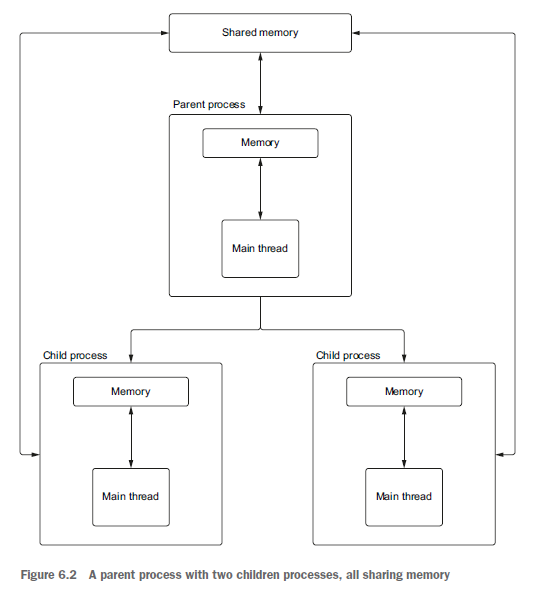

## Sharing data and race conditions

Multiprocessing supports two kinds of shared data: values and array. A value is a singular value, such as an integer or floating-point number. An array is an array of singular values. The types of data that we can share in memory are limited by the types defined in the Python array module, available at https://docs.python.org/3/library/array .html#module-array.

To create a value or array, we first need to use the typecode from the array module that is just a character. Let’s create two shared pieces of data—one integer value and one integer array. We’ll then create two processes to increment each of these shared pieces of data in parallel.

```Python3
from multiprocessing import Process, Value, Array


def increment_value(shared_int: Value):
  shared_int.value += 1


def increment_array(shared_array: Array):
  for index, integer in enumerate(shared_array):
    shared_array[index] = integer + 1


if __name__ == '__main__':
  integer = Value('i', 0)
  integer_array = Array('i', [0, 0])

  procs = [
    Process(target=increment_value, args=(integer,)),
    Process(target=increment_array, args=(integer_array,))
  ]

  [p.start() for p in procs]
  [p.join() for p in procs]

  print(integer.value)
  print(integer_array[:])
```

In the preceding listing, we create two processes—one to increment our shared integer value and one to increment each element in our shared array. Once our two subprocesses complete, we print out the data.

Since our two pieces of data are never touched by different processes, this code works well. Will this code continue to work if we have multiple processes modifying the same shared data? Let’s test this out by creating two processes to increment a shared integer value in parallel. We’ll run this code repeatedly in a loop to see if we get consistent results. Since we have two processes, each incrementing a shared counter by one, once the processes finish we expect the shared value to always be two.

```Python3
from multiprocessing import Process, Value, Array


def increment_value(shared_int: Value):
  shared_int.value += 1


if __name__ == '__main__':
  for _ in range(100):
    integer = Value('i', 0)

    procs = [
      Process(target=increment_value, args=(integer,)),
      Process(target=increment_value, args=(integer,)),
    ]

    [p.start() for p in procs]
    [p.join() for p in procs]

    print(integer.value)
    assert (integer.value == 2)
```

While you will see different output because this problem is nondeterministic, at some point you should see that the result isn’t always 2.

```
2
2
2
Traceback (most recent call last):
File "listing_6_11.py", line 17, in <module>
assert(integer.value == 2)
AssertionError
1
```

Sometimes our result is 1! Why is this? What we’ve encountered is called a race condition. A race condition occurs when the outcome of a set of operations is dependent on which operation finishes first. You can imagine the operations as racing against one another; if the operations win the race in the right order, everything works fine. If they win the race in the wrong order, bizarre behavior results.

So where is the race occurring in our example? The problem lies in that incrementing a value involves both read and write operations. To increment a value, we first need to read the value, add one to it, then write the result back to memory. The value each process sees in the shared data is entirely dependent on when it reads the shared value.

If the processes run in the following order, everything works fine, as seen in figure 6.3.

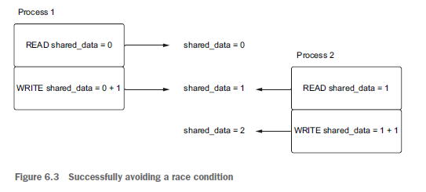

In this example, Process 1 increments the value just before Process 2 reads it and wins the race. Since Process 2 finishes second, this means that it will see the correct value of one and will add to it, producing the correct final value.

What happens if there is a tie in our virtual race? Look at figure 6.4.

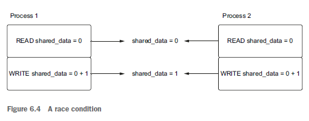

In this instance, Processes 1 and 2 both read the initial value of zero. They then increment that value to 1 and write it back at the same time, producing the incorrect value.

You may ask, “But our code is only one line. Why are there two operations!?” Under the hood, incrementing is written as two operations, which causes this issue. This makes it non-atomic or not thread-safe. This isn’t easy to figure out. 

These types of errors are tricky because they are often difficult to reproduce. They aren’t like normal bugs, since they depend on the order in which our operating system runs things, which is out of our control when we use multiprocessing. So how do we fix this nasty bug?

## Synchronizing with locks

We can avoid race conditions by synchronizing access to any shared data we want to modify. What does it mean to synchronize access? Revisiting our race example, it means that we control access to any shared data so that any operations we have finish the race in an order that makes sense. If we’re in a situation where a tie between two operations could occur, we explicitly block the second operation from running until the first completes, guaranteeing operations to finish the race in a consistent manner. You can imagine this as a referee at the finish line, seeing that a tie is about to happen and telling the runners, “Hold up a minute. One racer at a time!” and picking one runner to wait while the other crosses the finish line.

One mechanism for synchronizing access to shared data is a lock, also known as a mutex (short for mutual exclusion). These structures allow for a single process to “lock” a section of code, preventing other processes from running that code. The locked section of code is commonly called a critical section. This means that if one process is executing the code of a locked section and a second process tries to access that code, the second process will need to wait (blocked by the referee) until the first process is finished with the locked section.

Locks support two primary operations: acquiring and releasing. When a process acquires a lock, it is guaranteed that it will be the only process running that section of code. Once the section of code that needs synchronized access is finished, we release the lock. This allows other processes to acquire the lock and run any code in the critical section. If a process tries to run code that is locked by another process, acquiring the lock will block until the other process releases that lock.

Revisiting our counter race condition example, and using figure 6.5, let’s visualize what happens when two processes try and acquire a lock at roughly the same time. Then, let’s see how it prevents the counter from getting the wrong value.

In this diagram, Process 1 first acquires the lock successfully and reads and increments the shared data. The second process tries to acquire the lock but is blocked from advancing further until the first process releases the lock. Once the first process releases the lock, the second process can successfully acquire the lock and increment the shared data. This prevents the race condition because the lock prevents more than one process from reading and writing the shared data at the same time.

So how do we implement this synchronization with our shared data? The multiprocessing API implementors thought of this and nicely included a method to get a lock on both value and array. To acquire a lock, we call get_lock().acquire() and to release a lock we call get_lock().release(). Using listing 6.12, let’s apply this to our previous example to fix our bug.

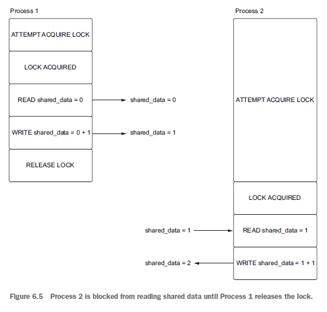

```Python3
from multiprocessing import Process, Value, Array


def increment_value(shared_int: Value):
  shared_int.get_lock().acquire()
  shared_int.value += 1
  shared_int.get_lock().release()


if __name__ == '__main__':
  for _ in range(100):
    integer = Value('i', 0)

    procs = [
      Process(target=increment_value, args=(integer,)),
      Process(target=increment_value, args=(integer,)),
    ]

    [p.start() for p in procs]
    [p.join() for p in procs]

    print(integer.value)
    assert (integer.value == 2)
```

When we run this code, every value we get should be 2. We’ve fixed our race condition! Note that locks are also context managers, and to clean up our code we could have written increment_value using a with block. This will acquire and release the lock for us automatically:

```Python3
def increment_value(shared_int: Value):
    with shared_int.get_lock():
        shared_int.value = shared_int.value + 1
```

Notice that we have taken concurrent code and have just forced it to be sequential, negating the value of running in parallel. This is an important observation and is a caveat of synchronization and shared data in concurrency in general. To avoid race conditions, we must make our parallel code sequential in critical sections. This can hurt the performance of our multiprocessing code. Care must be taken to lock only the sections that absolutely need it so that other parts of the application can execute concurrently. When faced with a race condition bug, it is easy to protect all your code with a lock. This will “fix” the problem but will likely degrade your application’s performance.

## Sharing data with process pools

We’ve just seen how to share data within a couple of processes, so how do we apply this knowledge to process pools? Process pools operate a bit differently than creating processes manually, posing a challenge with shared data. Why is this?

When we submit a task to a process pool, it may not run immediately because the processes in the pool may be busy with other tasks. How does the process pool handle this? In the background, process pool executors keep a queue of tasks to manage this. When we submit a task to the process pool, its arguments are pickled (serialized) and put on the task queue. Then, each worker process asks for a task from the queue when it is ready for work. When a worker process pulls a task off the queue, it unpickles (deserializes) the arguments and begins to execute the task.

Shared data is, by definition, shared among worker processes. Therefore, pickling and unpickling it to send it back and forth between processes makes little sense. In fact, neither Value nor Array objects can be pickled, so if we try to pass the shared data in as arguments to our functions as we did before, we’ll get an error along the lines of can’t pickle Value objects.

To handle this, we’ll need to put our shared counter in a global variable and somehow let our worker processes know about it. We can do this with process pool initializers. These are special functions that are called when each process in our pool starts up. Using this, we can create a reference to the shared memory that our parent process created. We can pass this function in when we create a process pool. To see how this works, let’s create a simple example that increments a counter.

```Python3
from concurrent.futures import ProcessPoolExecutor
import asyncio
from multiprocessing import Value

shared_counter: Value


def init(counter: Value):
  global shared_counter
  shared_counter = counter


def increment():
  with shared_counter.get_lock():
    shared_counter.value += 1


async def main():
  counter = Value('d', 0)
  # This tells the pool to execute the function init with the argument counter for each process.
  with ProcessPoolExecutor(initializer=init, initargs=(counter,)) as pool:
    await asyncio.get_running_loop().run_in_executor(pool, increment)
    print(counter.value)


if __name__ == '__main__':
  asyncio.run(main())
```

We first define a global variable, shared_counter, which will contain the reference to the shared Value object we create. In our init function, we take in a Value and initialize shared_counter to that value. Then, in the main coroutine, we create the counter and initialize it to 0, then pass in our init function and our counter to the initializer and initargs parameter when creating the process pool. The init function will be called for each process that the process pool creates, correctly initializing our shared_ counter to the one we created in our main coroutine.

You may ask, “Why do we need to bother with all this? Can’t we just initialize the global variable as shared_counter: Value = Value('d', 0) instead of leaving it empty?” The reason we can’t do this is that when each process is created, the script we created it from is run again, per each process. This means that each process that starts will execute shared_counter: Value = Value('d', 0), meaning that if we have 100 processes, we’d get 100 shared_counter values, each set to 0, resulting in some strange behavior

# 7. Handling blocking work with threads

## Introducing the threading module

Python lets developers create and manage threads via the threading module. This module exposes the Thread class, which, when instantiated, accepts a function to run in a separate thread. The Python interpreter runs single-threaded within a process, meaning that only one piece of Python bytecode can be running at one time even if we have code running in multiple threads. The global interpreter lock will only allow one thread to execute code at a time.

This seems like Python limits us from using multithreading to any advantage, but there are a few cases in which the global interpreter lock is released, the primary one being during I/O operations. Python can release the GIL in this case because, under the hood, Python is making low-level operating system calls to perform I/O. These system calls are outside the Python interpreter, meaning that no Python bytecode needs to run while we’re waiting for I/O to finish.

To get a better sense of how to create and run threads in the context of blocking I/O, we’ll revisit our example of an echo server from chapter 3. Recall that to handle multiple connections, we needed to switch our sockets to non-blocking mode and use the select module to watch for events on the sockets. What if we were working with a legacy codebase where non-blocking sockets weren’t an option? Could we still build an echo server that can handle more than one client at a time?

Since a socket’s recv and sendall are I/O-bound methods, and therefore release the GIL, we should be able to run them in separate threads concurrently. This means that we can create one thread per each connected client and read and write data in that thread. This model is a common paradigm in web servers such as Apache and is known as a thread-per-connection model. Let’s give this idea a try by waiting for connections in our main thread and then creating a thread to echo for each client that connects.

```Python3
from threading import Thread
import socket


def echo(client: socket.socket):
  while True:
    data = client.recv(2048)
    print(f'Received {data}, sending!')
    client.sendall(data)


with socket.socket(socket.AF_INET, socket.SOCK_STREAM) as server:
  server.setsockopt(socket.SOL_SOCKET, socket.SO_REUSEADDR, 1)
  server.bind(('127.0.0.1', 8000))
  server.listen()

  while True:
    # Block waiting for a client to connect
    connection, _ = server.accept()

    # Once a client connects, create a thread to run our echo function.
    thread = Thread(target=echo, args=(connection,))

    # Start running the thread
    thread.start()
```

In the preceding listing, we enter an infinite loop listening for connections on our server socket. Once we have a client connected, we create a new thread to run our echo function. We supply the thread with a target that is the echo function we want to run and args, which is a tuple of arguments passed to echo. This means that we’ll call echo(connection) in our thread. Then, we start the thread and loop again, waiting for a second connection. Meanwhile, in the thread we created, we loop forever listening for data from our client, and when we have it, we echo it back.]

You should be able to connect an arbitrary amount of telnet clients concurrently and have messages echo properly. Since each recv and sendall operates in a separate thread per client, these operations never block each other; they only block the thread they are running in.

This solves the problem of multiple clients being unable to connect at the same time with blocking sockets, although the approach has some issues unique to threads. What happens if we try to kill this process with CTRL-C while we have clients connected? Does our application shut down the threads we created cleanly?

It turns out that things don’t shut down quite so cleanly. If you kill the application, you should see a KeyboardInterrupt exception thrown on server.accept(), but your application will hang as the background thread will keep the program alive. Furthermore, any connected clients will still be able to send and receive messages!

Unfortunately, user-created threads in Python do not receive KeyboardInterrupt exceptions; only the main thread will receive them. This means that our threads will keep running, happily reading from our clients and preventing our application from exiting.

There are a couple approaches to handle this; specifically, we can use what are called daemon threads (pronounced demon), or we can come up with our own way of canceling or “interrupting” a running thread. Daemon threads are a special kind of thread for long-running background tasks. These threads won’t prevent an application from shutting down. In fact, when only daemon threads are running, the application will shut down automatically. Since Python’s main thread is not a daemon thread, this means that, if we make all our connection threads daemonic, our application will terminate on a KeyboardInterrupt. Adapting our code from listing 7.1 to use daemonic threads is easy; all we need to do is set thread.daemon = True before we run thread.start(). Once we make that change, our application will terminate properly on CTRL-C.

The problem with this approach is we have no way to run any cleanup or shutdown logic when our threads stop, since daemon threads terminate abruptly. Let’s say that on shutdown we want to write out to each client that the server is shutting down. Is there a way we can have some type of exception interrupt our thread and cleanly shut down the socket? If we call a socket’s shutdown method, any existing calls to recv will return zero, and sendall will throw an exception. If we call shutdown from the main thread, this will have the effect of interrupting our client threads that are blocking a recv or sendall call. We can then handle the exception in the client thread and perform any cleanup logic we’d like.

To do this, we’ll create threads slightly differently than before, by subclassing the Thread class itself. This will let us define our own thread with a cancel method, inside of which we can shut down the client socket. Then, our calls to recv and sendall will be interrupted, allowing us to exit our while loop and close out the thread.

The Thread class has a run method that we can override. When we subclass Thread, we implement this method with the code that we want the thread to run when we start it. In our case, this is the recv and sendall echo loop.

```Python3
from threading import Thread
import socket


class ClientEchoThread(Thread):
  def __init__(self, client: socket.socket):
    super().__init__()
    self.client: socket.socket = client

  def run(self):
    try:
      while True:
        data = self.client.recv(2048)

        # If there is no data, raise an exception. This happens when the connection was closed by the client or the connection was shut down.
        if not data:
          raise BrokenPipeError('Connection closed!')

        print(f'Received {data}, sending!')

        self.client.sendall(data)
    except OSError as e:
      # When we have an exception, exit the run method. This terminates the thread.
      print(f'Thread interrupted by {e} exception, shutting down !')

  def close(self):
    # Shut down the connection if the thread is alive; the thread may not be alive if the client closed the connection
    if self.is_alive():
      self.client.sendall(bytes('Shutting down!', encoding='utf-8'))

      # Shut down the client connection for reads and writes.
      self.client.shutdown(socket.SHUT_RDWR)


with socket.socket(socket.AF_INET, socket.SOCK_STREAM) as server:
  server.setsockopt(socket.SOL_SOCKET, socket.SO_REUSEADDR, 1)
  server.bind(('127.0.0.1', 8000))
  server.listen()
  connection_threads = []

  try:
    while True:
      connection, addr = server.accept()
      thread = ClientEchoThread(connection)
      connection_threads.append(thread)
      thread.start()
  except KeyboardInterrupt:
    print('Shutting down')

    # Call the close method on our threads to shut down each client connection on keyboard interrupt.
    [thread.close() for thread in connection_threads]
```

We first create a new class, ClientEchoThread, that inherits from Thread. This class overrides the run method with the code from our original echo function, but with a few changes. First, we wrap everything in a try catch block and intercept OSError exceptions. This type of exception is thrown from methods such as sendall when we close the client socket. We also check to see if the data from recv is 0. This happens in two cases: if the client closes the connection (someone quits telnet, for example) or when we shut down the client connection ourselves. In this case we throw a Broken- PipeError ourselves (a subclass of OSError), execute the print statement in the except block, and exit the run method, which shuts down the thread.

We also define a close method on our ClientEchoThread class. This method first checks to see if the thread is alive before shutting down the client connection. What does it mean for a thread to be “alive,” and why do we need to do this? A thread is alive if its run method is executing; in this case this is true if our run method does not throw any exceptions. We need this check because the client itself may have closed the connection, resulting in a BrokenPipeError exception in the run method before we call close. This means that calling sendall would result in an exception, as the connection

is no longer valid. Finally, in our main loop, which listens for new incoming connections, we intercept KeyboardInterrupt exceptions. Once we have one, we call the close method on each thread we’ve created. This will send a message to the client, assuming the connection is still active and shut down the connection.

Overall, canceling running threads in Python, and in general, is a tricky problem and depends on the specific shutdown case you’re trying to handle. You’ll need to take special care that your threads do not block your application from exiting and to figure out where to put in appropriate interrupt points to exit your threads.

We’ve now seen a couple ways to manage threads manually ourselves, creating a thread object with a target function and subclassing Thread and overriding the run method. Now that we understand threading basics, let’s see how to use them with asyncio to work with popular blocking libraries.

## Introducing thread pool executors

Much like process pool executors, the concurrent.futures library provides an implementation of the Executor abstract class to work with threads named Thread- PoolExecutor. Instead of maintaining a pool of worker processes like a process pool does, a thread pool executor will create and maintain a pool of threads that we can then submit work to.

While a process pool will by default create one worker process for each CPU core our machine has available, determining how many worker threads to create is a bit more complicated. Internally, the formula for the default number of threads is min(32, os.cpu_count() + 4). This causes the maximum (upper) bound of worker threads to be 32 and the minimum (lower) bound to be 5. The upper bound is set to 32 to avoid creating a surprising number of threads on machines with large amounts of CPU cores (remember, threads are resource-expensive to create and maintain). The lower bound is set to 5 because on smaller 1–2 core machines, spinning up only a couple of threads isn’t likely to improve performance much. It often makes sense to create a few more threads than your available CPUs for I/O-bound work. For example, on an 8-core machine the above formula means we’ll create 12 threads. While only 8 threads can run concurrently, we can have other threads paused waiting for I/O to finish, letting our operating resume them when I/O is done.

Let’s adapt our example from listing 7.3 to run 1,000 HTTP requests concurrently with a thread pool. We’ll time the results to get an understanding of what the benefit is.

```Python3
import time
import requests
from concurrent.futures import ThreadPoolExecutor


def get_status_code(url: str) -> int:
  response = requests.get(url)
  return response.status_code


start = time.perf_counter()

with ThreadPoolExecutor(max_workers=1000) as pool:
  urls = ['https://www.example.com' for _ in range(1000)]
  results = pool.map(get_status_code, urls)
  for result in results:
    print(result)

end = time.perf_counter()
print(f'finished requests in {end - start:.4f} second(s)')
```

On an 8-core machine with a speedy internet connection, this code can execute in as little as 8–9 seconds with the default number of threads. It is easy to write this synchronously to understand the impact that threading has by doing something, as in the following:

```Python3
start = time.perf_counter()

urls = ['https://www.example.com' for _ in range(1000)]

for url in urls:
  print(get_status_code(url))

end = time.perf_counter()

print(f'finished requests in {end-start:.4f} second(s)')
```

Running this code can take upwards of 100 seconds! This makes our threaded code a bit more than 10 times faster than our synchronous code, giving us a pretty big performance bump.

While this is clearly an improvement, you may remember from chapter 4, on aiohttp, that we were able to make 1,000 requests concurrently in less than 1 second. Why is this so much slower than our threading version? Remember that our maximum number of worker threads is limited to 32 (that is, the number of CPUs plus 4), meaning that by default we can only run a maximum of 32 requests concurrently. We can try to get around this by passing in max_workers=1000 when we create our thread pool, as in the following:

```Python3
with ThreadPoolExecutor(max_workers=1000) as pool:
  urls = ['https://www.example.com' for _ in range(1000)]
  results = pool.map(get_status_code, urls)
  for result in results:
      print(result)
```

This approach can yield some improvements, as we now have one thread per each request we make. However, this still won’t come very close to our coroutine-based code. This is due to the resource overhead associated with threads. Threads are created at the operating-system level and are more expensive to create than coroutines. In addition, threads have a context-switching cost at the OS level. Saving and restoring thread state when a context switch happens eats up some of the performance gains obtained by using threads.

When you’re determining the number of threads to use for a particular problem, it is best to start small (the amount of CPU cores plus a few is a good starting point), test it, and benchmark it, gradually increasing the number of threads. You’ll usually find a “sweet spot,” after which the run time will plateau and may even degrade, no matter how many more threads you add. This sweet spot is usually a fairly low number relative to the requests you want to make (to make it clear, creating 1,000 threads for 1,000 requests probably isn’t the best use of resources).

## Thread pool executors with asyncio

Using thread pool executors with the asyncio event loop isn’t much different than using ProcessPoolExecutors. This is the beauty of having the abstract Executor base class in that we can use the same code to run threads or processes by only having to change one line of code. Let’s adapt our example of running 1,000 HTTP requests to use asyncio.gather instead of pool.map.

```Python3
import functools
import requests
import asyncio
from concurrent.futures import ThreadPoolExecutor


def get_status_code(url: str) -> int:
  response = requests.get(url)
  return response.status_code


async def main():
  loop = asyncio.get_running_loop()

  with ThreadPoolExecutor() as pool:
    urls = ['http://www.example.com' for _ in range(1000)]
    tasks = [loop.run_in_executor(pool, functools.partial(get_status_code, url)) for url in urls]
    results = await asyncio.gather(*tasks)
    print(results)

asyncio.run(main())
```

We create the thread pool as we did before, but instead of using map we create a list of tasks by calling our get_status_code function with loop.run_in_executor. Once we have a list of tasks, we can wait for them to finish with asyncio.gather or any of the other asyncio APIs we learned earlier.

Internally, loop.run_in_executor calls the thread pool executor’s submit method. This will put each function we pass in onto a queue. Worker threads in the pool then pull from the queue, running each work item until it completes. This approach does not yield any performance benefits over using a pool without asyncio, but while we’re waiting for await asyncio.gather to finish, other code can run.

## Default executors

Reading the asyncio documentation, you may notice that the run_in_executor method’s executor parameter can be None. In this case, run_in_executor will use the event loop’s default executor. What is a default executor? Think of it as a reusable singleton executor for your entire application. The default executor will always default to a ThreadPoolExecutor unless we set a custom one with the loop.set_default_executor method. This means that we can simplify the code from listing 7.5, as shown in the following listing.

```Python3
import functools
import requests
import asyncio


def get_status_code(url: str) -> int:
  response = requests.get(url)
  return response.status_code


async def main():
  loop = asyncio.get_running_loop()
  urls = ['http://www.example.com' for _ in range(1000)]

  tasks = [loop.run_in_executor(None, functools.partial(get_status_code, url)) for url in urls]
  results = await asyncio.gather(*tasks)

  print(results)


asyncio.run(main())
```

In the preceding listing, we eliminate creating our own ThreadPoolExecutor and using it in a context manager as we did before and, instead, pass in None as the executor. The first time we call run_in_executor, asyncio creates and caches a default thread pool executor for us. Each subsequent call to run_in_executor reuses the previously created default executor, meaning the executor is then global to the event loop. Shutdown of this pool is also different from what we saw before. Previously, the thread pool executor we created was shut down when we exited a context manager’s with block. When using the default executor, it won’t shut down until the event loop closes, which usually happens when our application finishes. Using the default thread pool executor when we want to use threads simplifies things, but can we make this even easier?

In Python 3.9, the asyncio.to_thread coroutine was introduced to further simplify putting work on the default thread pool executor. It takes in a function to run in a thread and a set of arguments to pass to that function. Previously, we had to use functools.partial to pass in arguments, so this makes our code a little cleaner. It then runs the function with its arguments in the default thread pool executor and the currently running event loop. This lets us simplify our threading code even more. Using the to_thread coroutine eliminates using functools.partial and our call to asyncio.get_running_loop, cutting down our total lines of code.

```Python3
import requests
import asyncio


def get_status_code(url: str) -> int:
  response = requests.get(url)
  return response.status_code


async def main():
  urls = ['https://www.example.com' for _ in range(1000)]
  tasks = [asyncio.to_thread(get_status_code, url) for url in urls]
  results = await asyncio.gather(*tasks)
  print(results)


asyncio.set_event_loop_policy(asyncio.WindowsSelectorEventLoopPolicy())
asyncio.run(main())
```

So far, we’ve only seen how to run blocking code inside of threads. The power of combining threads with asyncio is that we can run other code while we’re waiting for our threads to finish. To see how to run other code while threads are running, we’ll revisit our example from chapter 6 of periodically outputting the status of a long-running task.

## Locks, shared data, and deadlocks

Much like multiprocessing code, multithreaded code is also susceptible to race conditions when we have shared data, as we do not control the order of execution. Any time you have two threads or processes that could modify a shared piece of non-thread-safe data, you’ll need to utilize a lock to properly synchronize access. Conceptually, this is no different from the approach we took with multiprocessing; however, the memory model of threads changes the approach slightly.

Recall that with multiprocessing, by default the processes we create do not share memory. This meant we needed to create special shared memory objects and properly initialize them so that each process could read from and write to that object. Since threads do have access to the same memory of their parent process, we no longer need to do this, and threads can access shared variables directly.

This simplifies things a bit, but since we won’t be working with shared Value objects that have locks built in, we’ll need to create them ourselves. To do this, we’ll need to use the threading module’s Lock implementation, which is different from the one we used with multiprocessing. This is as easy as importing Lock from the threading module and calling its acquire and release methods around critical sections of code or using it in a context manager.

To see how to use locks with threading, let’s revisit our task from chapter 6 of keeping track and displaying the progress of a long task. We’ll take our previous example of making thousands of web requests and use a shared counter to keep track of how many requests we’ve completed so far.

```Python3
import functools
import requests
import asyncio
from concurrent.futures import ThreadPoolExecutor
from threading import Lock

counter_lock = Lock()
counter: int = 0


def get_status_code(url: str) -> int:
  global counter
  response = requests.get(url)

  with counter_lock:
    counter += 1

  return response.status_code


async def reporter(request_count: int):
  while counter < request_count:
    print(f'Finished {counter}/{request_count} requests')
    await asyncio.sleep(.5)


async def main():
  loop = asyncio.get_running_loop()

  with ThreadPoolExecutor() as pool:
    request_count = 200
    urls = ['https://www.example.com' for _ in range(request_count)]
    reporter_task = asyncio.create_task(reporter(request_count))
    tasks = [loop.run_in_executor(pool, functools.partial(get_status_code, url)) for url in urls]
    results = await asyncio.gather(*tasks)
    await reporter_task
    print(results)


asyncio.run(main())
```

This should look familiar, as it is like the code we wrote to output progress of our map operation in chapter 6. We create a global counter variable as well as a counter_lock to synchronize access to it in critical sections. In our get_status_code function we acquire the lock when we increment the counter. Then, in our main coroutine we kick off a reporter background task that outputs how many requests we’ve finished every 500 milliseconds. Running this, you should see output similar to the following:

```
Finished 0/200 requests
Finished 48/200 requests
Finished 97/200 requests
Finished 163/200 requests
```

We now know the basics around locks with both multithreading and multiprocessing, but there is still quite a bit to learn about locking. Next, we’ll look at the concept of reentrancy.

## Reentrant locks

Simple locks work well for coordinating access to a shared variable across multiple threads, but what happens when a thread tries to acquire a lock it has already acquired? Is this even safe? Since the same thread is acquiring the lock, this should be okay since this is single-threaded by definition and, therefore, thread-safe.

While this access should be okay, it does cause problems with the locks we have been using so far. To illustrate this, let’s imagine we have a recursive sum function that takes a list of integers and produces the sum of the list. The list we want to sum can be modified from multiple threads, so we need to use a lock to ensure the list we’re summing does not get modified during our sum operation. Let’s try implementing this with a normal lock to see what happens. We’ll also add some console output to see how our function is executing.

```Python3
from threading import Lock, Thread
from typing import List

list_lock = Lock()


def sum_list(int_list: List[int]) -> int:
  print('Waiting to acquire lock...')

  with list_lock:
    print('Acquired lock.')
    if len(int_list) == 0:
      print('Finished summing.')
      return 0
    else:
      head, *tail = int_list
      print('Summing rest of list.')
      return head + sum_list(tail)


thread = Thread(target=sum_list, args=([1, 2, 3, 4],))
thread.start()
thread.join()
```

If you run this code, you’ll see the following few messages and then the application will hang forever:

```
Waiting to acquire lock...
Acquired lock.
Summing rest of list.
Waiting to acquire lock...
```

Why is this happening? If we walk through this, we acquire list_lock the first time perfectly fine. We then unpack the list and recursively call sum_list on the remainder of the list. This then causes us to attempt to acquire list_lock a second time. This is where our code hangs because, since we already acquired the lock, we block forever trying to acquire the lock a second time. This also means we never exit the first with block and can’t release the lock; we’re waiting for a lock that will never be released!

Since this recursion is coming from the same thread that originated it, acquiring the lock more than once shouldn’t be a problem as this won’t cause race conditions. To support these use cases, the threading library provides reentrant locks. A reentrant lock is a special kind of lock that can be acquired by the same thread more than once, allowing that thread to “reenter” critical sections. The threading module provides reentrant locks in the RLock class. We can take our above code and fix the problem by modifying only two lines of code—the import statement and the creation of the list_lock:

```Python3
from threading import Rlock

list_lock = RLock()
```

If we modify these lines our code will work properly, and a single thread will be able to acquire the lock multiple times. Internally, reentrant locks work by keeping a recursion count. Each time we acquire the lock from the thread that first acquired the lock, the count increases, and each time we release the lock it decreases. When the count is 0, the lock is finally released for other threads to acquire it.

Let’s examine a more real-world application to truly understand the concept of recursion with locks. Imagine we’re trying to build a thread-safe integer list class with a method to find and replace all elements of a certain value with a different value. This class will contain a normal Python list and a lock we use to prevent race conditions. We’ll pretend our existing class already has a method called indices_of(to_ find: int) that takes in an integer and returns all the indices in the list that match to_find. Since we want to follow the DRY (don’t repeat yourself) rule, we’ll reuse this method when we define our find-and-replace method (note this is not the technically the most efficient way to do this, but we’ll do it to illustrate the concept). This means our class and method will look something like the following listing.

```Python3
from threading import Lock
from typing import List


class IntListThreadsafe:
  def __init__(self, wrapped_list: List[int]):
    self._lock = Lock()
    self._inner_list = wrapped_list

  def indices_of(self, to_find: int) -> List[int]:
    with self._lock:
      enumerator = enumerate(self._inner_list)
      return [index for index, value in enumerator if value == to_find]

  def find_and_replace(self, to_replace: int, replace_with: int) -> None:
    with self._lock:
      indices = self.indices_of(to_replace)
      for index in indices:
        self._inner_list[index] = replace_with


threadsafe_list = IntListThreadsafe([1, 2, 1, 2, 1])
threadsafe_list.find_and_replace(1, 2)
```

If someone from another thread modifies the list during our indices_of call, we could obtain an incorrect return value, so we need to acquire the lock before we search for matching indices. Our find_and_replace method must acquire the lock for the same reason. However, with a normal lock we wind up hanging forever when we call find_and_replace. The find-and-replace method first acquires the lock and then calls another method, which tries to acquire the same lock. Switching to an RLock in this case will fix this problem because one call to find_and_replace will always acquire any locks from the same thread. This illustrates a generic formula for when you need to use reentrant locks. If you are developing a thread-safe class with a method A, which acquires a lock, and a method B that also needs to acquire a lock and call method A, you likely need to use a reentrant lock.

## Deadlocks

You may be familiar with the concept of deadlock from political negotiations on the news, where one party makes a demand of the other side, and the other side makes a counterdemand. Both sides disagree on the next step and negotiation reaches a standstill. The concept in computer science is similar in that we reach a state where there is contention over a shared resource with no resolution, and our application hangs forever.

The issue we saw in the previous section, where non-reentrant locks can cause our program to hang forever, is one example of a deadlock. In that case, we reach a state where we’re stuck in a standstill negotiation with ourselves, demanding to acquire a lock that is never released. This situation can also arise when we have two threads using more than one lock. Figure 7.1 illustrates this scenario: if thread A asks for a lock that thread B has acquired, and thread B is asking for a lock that A has acquired, we reach a standstill and a deadlock. In that instance, using reentrant locks won’t help, as we have multiple threads stuck waiting on a resource the other thread holds.

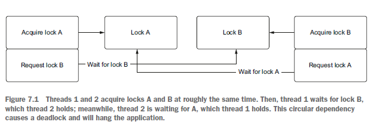

Let’s look at how to create this type of deadlock in code. We’ll create two locks, lock A and B, and two methods which need to acquire both locks. One method will acquire A first and then B and another will acquire B first and then A.

```Python3
from threading import Lock, Thread
import time

lock_a = Lock()
lock_b = Lock()


def a():
  # Acquire lock A.
  with lock_a:
    print('Acquired lock a from method a!')
    # Sleep for 1 seconds; this ensures we create the right conditions for deadlock
    time.sleep(1)
    with lock_b:
      print('Acquired both locks from method a!')


def b():
  # Acquire lock B.
  with lock_b:
    print('Acquired lock b from method b!')
    # Sleep for 1 seconds; this ensures we create the right conditions for deadlock
    time.sleep(1)

    # Acquire lock A.
    with lock_a:
      print('Acquired both locks from method b!')


thread1 = Thread(target=a)
thread2 = Thread(target=b)

thread1.start()
thread2.start()

thread1.join()
thread2.join()
```

When we run this code, we’ll see the following output, and our application will hang forever:

```
Acquired lock a from method a!
Acquired lock b from method b!
```

We first call method A and acquire lock A, then we introduce an artificial delay to give method B a chance to acquire lock B. This leaves us in a state where method A holds lock A and method B holds lock B. Next, method A attempts to acquire lock B, but method B is holding that lock. At the same time, method B tries to acquire lock A, but method A is holding it, stuck waiting for B to release its lock. Both methods are stuck waiting on one another to release a resource, and we reach a standstill.

How do we handle this situation? One solution is the so-called “ostrich algorithm,” named for the situation (although ostriches don’t actually behave this way) where an ostrich sticks its head in the sand whenever it senses danger. With this strategy, we ignore the problem and devise a strategy to restart our application when we encounter the issue. The driving idea behind this approach is if the issue happens rarely enough, investing in a fix isn’t worth it. If you remove the sleep from the above code, you’ll only rarely see deadlock occur, as it relies on a very specific sequence of operations. This isn’t really a fix and isn’t ideal but is a strategy used with deadlocks that rarely occur.

However, in our situation there is an easy fix, where we change the locks in both methods to always be acquired in the same order. For instance, both methods A and B can acquire lock A first then lock B. This resolves the issue, as we’ll never acquire locks in an order where a deadlock could occur. The other option would be to refactor the locks so we use only one instead of two. It is impossible to have a deadlock with one lock (excluding the reentrant deadlock we saw earlier). Overall, when dealing with multiple locks that you need to acquire, ask yourself, “Am I acquiring these locks in a consistent order? Is there a way I can refactor this to use only one lock?”

We’ve now seen how to use threads effectively with asyncio and have investigated more complex locking scenarios. Next, let’s see how to use threads to integrate asyncio into existing synchronous applications that may not work smoothly with asyncio.

## Using threads for CPU-bound work

The global interpreter lock is a tricky subject in Python. The rule of thumb is multithreading only makes sense for blocking I/O work, as I/O will release the GIL. This is true in most cases but not all. To properly release the GIL and avoid any concurrency bugs, the code that is running needs to avoid interacting with Python objects (dictionaries, lists, Python integers, and so on). This can happen when a large portion of our libraries’ work is done in low-level C code. There are a few notable libraries, such as hashlib and NumPy, that perform CPU-intensive work in pure C and release the GIL. This enables us to use multithreading to improve the performance of certain CPU bound workloads.

### Multithreading with hashlib

In today’s world, security has never been more important. Ensuring that data is not read by hackers is key to avoiding leaking sensitive customer data, such as passwords or other information that can be used to identify or harm them.

Hashing algorithms solve this problem by taking a piece of input data and creating a new piece of data that is unreadable and unrecoverable (if the algorithm is secure) to a human. For example, the password “password” may be hashed to a string that looks more like 'a12bc21df'. While no one can read or recover the input data, we’re still able to check if a piece of data matches a hash. This is useful for scenarios such as validating a user’s password on login or checking if a piece of data has been tampered with.

There are many different hashing algorithms today, such as SHA512, BLAKE2, and scrypt, though SHA is not the best choice for storing passwords, as it is susceptible to brute-force attacks. Several of these algorithms are implemented in Python’s hashlib library. Many functions in this library release the GIL when hashing data greater than 2048 bytes, so multithreading is an option to improve this library’s performance. In addition, the scrypt function, used for hashing passwords, always releases the GIL.

Let’s introduce a (hopefully) hypothetical scenario to see when multithreading might be useful with hashlib. Imagine you’ve just started a new job as principal software architect at a successful organization. Your manager assigns you your first bug to get started learning the company’s development process—a small issue with the login system. To debug this issue, you start to look at a few database tables, and to your horror you notice that all your customers’ passwords are stored in plaintext! This means that if your database is compromised, attackers could get all your customers’ passwords and log in as them, potentially exposing sensitive data such as saved credit card numbers. You bring this to your manager’s attention, and they ask you to find a solution to the problem as soon as possible.

Using the scrypt algorithm to hash the plaintext passwords is a good solution for this kind of problem. It is secure and the original password is unrecoverable, as it introduces a salt. A salt is a random number that ensures that the hash we get for the password is unique. To test out using scrypt, we can quickly write a synchronous script to create random passwords and hash them to get a sense of how long things will take. For this example, we’ll test on 10,000 random passwords.

```Python3
import hashlib
import os
import string
import time
import random


def random_password(length: int) -> bytes:
  ascii_lowercase = string.ascii_lowercase.encode()
  return b''.join(bytes(random.choice(ascii_lowercase)) for _ in range(length))


passwords = [random_password(10) for _ in range(10000)]


def hash(password: bytes) -> str:
  salt = os.urandom(16)
  return str(hashlib.scrypt(password, salt=salt, n=2048, p=1, r=8))


start = time.perf_counter()

for password in passwords:
  hash(password)

end = time.perf_counter()

print(end - start)
```

We first write a function to create random lowercase passwords and then use that to create 10,000 random passwords of 10 characters each. We then hash each password with the scrypt function. We’ll gloss over the details (n, p, and r parameters of the scrypt function), but these are used to tune how secure we’d like our hash to be and memory/CPU usage.

Running this on the servers you have, which are 2.4 Ghz 8-core machines, this code completes in just over 40 seconds, which is not too bad. The issue is that you have a large user base, and you need to hash 1,000,000,000 passwords. Doing the calculation based on this test, it will take a bit over 40 days to hash the entire database! We could split up our data set and run this procedure on multiple machines, but we’dneed a lot of machines to do that, given how slow this is. Can we use threading to improve the speed and therefore cut down on the time and machines we need to use? Let’s apply what we know about multithreading to give this a shot. We’ll create a thread pool and hash passwords in multiple threads.

```Python3
import asyncio
import functools
import hashlib
import os
from concurrent.futures.thread import ThreadPoolExecutor
import random
import string


def random_password(length: int) -> bytes:
  ascii_lowercase = string.ascii_lowercase.encode()
  return b''.join(bytes(random.choice(ascii_lowercase)) for _ in range(length))


passwords = [random_password(10) for _ in range(10000)]


def hash(password: bytes) -> str:
  salt = os.urandom(16)
  return str(hashlib.scrypt(password, salt=salt, n=2048, p=1, r=8))


async def main():
  loop = asyncio.get_running_loop()
  tasks = []

  with ThreadPoolExecutor() as pool:
    for password in passwords:
      tasks.append(loop.run_in_executor(pool, functools.partial(hash, password)))

  await asyncio.gather(*tasks)


asyncio.run(main())
```

This approach involves us creating a thread pool executor and creating a task for each password we want to hash. Since hashlib releases the GIL we realize some decent performance gains. This code runs in about 5 seconds as opposed to the 40 we got earlier. We’ve just cut our runtime down from 47 days to a bit over 5! As a next step, we could take this application and run it concurrently on different machines to further cut runtime, or we could get a machine with more CPU cores

# 8. Streams

## Introducing streams

In asyncio, streams are a high-level set of classes and functions that create and manage network connections and generic streams of data. Using them, we can create client connections to read and write to servers, or even create servers and manage them ourselves.

These APIs abstract a lot of knowledge around managing sockets, such as dealing with SSL or lost connections, making our lives as developers a little easier. The stream APIs are built on top of a lower-level set of APIs known as transports and protocols. These APIs directly wrap the sockets we used in previous chapters (generally, any generic stream of data), providing us with a clean API for reading and writing data to sockets.

These APIs are structured a little differently from others in that they use a callback style design. Instead of actively waiting for data from a socket like we did previously, a method on a class we implement is called for us when data is available. We then process the data we receive in this method as needed. To get started learning how these callback-based APIs work, let’s first see how to use the lower-level transport and protocol APIs by building a basic HTTP client.

## Transports and protocols

At a high level, a transport is an abstraction for communication with an arbitrary stream of data. When we communicate with a socket or any data stream such as standard input, we work with a familiar set of operations. We read data from or write data to a source, and when we’re finished working with it, we close it. A socket cleanly fits how we’ve defined this transport abstraction; that is, we read and write data to it and once we’ve finished, we close it. In short, a transport provides definitions for sending and receiving data to and from a source. Transports have several implementations depending on which type of source we’re using. We’re mainly concerned with Read- Transport, WriteTransport, and Transport, though there are others for dealing with UDP connections and subprocess communication. Figure 8.1 illustrates the class hierarchy of transports.

Transmitting data to and from a socket is only part of the equation. What about the lifecycle of a socket? We establish a connection; we write data and then process any response we get. These are the set of operations a protocol owns. Note that a protocol simply refers to a Python class here and not a protocol like HTTP or FTP. A transport manages data transmission and calls methods on a protocol when events occur, such as a connection being established or data being ready to process, as shown in figure 8.2.

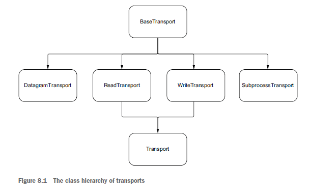
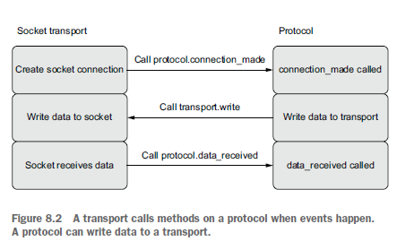

# 9. Web applications

\-

# 10. Microservices

\-

# 11. Synchronization

## Understanding single-threaded concurrency bugs

In earlier chapters on multiprocessing and multithreading, recall that when we were working with data that is shared among different processes and threads, we had to worry about race conditions. This is because a thread or process could read data while it is being modified by a different thread or process, leading to an inconsistent state and therefore corruption of data.

This corruption was in part due to some operations being non-atomic, meaning that while they appear like one operation, they comprise multiple separate operations under the hood. The example we gave in chapter 6 dealt with incrementing an integer variable; first, we read the current value, then we increment it, then we reassign it back to the variable. This gives other threads and processes ample opportunities to get data in an inconsistent state.

In a single-threaded concurrency model, we avoid race conditions caused by nonatomic operations. In asyncio’s single-threaded model, we only have one thread executing one line of Python code at any given time. This means that even if an operation is non-atomic, we’ll always run it to completion without other coroutines reading inconsistent state information.

To prove this to ourselves, let’s try and re-create the race condition we looked at in chapter 7 with multiple threads trying to implement a shared counter. Instead of having multiple threads modify the variable, we’ll have multiple tasks. We’ll repeat this 1,000 times and assert that we get the correct value back.

```Python3
import asyncio

counter: int = 0


async def increment():
  global counter
  await asyncio.sleep(0.01)
  counter += 1


async def main():
  global counter
  for _ in range(1000):
    tasks = [asyncio.create_task(increment()) for _ in range(100)]
    await asyncio.gather(*tasks)
    print(f'Counter is {counter}')
    assert counter == 100
    counter = 0


asyncio.run(main())
```

In the preceding listing, we create an increment coroutine function that adds one to a global counter, adding a 1-millisecond delay to simulate a slow operation. In our main coroutine, we create 100 tasks to increment the counter and then run them all concurrently with gather. We then assert that our counter is the expected value, which, since we ran 100 increment tasks, should always be 100. Running this, you should see that the value we get is always 100 even though incrementing an integer is non-atomic. If we ran multiple threads instead of coroutines, we should see our assertion fail at some point in execution.

Does this mean that with a single-threaded concurrency model we’ve found a way to completely avoid race conditions? Unfortunately, it’s not quite the case. While we avoid race conditions where a single non-atomic operation can cause a bug, we still have the problem where multiple operations executed in the wrong order can cause issues. To see this in action, let’s make incrementing an integer in the eyes of asyncio non-atomic.

To do this, we’ll replicate what happens under the hood when we increment a global counter. We read the global value, increment it, then write it back. The basic idea is if other code modifies state while our coroutine is suspended on an await, once the await finishes we may be in an inconsistent state.

```Python3
import asyncio

counter: int = 0


async def increment():
  global counter
  temp_counter = counter
  temp_counter = temp_counter + 1
  await asyncio.sleep(0.01)
  counter = temp_counter


async def main():
  global counter
  for _ in range(1000):
    tasks = [asyncio.create_task(increment()) for _ in range(100)]
    await asyncio.gather(*tasks)
    print(f'Counter is {counter}')
    assert counter == 100
    counter = 0


asyncio.run(main())
```

Instead of our increment coroutine directly incrementing the counter, we first read it into a temporary variable and then increment the temporary counter by one. We then await asyncio.sleep to simulate a slow operation, suspending our coroutine, and only then do we reassign it back to the global counter variable. Running this, you should see this code fail with an assertion error instantly, and our counter only ever gets set to 1! Each coroutine reads the counter value first, which is 0, stores it to a temp value, then goes to sleep. Since we’re single-threaded, each read to a temporary variable runs sequentially, meaning each coroutine stores the value of counter as 0 and increments this to 1. Then, once the sleep is finished, every coroutine sets the value of the counter to 1, meaning despite running 100 coroutines to increment our counter, our counter is only ever 1. Note that if you remove the await expression, things will operate in the correct order because there is no opportunity to modify the application state while we’re paused at an await point.

These are the types of bugs you tend to see in a single-threaded concurrency model. You hit a suspension point with await, and another coroutine runs and modifies some shared state, changing it for the first coroutine once it resumes in an undesired way. The key difference between multithreaded concurrency bugs and singlethreaded concurrency bugs is that in a multithreaded application, race conditions are possible anywhere you modify a mutable state. In a single-threaded concurrency model, you need to modify the mutable state during an await point. Now that we understand the types of concurrency bugs in a single-threaded model, let’s see how to avoid them by using asyncio locks.

## Locks

asyncio locks operate similarly to the locks in the multiprocessing and multithreading modules. We acquire a lock, do work inside of a critical section, and when we’re done, we release the lock, letting other interested parties acquire it. The main difference is that asyncio locks are awaitable objects that suspend coroutine execution when they are blocked. This means that when a coroutine is blocked waiting to acquire a lock, other code can run. In addition, asyncio locks are also asynchronous context managers, and the preferred way to use them is with async with syntax.

To get familiar with how locks work, let’s look at a simple example with one lock shared between two coroutines. We’ll acquire the lock, which will prevent other coroutines from running code in the critical section until someone releases it.

```Python3
import asyncio
from asyncio import Lock


async def delay(delay_seconds: int) -> int:
  print("Sleeping for {0} second(s)".format(delay_seconds))
  await asyncio.sleep(delay_seconds)
  print("Finished sleeping for {0} second(s)".format(delay_seconds))
  return delay_seconds


async def a(lock: Lock):
  print('Coroutine a waiting to acquire the lock')
  async with lock:
    print('Coroutine a is in the critical section')
    await delay(2)
  print('Coroutine a released the lock')


async def b(lock: Lock):
  print('Coroutine b waiting to acquire the lock')
  async with lock:
    print('Coroutine b is in the critical section')
    await delay(2)
  print('Coroutine b released the lock')


async def main():
  lock = Lock()
  await asyncio.gather(a(lock), b(lock))


asyncio.run(main())
```

When we run the preceding listing, we will see that coroutine a acquires the lock first, leaving coroutine b waiting until a releases the lock. Once a releases the lock, b can do its work in the critical section, giving us the following output:

```
Coroutine a waiting to acquire the lock
Coroutine a is in the critical section
sleeping for 2 second(s)
Coroutine b waiting to acquire the lock
finished sleeping for 2 second(s)
Coroutine a released the lock
Coroutine b is in the critical section
sleeping for 2 second(s)
finished sleeping for 2 second(s)
Coroutine b released the lock
```

Here we used async with syntax. If we had wanted, we could use the acquire and release methods on the lock like so:

```Python3
await lock.acquire()

try:
    print('In critical section')
finally:
    lock.release()
```

That said, it is best practice to use async with syntax where possible.

One important thing to note is that we created the lock inside of the main coroutine. Since the lock is shared globally amongst the coroutines we create, we may be tempted to make it a global variable to avoid passing it in each time like so:

```Python3
lock = Lock()

# coroutine definitions
async def main():
    await asyncio.gather(a(), b())
```

If we do this, we’ll quickly see a crash with an error reporting multiple event loops:

```Task <Task pending name='Task-3' coro=<b()> got Future <Future pending> attached to a different loop```

Why is this happening when all we’ve done is move our lock definition? This is a confusing quirk of the asyncio library and is not unique to just locks. Most objects in asyncio provide an optional loop parameter that lets you specify the specific event loop to run in. When this parameter is not provided, asyncio tries to get the currently running event loop, but if there is none, it creates a new one. In the above case, creating a Lock creates a new event loop, since when our script first runs we haven’t yet created one. Then, asyncio.run(main()) creates a second event loop, and when we attempt to use our lock we intermingle these two separate event loops, which causes a crash.

This behavior is tricky enough that in Python 3.10, event loop parameters are going to be removed, and this confusing behavior will go away, but until then you’ll need to think through these cases when using global asyncio variables carefully.

## Limiting concurrency with semaphores

Resources that our applications need to use are often finite. We may have a limited number of connections we can use concurrently with a database; we may have a limited number of CPUs that we don’t want to overload; or we may be working with an API that only allows a few concurrent requests, based on our current subscription pricing. We could also be using our own internal API and may be concerned with overwhelming it with load, effectively launching a distributed denial of service attack against ourselves.

Semaphores are a construct that can help us out in these situations. A semaphore acts much like a lock in that we can acquire it and we can release it, with the major difference being that we can acquire it multiple times up to a limit we specify. Internally, a semaphore keeps track of this limit; each time we acquire the semaphore we decrement the limit, and each time we release the semaphore we increment it. If the count reaches zero, any further attempts to acquire the semaphore will block until someone else calls release and increments the count. To draw parallels to what we just learned with locks, you can think of a lock as a special case of a semaphore with a limit of one.

To see semaphores in action, let’s build a simple example where we only want two tasks running at the same time, but we have four tasks to run in total. To do this, we’ll create a semaphore with a limit of two and acquire it in our coroutine.

```Python3
import asyncio
from asyncio import Semaphore


async def operation(semaphore: Semaphore):
  print('Waiting to acquire semaphore...')
  async with semaphore:
    print('Semaphore acquired!')
    await asyncio.sleep(2)
  print('Semaphore released!')


async def main():
  semaphore = Semaphore(2)
  await asyncio.gather(*[operation(semaphore) for _ in range(4)])


asyncio.run(main())
```

In our main coroutine, we create a semaphore with a limit of two, indicating we can acquire it twice before additional acquisition attempts start to block. We then create four concurrent calls to operation—this coroutine acquires the semaphore with an async with block and simulates some blocking work with sleep. When we run this, we’ll see the following output:

```
Waiting to acquire semaphore...
Semaphore acquired!
Waiting to acquire semaphore...
Semaphore acquired!
Waiting to acquire semaphore...
Waiting to acquire semaphore...
Semaphore released!
Semaphore released!
Semaphore acquired!
Semaphore acquired!
Semaphore released!
Semaphore released!
```

Since our semaphore only allows two acquisitions before it blocks, our first two tasks successfully acquire the lock while our other two tasks wait for the first two tasks to release the semaphore. Once the work in the first two tasks finishes and we release the semaphore, our other two tasks can acquire the semaphore and start doing their work.

### Bounded semaphores

One aspect of semaphores is that it is valid to call release more times than we call acquire. If we always use semaphores with an async with block, this isn’t possible, since each acquire is automatically paired with a release. However, if we’re in a situation where we need finer-grained control over our releasing and acquisition mechanisms (for example, perhaps we have some branching code where one branch lets us release earlier than another), we can run into issues. As an example, let’s see what happens when we have a normal coroutine that acquires and releases a semaphore with an async with block, and while that coroutine is executing another coroutine calls release.

```Python3
import asyncio
from asyncio import Semaphore


async def acquire(semaphore: Semaphore):
  print('Waiting to acquire')
  async with semaphore:
    print('Acquired')
    await asyncio.sleep(5)
  print('Releasing')


async def release(semaphore: Semaphore):
  print('Releasing as a one off!')
  semaphore.release()
  print('Released as a one off!')


async def main():
  semaphore = Semaphore(2)

  print('Acquiring twice, releasing three times...')
  await asyncio.gather(acquire(semaphore), acquire(semaphore), release(semaphore))

  print('Acquiring three times...')
  await asyncio.gather(acquire(semaphore), acquire(semaphore), acquire(semaphore))


asyncio.run(main())
```

In the preceding listing, we create a semaphore with two permits. We then run two calls to acquire and one call to release, meaning we’ll call release three times. Our first call to gather seems to run okay, giving us the following output:

```
Acquiring twice, releasing three times...
Waiting to acquire
Acquired
Waiting to acquire
Acquired
Releasing as a one off!
Released as a one off!
Releasing
Releasing
```

However, our second call where we acquire the semaphore three times runs into issues, and we acquire the lock three times at once! We’ve inadvertently increased the number of permits our semaphore has available:

```
Acquiring three times...
Waiting to acquire
Acquired
Waiting to acquire
Acquired
Waiting to acquire
Acquired
Releasing
Releasing
Releasing
```

To deal with these types of situations, asyncio provides a BoundedSemaphore. This semaphore behaves exactly as the semaphore we’ve been using, with the key difference being that release will throw a ValueError: BoundedSemaphore released too many times exception if we call release such that it would change the available permits. Let’s look at a very simple example in the following listing.

```Python3
import asyncio
from asyncio import BoundedSemaphore


async def main():
  semaphore = BoundedSemaphore(1)

  await semaphore.acquire()
  semaphore.release()
  semaphore.release()


asyncio.run(main())
```

When we run the preceding listing, our second call to release will throw a ValueError indicating we’ve released the semaphore too many times. You’ll see similar results if you change the code in listing 11.8 to use a BoundedSemaphore instead of a Semaphore. If you’re manually calling acquire and release such that dynamically increasing the number of permits your semaphore has available would be an error, it is wise to use a BoundedSemaphore, so you’ll see an exception to warn you of the mistake.

We’ve now seen how to use semaphores to limit concurrency, which can be useful in situations where we need to constrain concurrency within our applications. asyncio synchronization primitives not only allow us to limit concurrency but also allow us to notify tasks when something happens. Next, let’s see how to do this with the Event synchronization primitive.

## Notifying tasks with events

Sometimes, we may need to wait for some external event to happen before we can proceed. We might need to wait for a buffer to fill up before we can begin to process it, we might need to wait for a device to connect to our application, or we may need to wait for some initialization to happen. We may also have multiple tasks waiting to process data that may not yet be available. Event objects provide a mechanism to help us out in situations where we want to idle while waiting for something specific to happen.

Internally, the Event class keeps track of a flag that indicates whether the event has happened yet. We can control this flag is with two methods, set and clear. The set method sets this internal flag to True and notifies anyone waiting that the event happened. The clear method sets this internal flag to False, and anyone who is waiting for the event will now block.

With these two methods, we can manage internal state, but how do we block until an event happens? The Event class has one coroutine method named wait. When we await this coroutine, it will block until someone calls set on the event object. Once this occurs, any additional calls to wait will not block and will return instantly. If we call clear once we have called set, then calls to wait will start blocking again until we call set again.

Let’s create a dummy example to see events in action. We’ll pretend we have two tasks that are dependent on something happening. We’ll have these tasks wait and idle until we trigger the event.

```Python3
import asyncio
import functools
from asyncio import Event


def trigger_event(event: Event):
  event.set()


async def do_work_on_event(event: Event):
  print('Waiting for event...')

  # Wait until the event occurs
  await event.wait()

  print('Performing work!')

  # Once the event occurs, wait will no longer block, and we can do work.
  await asyncio.sleep(1)

  print('Finished work!')

  # Reset the event, so future calls to wait will block.
  event.clear()


async def main():
  event = asyncio.Event()
  # Trigger the event 5 seconds in the future.
  asyncio.get_running_loop().call_later(5.0, functools.partial(trigger_event, event))
  await asyncio.gather(do_work_on_event(event), do_work_on_event(event))


asyncio.run(main())
```

In the preceding listing, we create a coroutine method do_work_on_event, this coroutine takes in an event and first calls its wait coroutine. This will block until someone calls the event’s set method to indicate the event has happened. We also create a simple method trigger_event, which sets a given event. In our main coroutine, we create an event object and use call_later to trigger the event 5 seconds in the future. We then call do_work_on_event twice with gather, which will create two concurrent tasks for us. We’ll see the two do_work_on_event tasks idle for 5 seconds until we trigger the event, after which we’ll see them do their work, giving us the following output:

```
Waiting for event...
Waiting for event...
Triggering event!
Performing work!
Performing work!
Finished work!
Finished work!
```

This shows us the basics; waiting on an event will block one or more coroutines until we trigger an event, after which they can proceed to do work.

## Conditions

Events are good for simple notifications when something happens, but what about more complex use cases? Imagine needing to gain access to a shared resource that requires a lock on an event, waiting for a more complex set of facts to be true before proceeding or waking up only a certain number of tasks instead of all of them. Conditions can be useful in these types of situations. They are by far the most complex synchronization primitives we’ve encountered so far, and as such, you likely won’t need to use them all that often.

A condition combines aspects of a lock and an event into one synchronization primitive, effectively wrapping the behavior of both. We first acquire the condition’s lock, giving our coroutine exclusive access to any shared resource, allowing us to safely change any state we need. Then, we wait for a specific event to happen with the wait or wait_for coroutine. These coroutines release the lock and block until the event happens, and once it does it reacquires the lock giving us exclusive access.

Since this is a bit confusing, let’s create a dummy example to understand how to use conditions. We’ll create two worker tasks that each attempt to acquire the condition lock and then wait for an event notification. Then, after a few seconds, we’ll trigger the condition, which will wake up the two worker tasks and allow them to do work.

```Python3
import asyncio
import functools
from asyncio import Event


def trigger_event(event: Event):
  event.set()


async def do_work_on_event(event: Event):
  print('Waiting for event...')

  # Wait until the event occurs
  await event.wait()

  print('Performing work!')

  # Once the event occurs, wait will no longer block, and we can do work.
  await asyncio.sleep(1)

  print('Finished work!')

  # Reset the event, so future calls to wait will block.
  event.clear()


async def main():
  event = asyncio.Event()
  # Trigger the event 5 seconds in the future.
  asyncio.get_running_loop().call_later(5.0, functools.partial(trigger_event, event))
  await asyncio.gather(do_work_on_event(event), do_work_on_event(event))


asyncio.run(main())
```

In the preceding listing, we create two coroutine methods: do_work and fire_event. The do_work method acquires the condition, which is analogous to acquiring a lock, and then calls the condition’s wait coroutine method. The wait coroutine method will block until someone calls the condition’s notify_all method.

The fire_event coroutine method sleeps for a little bit and then acquires the condition and calls the notify_all method, which will wake up any tasks that are currently waiting on the condition. Then, in our main coroutine we create one fire_event task and two do_work tasks and run them concurrently. When running this you’ll see the following repeated if the application runs:

```
Worker 1: waiting for condition lock...
Worker 1: acquired lock, releasing and waiting for condition...
Worker 2: waiting for condition lock...
Worker 2: acquired lock, releasing and waiting for condition...
fire_event: about to notify, acquiring condition lock...
fire_event: Lock acquired, notifying all workers.
fire_event: Notification finished, releasing lock.
Worker 1: condition event fired, re-acquiring lock and doing work...
Worker 1: Work finished, lock released.
Worker 1: waiting for condition lock...
Worker 2: condition event fired, re-acquiring lock and doing work...
Worker 2: Work finished, lock released.
Worker 2: waiting for condition lock...
Worker 1: acquired lock, releasing and waiting for condition...
Worker 2: acquired lock, releasing and waiting for condition...
```

You’ll notice that the two workers start right away and block waiting for the fire_ event coroutine to call notify_all. Once fire_event calls notify_all, the worker tasks wake up and then proceed to do their work.

Conditions have an additional coroutine method called wait_for. Instead of blocking until someone notifies the condition, wait_for accepts a predicate (a no-argument-function that returns a Boolean) and will block until that predicate returns True. This proves useful when there is a shared resource with some coroutines dependent on certain states becoming true.

# 12. Asynchronous queues

\-

# 13. Managing subprocesses

## Introduction

Many applications will never need to leave the world of Python. We’ll call code from other Python libraries and modules or use multiprocessing or multithreading to run Python code concurrently. However, not everything we’ll want to interact with is written in Python. We may have an already built application that is written in C++, Go, Rust, or some other language that provides better runtime characteristics or is simply already there for us to use without reimplementing. We may also want to use OS provided command-line utilities, such as GREP for searching through large files, cURL for making HTTP requests, or any of the numbers of applications we have at our disposal.

In standard Python, we can use the subprocess module to run different applications in separate processes. Like most other Python modules, the standard subprocess API is blocking, making it incompatible with asyncio without multithreading or multiprocessing. asyncio provides a module modeled on the subprocess module to create and manage subprocesses asynchronously with coroutines.

In this chapter, we’ll learn the basics of creating and managing subprocesses with asyncio by running an application written in a different language. We’ll also learn how to handle input and output, reading standard output, and sending input from our application to our subprocesses.

## Creating a subprocess

Suppose you’d like to extend the functionality of an existing Python web API. Another team within your organization has already built the functionality you’d like in a command-line application for a batch processing mechanism they have, but there is a major problem in that the application is written in Rust. Given the application already exists, you don’t want to reinvent the wheel by reimplementing it in Python. Is there a way we can still use this application’s functionality within our existing Python API?

Since this application has a command-line interface, we can use subprocesses to reuse this application. We’ll call the application via its command-line interface and run it in a separate subprocess. We can then read the results of the application and use it within our existing API as needed, saving us the trouble of having to reimplement the application.

So how do we create a subprocess and execute it? asyncio provides two coroutine functions out of the box to create subprocesses: asyncio.create_subprocess_shell and asyncio.create_subprocess_exec. Each of these coroutine functions returns an instance of a Process, which has methods to let us wait for the process to finish and terminate the process as well as a few others. Why are there two coroutines to accomplish seemingly the same task? When would we want to use one over the other? The create_subprocess_shell coroutine function creates a subprocess within a shell installed on the system it runs on such as zsh or bash. Generally speaking, you’ll want to use create_subprocess_exec unless you need to use functionality from the shell. Using the shell can have pitfalls, such as different machines having different shells or the same shell configured differently. This can make it hard to guarantee your application will behave the same on different machines.

To learn the basics of how to create a subprocess, let’s write an asyncio application to run a simple command-line program. We’ll start with the ls program, which lists the contents of the current directory to test things out, although we wouldn’t likely do this in the real world. If you’re running on a Windows machine, replace ls -l with cmd /c dir.

```Python3
import asyncio
from asyncio.subprocess import Process


async def main():
    process: Process = await asyncio.create_subprocess_exec('ls', '-l')
    print(f'Process pid is: {process.pid}')
    status_code = await process.wait()
    print(f'Status code: {status_code}')


asyncio.run(main())
```

In the preceding listing, we create a Process instance to run the ls command with create_subprocess_exec. We can also specify other arguments to pass to the program by adding them after. Here we pass in -l, which adds some extra information around who created the files in the directory. Once we’ve created the process, we print out the process ID and then call the wait coroutine. This coroutine will wait until the process finishes, and once it does it will return the subprocesses status code; in this case it should be zero. By default, standard output from our subprocess will be piped to standard output of our own application, so when you run this you should see something like the following, differing based in what you have in your directory:

```
Process pid is: 54438
total 8
drwxr-xr-x 4 matthewfowler staff 128 Dec 23 15:20 .
drwxr-xr-x 25 matthewfowler staff 800 Dec 23 14:52 ..
-rw-r--r-- 1 matthewfowler staff 0 Dec 23 14:52 __init__.py
-rw-r--r-- 1 matthewfowler staff 293 Dec 23 15:20 basics.py
Status code: 0
```

Note that the wait coroutine will block until the application terminates, and there are no guarantees as to how long a process will take to terminate, let alone if it will terminate at all. If you’re concerned about a runaway process, you’ll need to introduce a timeout with asyncio.wait_for. There is a caveat to this, however. Recall that wait_ for will terminate the coroutine that it is running if it times out. You may assume that this will terminate the process, but it does not. It only terminates the task that is waiting for the process to finish, and not the underlying process.

We’ll need a better way to shut down the process when it times out. Luckily, Process has two methods that can help us out in this situation: terminate and kill. The terminate method will send the SIGTERM signal to the subprocess, and kill will send the SIGKILL signal. Note that both these methods are not coroutines and are also nonblocking. They just send the signal. If you want to try and get the return code once you’ve terminated the subprocess or you want to wait for any cleanup, you’ll need to call wait again.

Let’s test out terminating a long-running application with the sleep command line application (for Windows users, replace 'sleep', '3' with the more complicated 'cmd', 'start', '/wait', 'timeout', '3'). We’ll create a subprocess that sleeps for a few seconds and try to terminate it before it has a chance to finish.

```Python3
import asyncio
from asyncio.subprocess import Process


async def main():
    process: Process = await asyncio.create_subprocess_exec('sleep', '3')
    print(f'Process pid is: {process.pid}')
    
    try:
        status_code = await asyncio.wait_for(process.wait(), timeout=1.0)
        print(status_code)
    except asyncio.TimeoutError:
        print('Timed out waiting to finish, terminating...')
        process.terminate()
        status_code = await process.wait()
        print(status_code)


asyncio.run(main())
```

In the preceding listing, we create a subprocess that will take 3 seconds to complete but wrap it in a wait_for with a 1-second timeout. After 1 second, wait_for will throw a TimeoutError, and in the except block we terminate the process and wait for it to finish, printing out its status code. This should give us output similar to the following:

```
Process pid is: 54709
Timed out waiting to finish, terminating...
-15
```

One thing to watch out for when writing your own code is the wait inside of the except block still has a chance of taking a long time, and you may want to wrap this in a wait_for if this is a concern.

## Controlling standard output

In the previous examples, the standard output of our subprocess went directly to our application’s standard output. What if we don’t want this behavior? Perhaps we want to do additional processing on the output, or maybe the output is inconsequential, and we can safely ignore it. The create_subprocess_exec coroutine has a stdout parameter that let us specify where we want standard output to go. This parameter takes in an enum that lets us specify if we want to redirect the subprocess’s output to our own standard output, pipe it to a StreamReader, or ignore it entirely by redirecting it to /dev/null.

Let’s say we’re planning to run multiple subprocesses concurrently and echo their output. We’d like to know which subprocess generated the output to avoid confusion. To make this output easier to read, we’ll add some extra data about which subprocess generated the output before writing it to our application’s standard output. We’ll prepend the command that generated the output before printing it out.

## Communicating with subprocesses

Up to this point, we’ve been using one-way, noninteractive communication with processes. But what if we’re working with an application that may require user input? For example, we may be asked for a passphrase, username, or any other number of inputs.

In the case in which we know we only have one piece of input to deal with, using communicate is ideal. We saw this previously using gpg to send in text to encrypt, but let’s try it when the subprocess explicitly asks for input. We’ll first create a simple Python program to ask for a username and echo it to standard output.

```Python3
username = input('Please enter a username: ')
print(f'Your username is {username}')
```

Now, we can use communicate to input the username.

```Python3
import asyncio
from asyncio.subprocess import Process


async def main():
    program = ['python3', 'Listing_13_9.py']
    process: Process = await asyncio.create_subprocess_exec(*program, stdout=asyncio.subprocess.PIPE,
                                                            stdin=asyncio.subprocess.PIPE)

    stdout, stderr = await process.communicate(b'TestUsername')
    print(stdout)
    print(stderr)


asyncio.run(main())
```

When we run this code, we’ll see b'Please enter a username: Your username is TestUsername\n' printed to the console, as our application terminates right after our first user input. This won’t work if we have a more interactive application. For example, take this application, which repeatedly asks for user input and echoes it until the user types quit