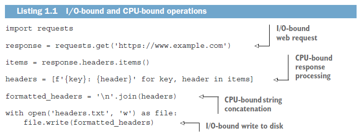
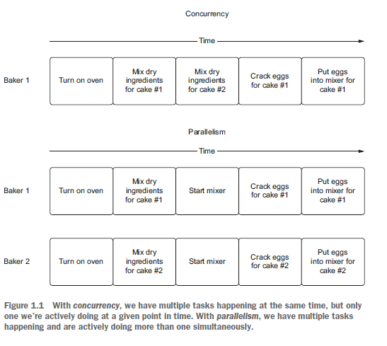
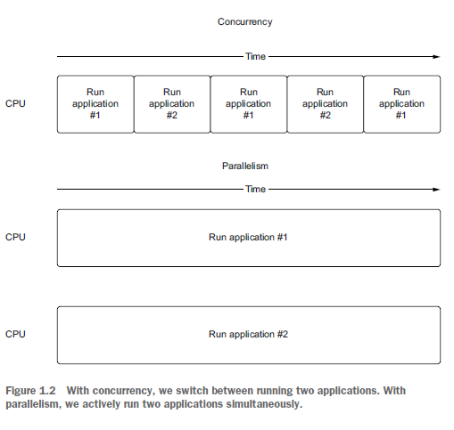
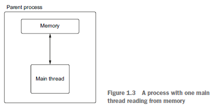
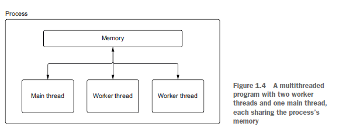
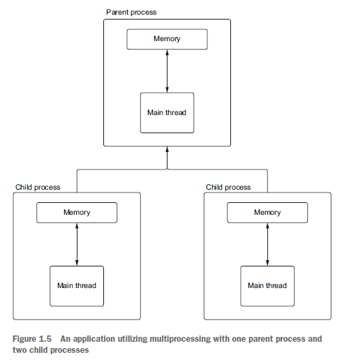
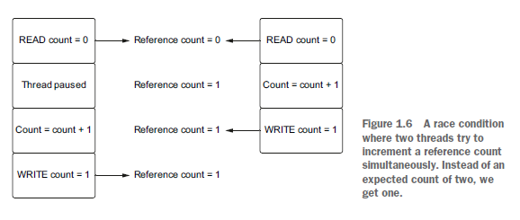
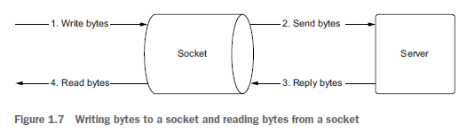
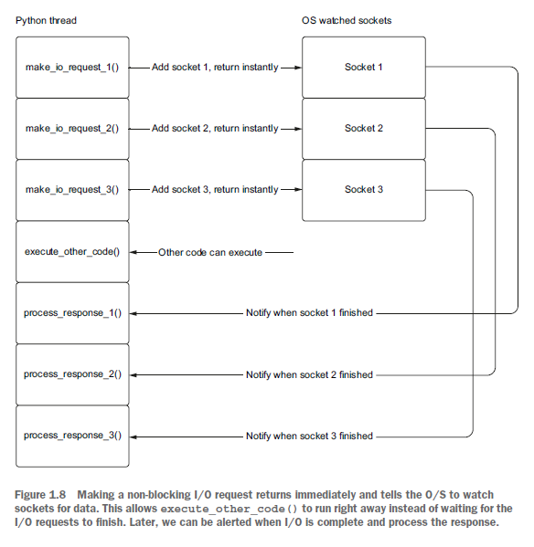
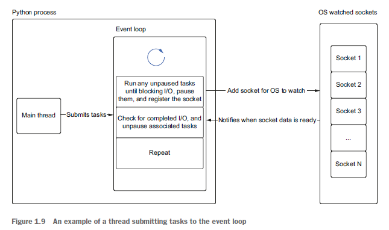

# Python Concurrency with asyncio by Matthew Fowler

## 1. Getting to know asyncio
## 2. asyncio basics
## 3. A first asyncio application
## 4. Concurrent web requests
## 5. Non-blocking database drivers
## 6. Handling CPU-bound work
## 7. Handling blocking work with threads
## 8. Streams
## 9. Web applications
## 10. Microservices
## 11. Synchronization
## 12. Asynchronous queues
## 13. Managing subprocesses
## 14. Advanced asyncio

---
---

# 1. Getting to know asyncio

## What is asyncio ?

In a synchronous application, code runs sequentially. The next line of code runs as soon as the previous one has finished, and only one thing is happening at once. This model works fine for many, if not most, applications. However, what if one line of code is especially slow? In that case, all other code after our slow line will be stuck waiting for that line to complete. These potentially slow lines can block the application from running any other code. Many of us have seen this before in buggy user interfaces, where we happily click around until the application freezes, leaving us with a spinner or an unresponsive user interface. This is an example of an application being blocked leading to a poor user experience.

While any operation can block an application if it takes long enough, many applications will block waiting on I/O. I/O refers to a computer’s input and output devices such as a keyboard, hard drive, and, most commonly, a network card. These operations wait for user input or retrieve the contents from a web-based API. In a synchronous application, we’ll be stuck waiting for those operations to complete before we can run anything else. This can cause performance and responsiveness issues, as we can only have one long operation running at any given time, and that operation will stop our application from doing anything else.

One solution to this issue is to introduce concurrency. In the simplest terms, concurrency means allowing more than one task being handled at the same time. In the case of concurrent I/O, examples include allowing multiple web requests to be made at the same time or allowing simultaneous connections to a web server.

There are several ways to achieve this concurrency in Python. One of the most recent additions to the Python ecosystem is the asyncio library. asyncio is short for asynchronous I/O. It is a Python library that allows us to run code using an asynchronous programming model. This lets us handle multiple I/O operations at once, while still allowing our application to remain responsive.

So what is asynchronous programming? It means that a particular long-running task can be run in the background separate from the main application. Instead of blocking all other application code waiting for that long-running task to be completed, the system is free to do other work that is not dependent on that task. Then, once the long-running task is completed, we’ll be notified that it is done so we can process the result.

In Python version 3.4, asyncio was first introduced with decorators alongside generator yield from syntax to define coroutines. A coroutine is a method that can be paused when we have a potentially long-running task and then resumed when that task is finished. In Python version 3.5, the language implemented first-class support for coroutines and asynchronous programming when the keywords async and await were explicitly added to the language. This syntax, common in other programming languages such as C# and JavaScript, allows us to make asynchronous code look like it is run synchronously. This makes asynchronous code easy to read and understand, as it looks like the sequential flow most software engineers are familiar with. asyncio is a library to execute these coroutines in an asynchronous fashion using a concurrency model known as a single-threaded event loop.

While the name of asyncio may make us think that this library is only good for I/O operations, it has functionality to handle other types of operations as well by interoperating with multithreading and multiprocessing. With this interoperability, we can use async and await syntax with threads and processes making these workflows easier to understand. This means this library not only is good for I/O based concurrency but can also be used with code that is CPU intensive. To better understand what type of workloads asyncio can help us with and which concurrency model is best for each type of concurrency, let’s explore the differences between I/O and CPU-bound operations.

## What is I/O-bound and what is CPU-bound ?

When we refer to an operation as I/O-bound or CPU-bound we are referring to the limiting factor that prevents that operation from running faster. This means that if we increased the performance of what the operation was bound on, that operation would complete in less time.

In the case of a CPU-bound operation, it would complete faster if our CPU was more powerful, for instance by increasing its clock speed from 2 GHz to 3 GHz. In the case of an I/O-bound operation, it would get faster if our I/O devices could handle more data in less time. This could be achieved by increasing our network bandwidth through our ISP or upgrading to a faster network card.

CPU-bound operations are typically computations and processing code in the Python world. An example of this is computing the digits of pi or looping over the contents of a dictionary, applying business logic. In an I/O-bound operation we spend most of our time waiting on a network or other I/O device. An example of an I/Obound operation would be making a request to a web server or reading a file from our machine’s hard drive.



I/O-bound and CPU-bound operations usually live side by side one another. We first make an I/O-bound request to download the contents of https:/ /www.example.com. Once we have the response, we perform a CPU-bound loop to format the headers of the response and turn them into a string separated by newlines. We then open a file and write the string to that file, both I/O-bound operations.

Asynchronous I/O allows us to pause execution of a particular method when we have an I/O operation; we can run other code while waiting for our initial I/O to complete in the background. This allows us to execute many I/O operations concurrently, potentially speeding up our application.

## Understanding concurrency, parallelism, and multitasking

### Concurrency

When we say two tasks are happening concurrently, we mean those tasks are happening at the same time. Take, for instance, a baker baking two different cakes. To bake these cakes, we need to preheat our oven. Preheating can take tens of minutes depending on the oven and the baking temperature, but we don’t need to wait for our oven to preheat before starting other tasks, such as mixing the flour and sugar together with eggs. We can do other work until the oven beeps, letting us know it is preheated.

We also don’t need to limit ourselves from starting work on the second cake before finishing the first. We can start one cake batter, put it in a stand mixer, and start preparing the second batter while the first batter finishes mixing. In this model, we’re switching between different tasks concurrently. This switching between tasks (doing something else while the oven heats, switching between two different cakes) is concurrent behavior.

### Parallelism

While concurrency implies that multiple tasks are in process simultaneously, it does not imply that they are running together in parallel. When we say something is running in parallel, we mean not only are there two or more tasks happening concurrently, but they are also executing at the same time. Going back to our cake baking example, imagine we have the help of a second baker. In this scenario, we can work on the first cake while the second baker works on the second. Two people making batter at once is parallel because we have two distinct tasks running concurrently (figure 1.1).



Putting this into terms of applications run by our operating system, let’s imagine it has two applications running. In a system that is only concurrent, we can switch between running these applications, running one application for a short while before letting the other one run. If we do this fast enough, it gives the appearance of two things happening at once. In a system that is parallel, two applications are running simultaneously, and we’re actively running two things concurrently.

The concepts of concurrency and parallelism are similar (figure 1.2) and slightly confusing to differentiate, but it is important to understand what makes them distinct from one another.



### The difference between concurrency and parallelism

Concurrency is about multiple tasks that can happen independently of one another. We can have concurrency on a CPU with only one core, as the operation will employ preemptive multitasking (defined in the next section) to switch between tasks. Parallelism, however, means that we must be executing two or more tasks at the same time. On a machine with one core, this is not possible. To make this possible, we need a CPU with multiple cores that can run two tasks together.

While parallelism implies concurrency, concurrency does not always imply parallelism. A multithreaded application running on a multiple-core machine is both concurrent and parallel. In this setup, we have multiple tasks running at the same time, and there are two cores independently executing the code associated with those tasks. However, with multitasking we can have multiple tasks happening concurrently, yet only one of them is executing at a given time.

### What is multitasking?

Multitasking is everywhere in today’s world. We multitask while making breakfast by taking a call or answering a text while we wait for water to boil to make tea. We even multitask while commuting to work, by reading a book while the train takes us to our stop. Two main kinds of multitasking are discussed in this section: preemptive multitasking and cooperative multitasking.

* ***PREEMPTIVE MULTITASKING***

  * In this model, we let the operating system decide how to switch between which work is currently being executed via a process called time slicing. When the operating system switches between work, we call it preempting. How this mechanism works under the hood is up to the operating system itself. It is primarily achieved through using either multiple threads or multiple processes.

* ***COOPERATIVE MULTITASKING***

  * In this model, instead of relying on the operating system to decide when to switch between which work is currently being executed, we explicitly code points in our application where we can let other tasks run. The tasks in our application operate in a model where they cooperate, explicitly saying, “I’m pausing my task for a while; go ahead and run other tasks.”

### The benefits of cooperative multitasking

asyncio uses cooperative multitasking to achieve concurrency. When our application reaches a point where it could wait a while for a result to come back, we explicitly mark this in code. This allows other code to run while we wait for the result to come back in the background. Once the task we marked has completed, we in effect “wake up” and resume executing the task. This gives us a form of concurrency because we can have multiple tasks started at the same time but, importantly, not in parallel because they aren’t executing code simultaneously.

Cooperative multitasking has benefits over preemptive multitasking. First, cooperative multitasking is less resource intensive. When an operating system needs to switch between running a thread or process, it involves a context switch. Context switches are intensive operations because the operating system must save information about the running process or thread to be able to reload it.

A second benefit is granularity. An operating system knows that a thread or task should be paused based on whichever scheduling algorithm it uses, but that might not be the best time to pause. With cooperative multitasking, we explicitly mark the areasthat are the best for pausing our tasks. This gives us some efficiency gains in that we are only switching tasks when we explicitly know it is the right time to do so. Now that we understand concurrency, parallelism, and multitasking, we’ll use these concepts to understand how to implement them in Python with threads and processes.

## Understanding processes, threads, multithreading, and multiprocessing

### Process

A process is an application run that has a memory space that other applications cannot access. An example of creating a Python process would be running a simple “hello world” application or typing python at the command line to start up the REPL (read eval print loop).

Multiple processes can run on a single machine. If we are on a machine that has a CPU with multiple cores, we can execute multiple processes at the same time. If we are on a CPU with only one core, we can still have multiple applications running simultaneously, through time slicing. When an operating system uses time slicing, it will switch between which process is running automatically after some amount of time. The algorithms that determine when this switching occurs are different, depending on the operating system.

### Thread

 Threads can be thought of as lighter-weight processes. In addition, they are the smallest construct that can be managed by an operating system. They do not have their own memory as does a process; instead, they share the memory of the process that created them. Threads are associated with the process that created them. A process will always have at least one thread associated with it, usually known as the main thread. A process can also create other threads, which are more commonly known as worker or background threads. These threads can perform other work concurrently alongside the main thread. Threads, much like processes, can run alongside one another on a multi-core CPU, and the operating system can also switch between them via time slicing. When we run a normal Python application, we create a process as well as a main thread that will be responsible for running our Python application.

```Python3
import os
import threading

print("Python process running with process id: {0}".format(os.getpid()))

total_threads = threading.active_count()
thread_name = threading.current_thread().name

print("Python is currently running {0} thread(s)".format(total_threads))
print("The current thread is {0}".format(thread_name))
```



In figure 1.3, we sketch out the process for listing 1.2. We create a simple application to show us the basics of the main thread. We first grab the process ID (a unique identifier for a process) and print it to prove that we indeed have a dedicated process running. We then get the active count of threads running as well as the current thread’s name to show that we are running one thread—the main thread. While the process ID will be different each time this code is run, running listing 1.2 will give output similar to the following:

```
Python process running with process id: 98230
Python currently running 1 thread(s)
The current thread is MainThread
```

Processes can also create other threads that share the memory of the main process. These threads can do other work concurrently for us via what is known as multithreading.

```Python3
import threading


def hello_from_thread():
  print("Hello from thread {0}".format(threading.current_thread()))


hello_thread = threading.Thread(target=hello_from_thread)
hello_thread.start()

total_threads = threading.active_count()
thread_name = threading.current_thread().name

print("Python is currently running {0} thread(s)".format(total_threads))
print("The current thread is {0}".format(thread_name))

hello_thread.join()
```



In figure 1.4, we sketch out the process and threads for listing 1.3. We create a method to print out the name of the current thread and then create a thread to run that method. We then call the start method of the thread to start running it. Finally, we call the join method. join will cause the program to pause until the thread we started completed. If we run the previous code, we’ll see output similar to the following:

```
Hello from thread <Thread(Thread-1, started 123145541312512)>!
Python is currently running 2 thread(s)
The current thread is MainThread
```

Note that when running this you may see the hello from thread and python is currently running 2 thread(s) messages print on the same line. This is a race condition; we’ll explore a bit about this in the next section and in chapters 6 and 7.

Multithreaded applications are a common way to achieve concurrency in many programming languages. There are a few challenges in utilizing concurrency with threads in Python, however. Multithreading is only useful for I/O-bound work because we are limited by the global interpreter lock, which is discussed in section 1.5.

Multithreading is not the only way we can achieve concurrency; we can also create multiple processes to do work concurrently for us. This is known as multiprocessing. In multiprocessing, a parent process creates one or more child processes that it manages. It can then distribute work to the child processes.

Python gives us the multiprocessing module to handle this. The API is similar to that of the threading module. We first create a process with a target function. Then, we call its start method to execute it and finally its join method to wait for it to complete running.

```Python3
import multiprocessing
import os


def hello_from_process():
  print("Hello from child process {0}".format(os.getpid()))


if __name__ == '__main__':
  hello_process = multiprocessing.Process(target=hello_from_process)
  hello_process.start()

  print("Hello from parent process {0}".format(os.getpid()))

  hello_process.join()
```



In figure 1.5, we sketch out the process and threads for listing 1.4. We create one child process that prints its process ID, and we also print out the parent process ID to prove that we are running different processes. Multiprocessing is typically best when we have CPU-intensive work.

Multithreading and multiprocessing may seem like magic bullets to enable concurrency with Python. However, the power of these concurrency models is hindered by an implementation detail of Python—the global interpreter lock.

## Understanding the global interpreter lock

The global interpreter lock, abbreviated GIL and pronounced gill, is a controversial topic in the Python community. Briefly, the GIL prevents one Python process from executing more than one Python bytecode instruction at any given time. This means that even if we have multiple threads on a machine with multiple cores, a Python process can have only one thread running Python code at a time. In a world where we have CPUs with multiple cores, this can pose a significant challenge for Python developers looking to take advantage of multithreading to improve the performance of their application.

Multiprocessing can run multiple bytecode instructions concurrently because each Python process has its own GIL.

So why does the GIL exist? The answer lies in how memory is managed in CPython. In CPython, memory is managed primarily by a process known as reference counting. Reference counting works by keeping track of who currently needs access to a particular Python object, such as an integer, dictionary, or list. A reference count is an integer keeping track of how many places reference that particular object. When someone no longer needs that referenced object, the reference count is decremented, and when someone else needs it, it is incremented. When the reference count reaches zero, no one is referencing the object, and it can be deleted from memory.

CPython is the reference implementation of Python. By reference implementation we mean it is the standard implementation of the language and is used as the reference for proper behavior of the language. There are other implementations of Python such as Jython, which is designed to run on the Java Virtual Machine, and IronPython, which is designed for the .NET framework.

The conflict with threads arises in that the implementation in CPython is not thread safe. When we say CPython is not thread safe, we mean that if two or more threads modify a shared variable, that variable may end in an unexpected state. This unexpected state depends on the order in which the threads access the variable, commonly known as a race condition. Race conditions can arise when two threads need to reference a Python object at the same time.

As shown in figure 1.6, if two threads increment the reference count at one time, we could face a situation where one thread causes the reference count to be zero when the object is still in use by the other thread. The likely result of this would be an application crash when we try to read the potentially deleted memory.

To demonstrate the effect of the GIL on multithreaded programming, let’s examine the CPU-intensive task of computing the nth number in the Fibonacci sequence. We’ll use a fairly slow implementation of the algorithm to demonstrate a time-intensive operation. A proper solution would utilize memoization or mathematical techniques to improve performance.



```Python3
import time


def print_fib(number: int) -> None:
  def fib(n: int) -> int:
    if n == 1:
      return 0
    elif n == 2:
      return 1
    else:
      return fib(n - 1) + fib(n - 2)

  print("fib {0} is {1}".format(number, fib(number)))


def fibs_no_threading():
  print_fib(40)
  print_fib(41)


start = time.perf_counter()
fibs_no_threading()
end = time.perf_counter()

print("Completed in {0:.4f} seconds".format(end - start))
```

This implementation uses recursion and is overall a relatively slow algorithm, requiring exponential O(2^N) time to complete. If we are in a situation where we need to print two Fibonacci numbers, it is easy enough to synchronously call them and time the result, as we have done in the preceding listing.

Depending on the speed of the CPU we run on, we will see different timings, but running the code in listing 1.5 will yield output similar to the following:

```
fib(40) is 63245986
fib(41) is 102334155
Completed in 65.1516 seconds.
```

This is a fairly long computation, but our function calls to print_fibs are independent from one another. This means that they can be put in multiple threads that our CPU can, in theory, run concurrently on multiple cores, thus, speeding up our application.

```Python3
import threading
import time


def print_fib(number: int) -> None:
  def fib(n: int) -> int:
    if n == 1:
      return 0
    elif n == 2:
      return 1
    else:
      return fib(n - 1) + fib(n - 2)

  print("fib {0} is {1}".format(number, fib(number)))


def fibs_with_threads():
  thread_1 = threading.Thread(target=print_fib, args=(40, ))
  thread_2 = threading.Thread(target=print_fib, args=(41,))

  thread_1.start()
  thread_2.start()

  thread_1.join()
  thread_2.join()


start_threads = time.perf_counter()
fibs_with_threads()
end_threads = time.perf_counter()
print("Completed in {0:.4f} seconds".format(end_threads - start_threads))
```

In the preceding listing, we create two threads, one to compute fib(40) and one to compute fib(41) and start them concurrently by calling start() on each thread. Then we make a call to join(), which will cause our main program to wait until the threads finish. Given that we start our computation of fib(40) and fib(41) simultaneously and run them concurrently, you would think we could see a reasonable speedup; however, we will see an output like the following even on a multi-core machine.

```
fib(40) is 63245986
fib(41) is 102334155
Threads took 66.1059 seconds.
```

Our threaded version took almost the same amount of time. In fact, it was even a little slower! This is almost entirely due to the GIL and the overhead of creating and managing threads. While it is true the threads run concurrently, only one of them is allowed to run Python code at a time due to the lock. This leaves the other thread in a waiting state until the first one completes, which completely negates the value of multiple threads.

### Is the GIL ever released?

Based on the previous example, you may be wondering if concurrency in Python can ever happen with threads, given that the GIL prevents running two lines of Python concurrently. The GIL, however, is not held forever such that we can’t use multiple threads to our advantage.

The global interpreter lock is released when I/O operations happen. This lets us employ threads to do concurrent work when it comes to I/O, but not for CPU-bound Python code itself (there are some notable exceptions that release the GIL for CPUbound work in certain circumstances, and we’ll look at these in a later chapter). To illustrate this, let’s use an example of reading the status code of a web page.

```Python3
import time
import requests


def read_example() -> None:
  response = requests.get('http://www.example.com')
  print(response.status_code)


sync_start = time.perf_counter()

read_example()
read_example()

sync_end = time.perf_counter()


print("Running synchronously took {0:.4f} seconds".format(sync_end - sync_start))
```

In the preceding listing, we retrieve the contents of example.com and print the status code twice. Depending on our network connection speed and our location, we’ll see output similar to the following when running this code:

```
200
200
Running synchronously took 0.2306 seconds.
```

Now that we have a baseline for what a synchronous version looks like, we can write a multithreaded version to compare to. In our multithreaded version, in an attempt to run them concurrently, we’ll create one thread for each request to example.com.

```Python3
import time
import threading
import requests


def read_example() -> None:
  response = requests.get("https://www.example.com")
  print(response.status_code)


thread_1 = threading.Thread(target=read_example)
thread_2 = threading.Thread(target=read_example)

thread_start = time.perf_counter()

thread_1.start()
thread_2.start()

print('All threads running!')

thread_1.join()
thread_2.join()

thread_end = time.perf_counter()

print("Running with threads took {0:.4f} seconds".format(thread_end - thread_start))
```

When we execute the preceding listing, we will see output like the following, depending  again on our network connection and location:

```
All threads running!
200
200
Running with threads took 0.0977 seconds.
```

This is roughly two times faster than our original version that did not use threads, since we’ve run the two requests at roughly the same time! Of course, depending on your internet connection and machine specs, you will see different results, but the numbers should be directionally similar.

So how is it that we can release the GIL for I/O but not for CPU-bound operations? The answer lies in the system calls that are made in the background. In the case of I/O, the low-level system calls are outside of the Python runtime. This allows the GIL to be released because it is not interacting with Python objects directly. In this case, the GIL is only reacquired when the data received is translated back into a Python object. Then, at the operating-system level, the I/O operations execute concurrently. This model gives us concurrency but not parallelism. In other languages, such as Java or C++, we would get true parallelism on multi-core machines because we don’t have the GIL and can execute simultaneously. However, in Python, because of the GIL, the best we can do is concurrency of our I/O operations, and only one piece of Python code is executing at a given time.

### asyncio and the GIL

asyncio exploits the fact that I/O operations release the GIL to give us concurrency, even with only one thread. When we utilize asyncio we create objects called coroutines. A coroutine can be thought of as executing a lightweight thread. Much like we can have multiple threads running at the same time, each with their own concurrent I/O operation, we can have many coroutines running alongside one another. While we are waiting for our I/O-bound coroutines to finish, we can still execute other Python code, thus, giving us concurrency. It is important to note that asyncio does not circumvent the GIL, and we are still subject to it. If we have a CPU-bound task, we still need to use multiple processes to execute it concurrently (which can be done with asyncio itself); otherwise, we will cause performance issues in our application. Now that we know it is possible to achieve concurrency for I/O with only a single thread, let’s dive into the specifics of how this works with non-blocking sockets.

## How single-threaded concurrency works

In the previous section, we introduced multiple threads as a mechanism for achieving concurrency for I/O operations. However, we don’t need multiple threads to achieve this kind of concurrency. We can do it all within the confines of one process and one thread. We do this by exploiting the fact that, at the system level, I/O operations can be completed concurrently. To better understand this, we’ll need to dive into how sockets work and, in particular, how non-blocking sockets work.

### What is a socket?

A socket is a low-level abstraction for sending and receiving data over a network. It is the basis for how data is transferred to and from servers. Sockets support two main operations: sending bytes and receiving bytes. We write bytes to a socket, which will then get sent to a remote address, typically some type of server. Once we’ve sent those bytes, we wait for the server to write its response back to our socket. Once these bytes have been sent back to our socket, we can then read the result.

Sockets are a low-level concept and are fairly easy to understand if you think of them as mailboxes. You can put a letter in your mailbox that your letter carrier then picks up and delivers to the recipient’s mailbox. The recipient opens their mailbox and your letter. Depending on the contents, the recipient may send you a letter back. In this analogy, you may think of the letter as the data or bytes we want to send. Consider that the act of putting a letter into the mailbox is writing the bytes to a socket, and opening the mailbox to read the letter is reading bytes from a socket. The letter carrier can be thought of as the transfer mechanism over the internet, routing the data to the correct address.

In the case of getting the contents from example.com as we saw earlier, we open a socket that connects to example.com’s server. We then write a request to get the contents to that socket and wait for the server to reply with the result: in this case, the HTML of the web page. We can visualize the flow of bytes to and from the server in figure 1.7.



Sockets are blocking by default. Simply put, this means that when we are waiting for a server to reply with data, we halt our application or block it until we get data to read. Thus, our application stops running any other tasks until we get data from the server, an error happens, or there is a timeout.

At the operating system level, we don’t need to do this blocking. Sockets can operate in non-blocking mode. In non-blocking mode, when we write bytes to a socket, we can just fire and forget the write or read, and our application can go on to perform other tasks. Later, we can have the operating system tell us that we received bytes and deal with it at that time. This lets the application do any number of things while we wait for bytes to come back to us. Instead of blocking and waiting for data to come to us, we become more reactive, letting the operating system inform us when there is data for us to act on.

In the background, this is performed by a few different event notification systems, depending on which operating system we’re running. asyncio is abstracted enough that it switches between the different notification systems, depending on which one our operating system supports. The following are the event notification systems used by specific operating systems:

* kqueue—FreeBSD and MacOS
* epoll—Linux
* IOCP (I/O completion port)—Windows

These systems keep track of our non-blocking sockets and notify us when they are ready for us to do something with them. This notification system is the basis of how asyncio can achieve concurrency. In asyncio’s model of concurrency, we have only one thread executing Python at any given time. When we hit an I/O operation, we hand it over to our operating system’s event notification system to keep track of it for us. Once we have done this handoff, our Python thread is free to keep running other Python code or add more non-blocking sockets for the OS to keep track of for us. When our I/O operation finishes, we “wake up” the task that was waiting for the result and then proceed to run any other Python code that came after that I/O operation. We can visualize this flow in figure 1.8 with a few separate operations that each rely on a socket.



But how do we keep track of which tasks are waiting for I/O as opposed to ones that can just run because they are regular Python code? The answer lies in a construct called an event loop.

## How an event loop works

An event loop is at the heart of every asyncio application. Event loops are a fairly common design pattern in many systems and have existed for quite some time. If you’ve ever used JavaScript in a browser to make an asynchronous web request, you’ve created a task on an event loop. Windows GUI applications use what are called message loops behind the scenes as a primary mechanism for handling events such as keyboard input, while still allowing the UI to draw.

The most basic event loop is extremely simple. We create a queue that holds a list of events or messages. We then loop forever, processing messages one at a time as they come into the queue. In Python, a basic event loop might look something like this:

```Python3
from collections import deque
messages = deque()

while True:
    if messages:
      message = messages.pop()
      process_message(message)
```

In asyncio, the event loop keeps a queue of tasks instead of messages. Tasks are wrappers around a coroutine. A coroutine can pause execution when it hits an I/O-bound operation and will let the event loop run other tasks that are not waiting for I/O operations to complete.

When we create an event loop, we create an empty queue of tasks. We can then add tasks into the queue to be run. Each iteration of the event loop checks for tasks that need to be run and will run them one at a time until a task hits an I/O operation. At that time the task will be “paused,” and we instruct our operating system to watch any sockets for I/O to complete. We then look for the next task to be run. On every iteration of the event loop, we’ll check to see if any of our I/O has completed; if it has, we’ll “wake up” any tasks that were paused and let them finish running. We can visualize this as follows in figure 1.9: the main thread submits tasks to the event loop, which can then run them.

To illustrate this, let’s imagine we have three tasks that each make an asynchronous web request. Imagine these tasks have a bit of code to do setup, which is CPU-bound, then they make a web request, and they follow with some CPU-bound postprocessing code. Now, let’s submit these tasks to the event loop simultaneously. In pseudocode, we would write something like this:

```Python3
def make_request():
    cpu_bound_setup()
    io_bound_web_request()
    cpu_bound_postprocess()

task_one = make_request()
task_two = make_request()
task_three = make_request()
```



All three tasks start with CPU-bound work and we are single-threaded, so only the first task starts executing code, and the other two are left waiting to run. Once the CPU-bound setup work is finished in Task 1, it hits an I/O-bound operation and will pause itself to say, “I’m waiting for I/O; any other tasks waiting to run can run.”

Once this happens, Task 2 can begin executing. Task 2 starts its CPU-bound code and then pauses, waiting for I/O. At this time both Task 1 and Task 2 are waiting concurrently for their network request to complete. Since Tasks 1 and 2 are both paused waiting for I/O, we start running Task 3.

Now imagine once Task 3 pauses to wait for its I/O to complete, the web request for Task 1 has finished. We’re now alerted by our operating system’s event notification system that this I/O has finished. We can now resume executing Task 1 while both Task 2 and Task 3 are waiting for their I/O to finish.

In figure 1.10, we show the execution flow of the pseudocode we just described. If we look at any vertical slice of this diagram, we can see that only one CPU-bound piece of work is running at any given time; however, we have up to two I/O-bound operations happening concurrently. This overlapping of waiting for I/O per each task is where the real time savings of asyncio comes in.

![Figure-1-10](ScreenshotsForNotes/Chapter1/Figure_1_10.PNG

